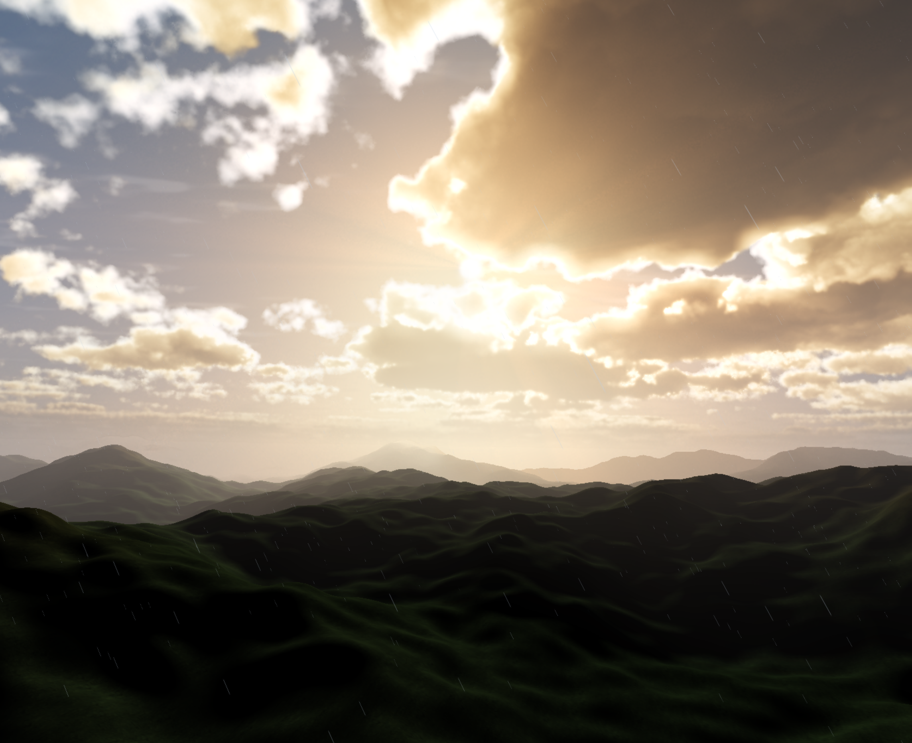
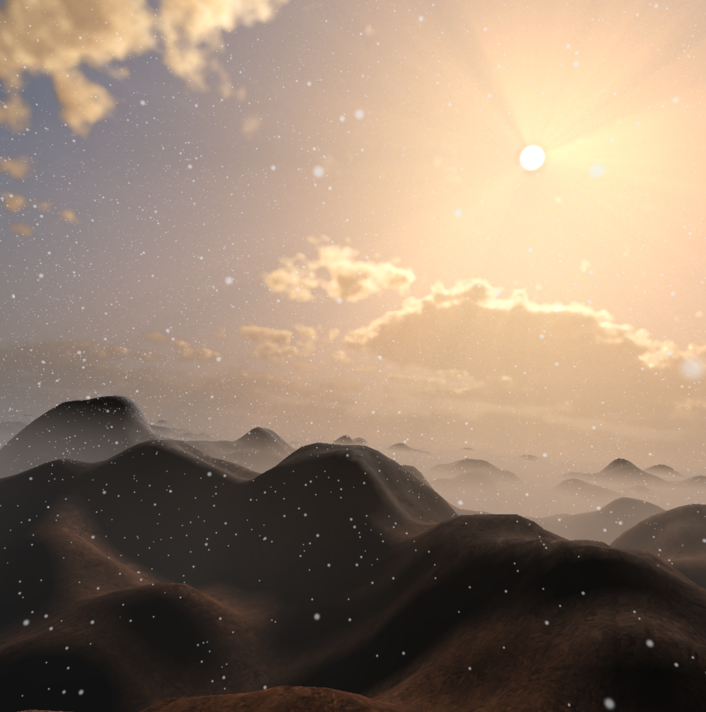
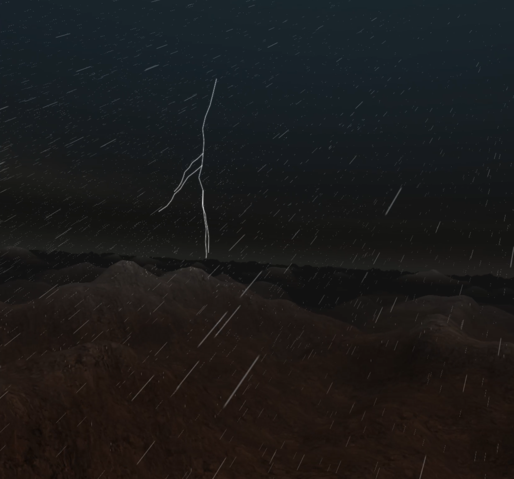
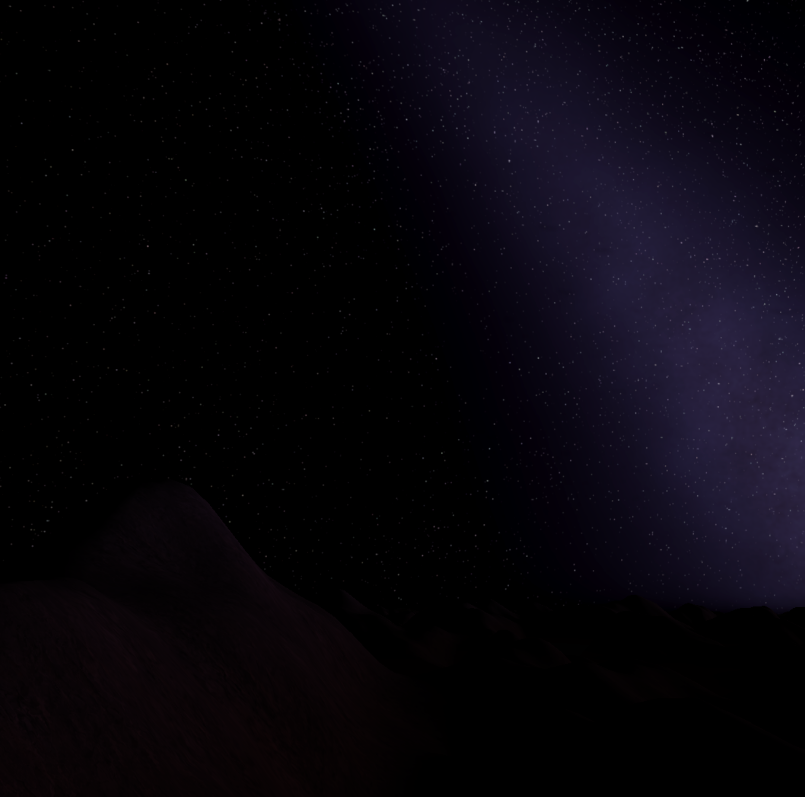

# RE-WILD

Rewild is a game about time travel and natural history. Built with TS and WebGPU. Its very much a work in progress. The demo below will give you access to the editor. You can create and save a local scene, and play it, though the functionality of a true 'game' is missing while I build out the engine. To be able to play something, first create a new project with at least one container. Add a player start in the container and you should be good to go. Note that everything is saved locally on your machine

Checkout the 🦕[Demo](https://rewild-client.s3-website.fr-par.scw.cloud)🦖 (WIP)

## Installation

- [Client Installation](./docs/client-installation.md)
- [Server Installation](./docs/server-installation.md)

## Architecture

- [Server & Sync Architecture](./docs/mycelium-network.md)

## Deployment

- [Deployment Guide](./docs/deployment.md)

## Engine Features

- Procedural endless terrain
- Weather system
- Dynamic atmosphere & effects
- Built in easy to use Editor

## Screenshots

### Cold Sunrise

### Storm

### Nightsky

