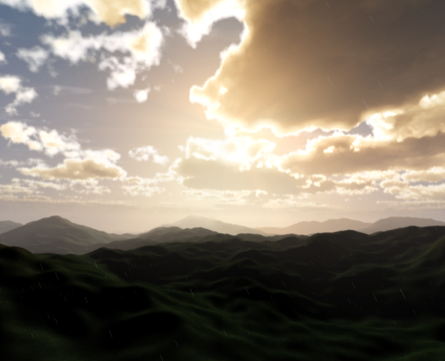
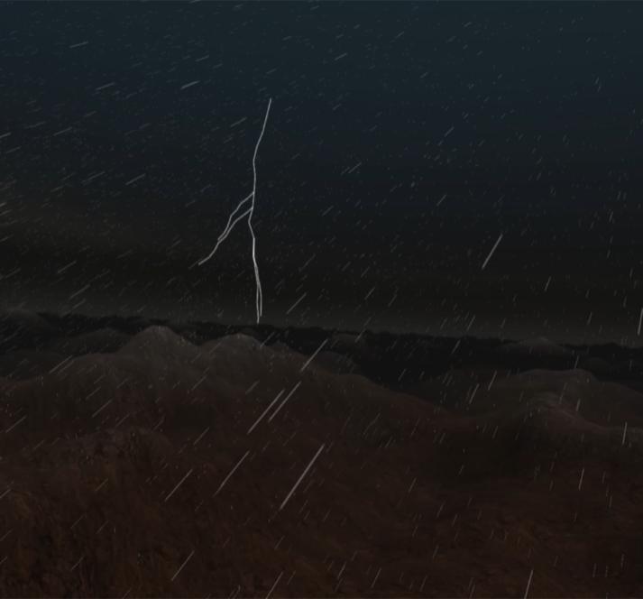
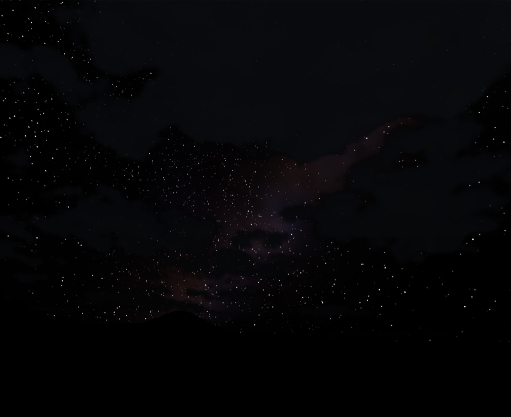

# RE-WILD

Rewild is a game about time travel and natural history. Built with Typescipt, Kotlin and WebGPU. Its very much a work in progress. The demo below will give you access to the editor. You can create and save a local scene, and play it, though the functionality of a true 'game' is missing while I build out the engine.

Checkout the 🦕[Demo](https://rewild-client.s3-website.fr-par.scw.cloud)🦖 (WIP)

## Installation

- [Client Installation](./docs/client-installation.md)
- [Server Installation](./docs/server-installation.md)

## Architecture

- [Server & Sync Architecture](./docs/milestones/mycelium-network.md)
- [Lighting](./docs/milestones/foxfire-lighting.md)
- [Materials & Shading](./docs/milestones/lichen.md)
- [Terrain](./docs/milestones/strata.md)

## Debugging

- [Debugger & Console Commands](./docs/debug-commands.md) — every console command the engine registers, and how to read what each one shows you

## Deployment

- [Deployment Guide](./docs/deployment.md)

## Engine Features

- Procedural endless terrain
- Weather system
- Dynamic atmosphere & effects
- Built in easy to use Editor

## Screenshots

### Cold Sunrise

### Storm

### Nightsky

