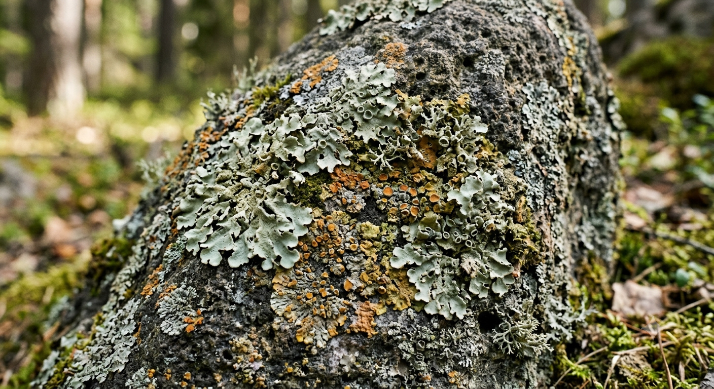

# Materials & Shading (Lichen)

Rewild shades the world with a single **physically based material model** —
metallic-roughness, the same one glTF and Blender speak. This document explains
what that gives you, how to author a material, and the console tools for when
something looks wrong.

> **Where the name comes from.** _Lichen_ was the milestone that replaced the
> engine's two ad-hoc shading models with one physical one. Where
> [Foxfire](./foxfire-lighting.md) decided how the world is _lit_, Lichen decided
> what the light actually _lands on_. That work has landed; this page is the
> plain-English guide to what it delivers.

---

## The short version

- **One material model.** A surface is described by base colour, **metallic** and
  **roughness** — not by hand-tuned specular exponents. Values authored in
  Blender or exported to glTF render as authored.
- **One HDR frame.** Everything — terrain, objects, sky, clouds, god rays —
  renders in high dynamic range and passes through **one exposure and one ACES
  curve** at the end. Before, only the sky was tonemapped.
- **Lights fall off physically** (inverse-square), with a smooth window that
  still takes them to zero at their `range`.
- **Ambient comes from the sky.** There is no flat ambient constant any more. The
  atmosphere is captured to a cubemap and used as image-based lighting, so
  ambient tracks time of day and weather **for free**.
- **Terrain uses the same shading path** as everything else, so surfaces match
  wherever they meet.
- **Textures declare their colour space**, and a `npm run textures:audit` tool
  catches the ones that lie about it.

---

## Authoring a material

Materials are declared in `templates/materials.json`. A PBR material is
`type: 'standard'` (or `'standard-instanced'` for instanced draws):

```json
{
  "name": "block-concrete",
  "type": "standard",
  "baseColorMap": "block-concrete-4",
  "normalMap": "block-concrete-4-normal",
  "metallicRoughnessMap": "block-concrete-4-roughness",
  "occlusionMap": "block-concrete-4-ao",
  "metallic": 0,
  "roughness": 1
}
```

Every field is optional except `name` and `type` — a material with nothing but a
`baseColorFactor` is valid and will shade correctly.

| Field                                                | What it does                                                                                                                                      |
| ---------------------------------------------------- | ------------------------------------------------------------------------------------------------------------------------------------------------- |
| `baseColorMap` / `baseColorFactor` / `opacity`       | The surface colour, and a tint multiplied over it. `opacity` is glTF's fourth base-colour component.                                              |
| `metallic` / `roughness`                             | 0–1. Metal or not; mirror-smooth to fully rough. Multiplied over `metallicRoughnessMap` if one is set.                                            |
| `metallicRoughnessMap`                               | Roughness in **G**, metallic in **B** — glTF's packing.                                                                                           |
| `occlusionMap` / `occlusionStrength`                 | Occlusion in **R**. Name the _same_ texture as `metallicRoughnessMap` to use a packed **ORM** atlas. Applies to ambient only, as glTF specifies.  |
| `normalMap` / `normalScale`                          | Tangent-space normals. Must be **linear** on disk — see [Colour spaces](#colour-spaces--the-texture-audit) below, this is the classic silent bug. |
| `emissiveMap` / `emissiveColor` / `emissiveStrength` | Light the surface emits. `emissiveStrength` may exceed 1 (`KHR_materials_emissive_strength`), which is how something glows into bloom.            |
| `alphaMode` / `alphaCutoff`                          | `OPAQUE`, `MASK` (cutout — what foliage needs) or `BLEND`.                                                                                        |
| `doubleSided`                                        | Disables back-face culling. Usually paired with `MASK` for leaves and cards.                                                                      |
| `vertexColors`                                       | Requires the geometry to carry `COLOR_0`; a mesh without it cannot use the material at all.                                                       |

The full schema, with the reasoning behind each choice, lives in
`packages/rewild-renderer/lib/managers/types.ts`.

**The classic shading models are still there.** `lambert`, `phong`, `wireframe`,
`gizmo` and `sprite` still work and still take a flat `ambientColor` — but they
are what Lichen replaces, not what it upgrades. New work should use `standard`.

---

## Colour spaces & the texture audit

Every texture in `materials.json` must declare a `colorSpace`, with no default:

- `srgb` — anything the eye reads as colour: base colour, emissive.
- `linear` — data maps whose channels are numbers: normal, roughness, metallic,
  occlusion, height.

There is no guessing, because guessing wrong is invisible in the source and only
shows up as shading that's slightly off. (Sprite, gizmo and UI textures are the
one surprising case — they're `linear` even when they're colour, because those
passes draw straight to the swapchain with no encode on the way out.)

The other half of the problem is files that are **encoded wrongly on disk**. A
gamma-encoded normal map still loads, still mips, and still looks like a normal
map in an image viewer — it just decodes to a constant tilt on every texel. That
cost a full day of chasing a "the spotlight dims when I turn" bug that turned out
to be sixteen terrain normal maps. So:

```sh
npm run textures:audit          # report on assets/shared
npm run textures:audit:strict   # treat warnings as failures too
npm run textures:fix            # convert gamma-encoded data maps to linear
npm run textures:shrink         # requantise 16-bit maps to 8-bit
```

The check works because a tangent-space normal map is **self-verifying** — every
texel must be a unit vector — so it settles the question without trusting the
filename or the file's own colour chunks. It also flags data maps saved as JPEG,
whose chroma subsampling decimates the roughness and metallic channels before the
shader ever sees them. `npm run assets:push` runs the audit and refuses to
publish if it fails. See `scripts/audit-textures.js`.

---

## Exposure & light intensity

The whole frame passes through one exposure multiplier and one ACES curve, both
applied at the end. Exposure is a property of the camera (`Camera.exposure`,
default `0.06`) — a plain linear multiplier, not an EV/aperture/ISO triple,
because the atmosphere's radiance scale was already hand-tuned against exactly
this number.

**Light intensity is radiance on the sky's scale**, not a photometric unit. Point
and spot lights divide it by distance squared, so it reads as _"the brightness
this light delivers one metre away"_ — which is why values look large compared to
the ones that came before. The unit system is deliberately anchored to the sky
rather than to lux and candela: the atmosphere model already defines an absolute
scale that has been tuned by hand, and adopting real-world units would mean
re-deriving all of it to arrive back at the same picture. The tradeoff is that
intensities aren't portable to or from real-world reference values.

Converting a light authored against the old linear ramp is mechanical — the
formula and its derivation are on `Light.intensity` in
`packages/rewild-renderer/lib/core/lights/Light.ts`.

---

## Ambient from the sky

There is no ambient constant to author. The atmosphere is rendered to a small
cubemap and prefiltered into the three things a PBR shader needs — a diffuse
irradiance cube, a roughness-mipped specular cube, and a BRDF map. Every lit
surface reads its ambient from those.

The practical consequences:

- **Ambient follows the sky.** Dusk, overcast, a storm rolling in — the ambient
  colour and intensity change with it, with nothing to author.
- **Metals reflect the sky**, which is what makes them read as metal at all.
- **It costs close to nothing per frame.** The capture is amortised at one cube
  face per frame and the prefilter at one level per frame, both idling at zero
  when the sky isn't moving. No per-frame compute passes were added.

Clouds are excluded from the capture — raymarching six more views was the one
cost that couldn't be absorbed — but cloudiness still greys and dims it, because
the gradient and fog shaders take it as an input directly.

How the capture and prefilter actually work, and how to read the debug viewer, is
in [Sky Rendering](../sky-rendering.md).

---

## Terrain

Terrain shades through the same PBR path as everything else, so a rock face and a
rock-textured mesh standing on it match. Per-material `specular`/`shininess` were
replaced by `roughness` and `occlusionStrength` in `TerrainMaterials.ts` — see
[Terrain (Strata)](./strata.md#core-api--tuning-levers) for the tuning levers.

---

## Render quality

Quality is **app-wide**, not per-subsystem: `renderer.quality` is the single
authority and every pass that scales with quality reads its level from there. Set
it with `setRenderQuality('low' | 'medium' | 'high')`.

---

## When something looks wrong

Shading has too many places to hide a mistake — a mis-declared colour space, a
flipped normal-map green channel and a roughness map that never loaded all present
as "it looks a bit off". So there is a reference harness rather than an eyeball
test: a grid of spheres stepping metallic and roughness, a switch to render any one
PBR input scene-wide, and a viewer for the IBL cubes.

All of it is console commands, documented in
[Debugger & Console Commands](../debug-commands.md#materials--shading) along with
what _correct_ looks like in each view.

---

## Related docs

- [Debugger & Console Commands](../debug-commands.md) — the reference grid, the
  material channels and the IBL viewer, and how to read each one.
- [Renderer](../renderer.md) — pass structure and the WGSL `#include` mechanism.
- [Sky Rendering](../sky-rendering.md) — the HDR pipeline, and how the IBL capture
  and prefilter actually work.
- [Lighting (Foxfire)](./foxfire-lighting.md) — the light types, storage buffer
  and shadow atlas this shades with.
- [Terrain (Strata)](./strata.md) — the material library and biome layer rules.
- [Weather System](../weather.md) — why sky-captured ambient is worth the
  trouble.
