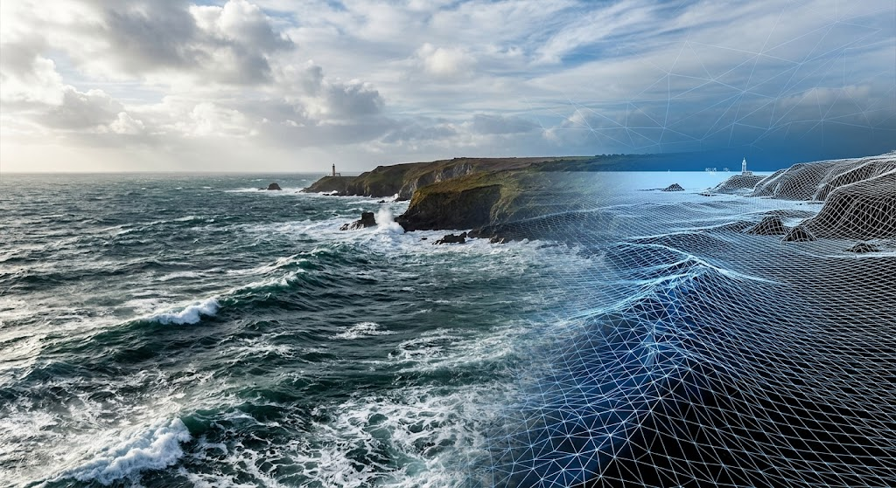

# Water (Pelagic)

Rewild's world has oceans, lakes, mountain tarns and lagoons. The water moves with the weather,
breaks on the shore, wets the sand and changes the light under it. You can add lakes, remove
water and move a lake's level in the editor, and the player can wade, swim and dive. This page
explains what the water system does and how to use it.

> **Where the name comes from.** _Pelagic_ means the open sea, far from any shore. Pelagic was the
> milestone that built this system. That work is complete. This page is now the plain-English
> guide to what it gives you.

---

## The short version

- **Every world has a sea level.** Large, slow land shapes sink below it to make oceans. Coasts
  get beaches.
- **Lakes grow from the seed.** Each world has the same lakes every time you load it. Steep
  mountains get small tarns, and lakes near the coast become lagoons.
- **Oceans and lakes are one system.** Each chunk has a small **water map** that says where water
  is, how high it is and what kind it is.
- **The sea follows the weather.** A calm day is a mirror with a slow swell. A storm is a rough sea
  with whitecaps and spray.
- **Waves break on the shore.** They turn toward the beach, roll in as lines of foam and run up
  the sand, which darkens where it is wet.
- **You can go under the water.** The view turns the water's colour, light falls in shafts, and
  the surface shows from below.
- **Rain wets the whole world**, and drops make rings on wet ground and open water.
- **The editor has a water brush.** Add a lake, remove water, change a lake's type or level.
- **The player wades and swims.** Water slows the player down, and deep water lifts them so they
  float, swim and dive.

---

## Oceans and sea level

Each world stores one **sea level**, like its seed. A very large, slow noise field, the
**continent field**, lowers the ground into ocean basins. Where it does, the ground gets a sea
bed: a shallow shelf near the coast, then deeper water.

The coast changes the land next to it:

- **Beaches.** Sand, then wet sand, then sea bed, chosen by the height above sea level. Steep
  coasts keep their rock, so cliffs stay cliffs.
- **Coastal moisture.** The air is wetter near the sea, which can change the biome next to it.
- **Fewer plants on the sand.** Trees do not grow on the beach.

**How to use it.** Open **Terrain settings** in the editor ribbon. Sea level sits next to the seed
and the climate. Changing it rebuilds the world.

**Files to look at:** `ClimateField.ts` (the continent field), `Biomes.ts` (the beach, in a
climate's `coast`).

---

## Lakes, tarns and lagoons

The world is divided into large **lake cells**. The seed decides if a cell has a lake, where its
centre is, and how big and deep it is. Any chunk can work out every lake that touches it, so a
lake never needs data from far away.

- **A lake's level** is set a little below the lowest point of the ground around it, so land
  always holds the water in. The ground is dug into a bowl, with a small bank (a **lip**)
  wherever the ground would let the water out.
- **Tarns.** Where the ground is too steep for a lake, the cell tries a smaller lake in a hollow,
  with a steep wall uphill and the lip holding the downhill side. This is how water reaches the
  mountains.
- **Lagoons.** A lake that touches the sea takes the sea's level, gets a channel cut to the sea,
  and its colour blends from lake water to sea water.
- **Spacing.** Two lakes at different heights never touch, so a water surface never has a step in
  it.

**Files to look at:** `Lakes.ts`. The lake settings are in `ClimateConfig.lakes` in `Biomes.ts`.

---

## How the water is stored

### The water map

Each chunk has a **water map** beside its splat map. The terrain worker builds both at the same
time. Each texel (8 m across) holds:

| Data         | What it means                                           |
| ------------ | ------------------------------------------------------- |
| Level        | The height of the water surface.                        |
| Coverage     | Is there water here? Zero means dry land at any height. |
| Type weights | What kind of water: for example 60% lake, 40% ocean.    |
| Body ID      | Which body of water owns this texel. The ocean is 0.    |

Water shows where there is coverage **and** the ground is lower than the level. So when you
sculpt, the shore moves on its own. Dig a hole in a lake bed and it fills. Raise an island and the
water moves away from it.

A chunk with no water near it has no water map, and costs nothing.

### The water palette

Kinds of water are entries in a **water palette** in the climate, in the same way that grass and
rock are entries in the material palette. Each entry sets the water's colour, how quickly the bed
fades with depth, how much the wind moves it, how big its waves are and how much foam it makes.
Where two kinds meet, they blend.

### Water bodies

Every lake is a **body** with an ID, a level and a **spill height**: the lowest point of its rim,
where it would overflow. A lake the seed makes is never saved, because the seed makes it again. A
lake you add or change is saved as a small record.

**Files to look at:** `WaterMap.ts`, `Water.ts` (the palette), `WaterBodies.ts`.

---

## Drawing the water

Each chunk with water draws one flat grid, and every chunk shares the same grid. The vertex shader
lifts it to the water's level and adds the waves. The ground hides the water wherever it is
higher than the level, so the shoreline is exact at every pixel.

The surface has:

- **Waves from a real sea model.** An FFT ocean, in four layers from long swells to small ripples,
  driven by the weather's wind. Lakes use only the smaller layers, so they stay calmer.
- **Sky reflection** and **sun glint**. The glint is hidden in shadow.
- **Refraction.** You see the bed through the water, bent by the waves.
- **Depth colour.** Shallow water is clear and deep water is dark. Each palette entry sets its own
  colour.
- **Crest glow.** The sun shines green through the thin top of a tall wave.
- **Darker troughs**, which see less of the sky.

**The horizon.** Chunks stop at 2.8 km, but the sea should reach the horizon. A **horizon ring**
draws the far sea and the far land past the last chunk, so the view from a hill does not end in
empty sky.

**Files to look at:** `ChunkWater.ts`, `OceanFFT.ts`, `OceanSpectrum.ts`, `HorizonOcean.ts`,
`water.wgsl`, `water-surface.wgsl`.

---

## Waves at the shore

- **Shallow water.** Shallow water cannot hold a big sea, so the long swell fades first and a
  little chop stays.
- **Shore waves.** Lines of waves roll in from deep water. They bend toward the beach, wrap
  around headlands and islands, and slow down as the bed rises. A lagoon behind a sand bar gets
  none. Their paths are worked out on a grid around the camera.
- **Foam lines.** Foam gathers where a wave breaks and trails behind it, so bands of white water
  roll in.
- **Swash.** After a wave breaks, a thin sheet of water runs up the sand and drains back. Big
  waves in a set run farther than the small ones.
- **Lapping.** Lakes do not get shore waves. Their water laps gently at the bank instead, more in
  a strong wind.

### Wet sand

The ground at the edge of the water gets wet in two ways:

- **Damp.** Below the highest point the swash reaches, the ground is darker.
- **Soaked.** Where the sheet has just drained away, the sand is shiny and darker still, then
  dries back to damp.

It works on any ground, not only sand. Steep rock keeps only a thin damp line.

**Files to look at:** `ShoreField.ts`, `ShoreWaves.ts`, `shore-waves.wgsl`.

---

## Wind, foam and spray

The weather's **windiness** sets the sea:

| Windiness | The sea                                                 |
| --------- | ------------------------------------------------------- |
| 0         | Calm, a slow swell, no foam                             |
| 0.3       | Small waves, no foam                                    |
| 0.5       | Moderate waves                                          |
| 0.7       | Rough, the first whitecaps and small spray              |
| 1         | Storm: crossing crests, whitecaps everywhere, big spray |

- **Whitecaps** form where waves fold over. The foam stays on the water after the crest moves on,
  and fades slowly into lace.
- **Foam texture.** A tiling foam image gives the foam its bubbles and holes.
- **Edge foam.** In a strong wind, foam collects in the shallows of a lake.
- **Sea spray.** Breaking crests near the camera throw spray. Storms throw big plumes off rocks,
  and breaking surf throws spray along the beach.

**Files to look at:** `OceanFFT.ts` (the foam), `SeaSpray.ts`.

---

## Rain on surfaces

Rain wets every surface, not only the shore:

- Ground and stone go **darker** as water soaks in.
- Flat surfaces get a **shiny film**. Slopes and walls shed it.
- **Drops land** on wet ground and open water and spread small rings.
- After the rain, the shine goes quickly but the dark stays for a while.

Leaves only darken a little and stay matte.

**Files to look at:** `RainWetness.ts`, `rain-wet.wgsl`.

---

## Under water

When the camera goes below the surface:

- **The view fills with the water's colour.** Near things are clear and far things fade away. The
  water glows toward the sun.
- **The surface shows from below.** Looking up, you see the sky through a bright circle (Snell's
  window). Outside it, the surface is a mirror of the water below.
- **The waterline on the lens.** When the surface crosses the camera, the screen splits into an
  above-water and an under-water part, with a thin line between them.
- **Drops on the lens.** After you surface, drops cling to the lens, slide down and dry. Rain lands
  drops on it too. In a gale, your eyes water and the edges of the view blur.
- **Caustics.** The waves focus sunlight into moving bright lines on the bed and on anything under
  the water.
- **Light shafts.** Beams of light fall through the water toward the sun.
- **Marine snow.** Small specks drift in the water around the camera.

### Lighting under water

Anything under water gets less light, the deeper it is. The terrain reads its own chunk's water
map. Rocks, plants and props read a **water level field**: a grid around the camera that holds
the level and colour of the water over each spot. So a rock in a lake is dimmed by that lake, and
a tree on dry land in a valley is not dimmed by a lake higher up.

**Files to look at:** `UnderWater.ts`, `UnderWaterFog.ts`, `WaterLens.ts`, `LensDrops.ts`,
`Caustics.ts`, `LightShafts.ts`, `MarineSnow.ts`, `WaterLevelField.ts`, `water-light.wgsl`.

---

## Plants and water

Scatter rules know about water:

- By default, a rule does **not** grow under water.
- `underwater: true` lets it grow under water, for example seaweed or lilies.
- `waterDepth` grows it only in a range of depths. A negative value means "above the water", for
  example reeds on a bank.
- `waterType` grows it only in one kind of water, for example reeds only in lakes.

Water you edit counts too, so reeds follow a shore you have changed.

**How to use it.** Add these to a rule in a biome's `scatter` list in `Biomes.ts`.

---

## The water brush in the Editor

Open it with the **droplets** button in the editor ribbon, next to sculpt, biome paint and scatter.
A small panel shows over the viewport. It shows only the controls the chosen brush uses, and what
the brush last did.

| Brush      | What it does                                                                        |
| ---------- | ----------------------------------------------------------------------------------- |
| **Level**  | Click a lake, then drag up or down to move its level. It stops at the spill height. |
| **Type**   | Paint a kind of water, such as lake or ocean, over the water under the brush.       |
| **Add**    | Drag to add water. Hold **Shift** to remove.                                        |
| **Remove** | Drag to give the area back to the generated world. Hold **Shift** to add.           |

| Control      | What it does                                 |
| ------------ | -------------------------------------------- |
| **Type**     | The kind of water the Type brush paints.     |
| **Radius**   | The size of the brush, in metres.            |
| **Strength** | How fast the brush works.                    |
| **Depth**    | How deep the Add brush digs below the water. |

**Add.** The brush's circle is the new shoreline. On a lake, it adds to that lake at its level. On
dry land, it makes a new lake at the height you clicked. It digs a bowl under the water, and when
you let go it raises a small bank around it. It stops at other water that sits at a different
height.

**Remove.** The brush gives the water and the ground back to what the generator made. A lake the
seed made comes back as it was. If you cut through part of a lake, the circle becomes that lake's
new shore and a bank is raised along it. Brushing inside a lake leaves an island.

Hold **Alt** and drag, or drag with the right mouse button, to move the camera. Press **Esc** to
close the brush.

### Sculpting near water

After each sculpt stroke, the water is checked:

- **Cut a lake's rim** below its level, and the lake **drains** down to the new lowest point.
- **Cut a rim down to the sea**, and the lake joins the ocean as a lagoon.
- **Dig a trench below sea level** that joins the sea, and it **fills with sea water**.
- **Dig a hole in dry land**, and nothing fills it. Use **Add** to make a pond.

**Files to look at:** `TerrainWaterBrushController.ts`, `WaterBrushToolbar.tsx`, `WaterCarve.ts`
(the bowl, the bank and the cut), `WaterEdit.ts`, `WaterBodyRules.ts` and `SpillHeight.ts`
(draining and sea channels).

---

## In the game: wading and swimming

The player reads the water under their feet each frame, waves included.

- **Wading.** As the water gets deeper, the player slows down.
- **Swimming.** At about shoulder depth, the player starts to swim. They float with their eyes
  just above the surface, and the waves lift and drop them.
- **Diving.** Hold **C** to dive and **Space** to rise. Let go, and the swimmer stays at that
  depth. Come back near the surface, and they float again.
- **Jumping in.** A fall into water plunges, then floats back up.
- **Wind.** In a gale, walking into the wind is slow, and gusts push the player downwind, in time
  with the trees bending around them.

For game code, `TerrainRenderer.waterQuery` gives the water at any point: the level, the depth,
the coverage, the kind of water and the height of the waves there. The wave height comes back from
the GPU a few frames late.

**Files to look at:** `Swimming.ts` (all the swimming numbers), `Headwind.ts`, `Player.ts`,
`WaterQuery.ts`, `WaterProbe.ts`.

---

## Saving & sync

Water edits save in the same way as terrain edits:

- Water the seed makes is never saved. The engine makes it again.
- Each chunk you edit saves a small water file beside its height file.
- Lakes you add or change save in one small list for each level.
- Edits save to the browser first, and sync to the cloud when you log in.

---

## Quality and performance

- Chunks with no water cost nothing.
- Far water uses fewer vertices and fewer wave layers.
- The ocean is one GPU compute pass a frame.
- Under-water effects only run when the camera can be under water.
- The **water** quality setting changes how sharp the ripples are, and how many lens drops and
  blur samples the lens uses. Light shafts and marine snow turn off on low quality.

The perf panel shows the water's GPU time under `gpu/water`. See
[Debugger & Console Commands](../debug-commands.md#perf-panel).

---

## Debugger / console functions

Type these in the browser console. Most of the scale commands take a number, with 1 as the
normal look.

| Command                                                                | What it does                                       |
| ---------------------------------------------------------------------- | -------------------------------------------------- |
| `waterAt(x, z)`                                                        | Logs the water at a point. Defaults to the camera. |
| `waterBody(x, z)`                                                      | Logs the lake at a point and its spill height.     |
| `addWater(...)`, `removeWater(...)`, `resetWater(...)`                 | Edit the water around a point and save it.         |
| `settleWater(x, z, radius)`                                            | Runs the drain and sea-fill rules over an area.    |
| `setOceanSeaState({...})`, `setOceanFoam(...)`                         | Override the sea and its foam.                     |
| `setWaterShoreWaves`, `setWaterSwash`, `setWaterWetBand`               | Scale the shore waves, swash and wet sand.         |
| `setWaterCrestGlow`, `setWaterTroughDarkening`, `setWaterHorizonSlope` | Scale parts of the surface's look.                 |
| `setSeaSpray({...})`                                                   | Tune the sea spray.                                |
| `setWaterCaustics({...})`, `setWaterShafts`, `setMarineSnow({...})`    | Tune the light under water.                        |
| `setWaterLens({...})`                                                  | Tune the lens blur.                                |
| `setRainWetness({...})`, `holdRainWetness(value)`                      | Tune rain wetness, or hold it at one value.        |
| `setWaterShoreDebug`, `setWaterFoamDebug`, `setWaterRefractionDebug`   | Paint debug views on the water.                    |
| `shoreFieldStats()`                                                    | Counts what the last shore wave grid found.        |

The commands are registered in `WaterDebugCommands.ts` and `WaterEditDevCommands.ts`.

---

## Related docs

- [Weather System](../weather.md): the wind and rain that drive the sea.
- [Sky Rendering](../sky-rendering.md): the sky the water reflects.
- [Renderer](../renderer.md): how the render passes fit together.
- [Debugger & Console Commands](../debug-commands.md): all the other console commands.
