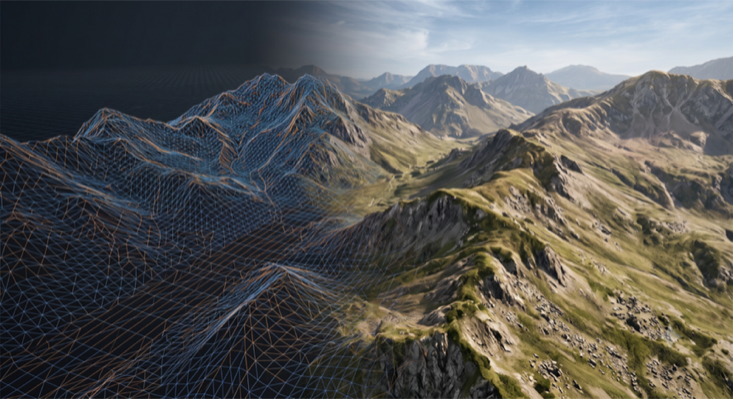

# Terrain (Strata)

Rewild's terrain is a **procedural, endless, heightmap world** that you can seed,
shape, paint and save. This document explains what the terrain system does,
feature by feature, and broadly how to use each part from the editor.

> **Where the name comes from.** _Strata_ was the milestone that built this
> system — the data-model "spine" the rest of the terrain roadmap sits on. That
> work has landed; this page is now the plain-English guide to what it delivers.

---

## The short version

- Every world has a **seed**, so each world is genuinely different — and always
  regenerates identically.
- Terrain shape is driven by **climate**: a temperature × moisture model decides
  which **biome** (plain, mountain, desert…) you're standing in, and biomes blend
  smoothly into one another.
- You can **sculpt** the ground (raise / lower / smooth / flatten) and **paint**
  which biome a patch of ground belongs to, directly in the editor.
- Biomes are drawn with **real per-biome materials** (grass, rock, snow, sand…)
  that blend by slope and height, with sharpened detail on distant hills.
- Anything you edit is **saved automatically** — local-first, and synced to the
  cloud once you're logged in. Anything you don't touch costs nothing to store.

---

## Seeded, endless worlds

Terrain has no edges — it generates forever as you move, in chunks, at several
levels of detail. Each world carries a single **seed** (an integer) that shifts
the entire world coherently. Two consequences:

- **Different seeds give different worlds.** Before, every "random" world was
  byte-for-byte identical; now a new seed is a genuinely new landscape.
- **The same seed always rebuilds the same world.** Move away and come back,
  reload the page, reopen tomorrow — the hills are exactly where you left them.
  This determinism is what makes saving edits possible (see
  [Saving & sync](#saving--sync)).

**How to use it.** When you create or edit a world, the editor's **seed dialog**
lets you set or change the seed. Changing the seed makes a different world, so
it will ask you to confirm — and any edits you'd saved to the old terrain are
discarded, because they no longer belong to the new ground.

---

## Climate & biomes

Terrain shape is not painted by hand — it's driven by a **climate model**. Two
slow-moving, large-scale fields, **temperature** and **moisture**, vary across
the world. Together they decide, for any point, which **biome** is active there:

- **Plain** — low, gentle, grassy.
- **Mountain** — tall, steep, snow-capped.
- **Desert** — dunes and sand.

Each biome has its own shaping settings (how tall, how rough, how the curve
bends), so a mountain region is dramatic and a plain is calm. Where two biomes
meet they **blend across a transition band** — a mountain eases down into a
plain rather than stopping at a hard line. Because climate varies over
kilometres and blends are smooth, you get large, believable regions rather than
patchwork.

Adding a new biome is a **table entry**, not new code — which is why plain,
mountain and desert could arrive one after another without re-architecting.

---

## Climate presets

The climate/biome tables are **game content, tuned in code**, not per-world data.
They're bundled as named **presets**. A world stores only _which_ preset it uses,
not a copy of the tables.

- Today there's a default preset; future presets are the door to "worlds back in
  time" — different eras with different climates.
- Because a world only references a preset, **re-tuning a preset in code reshapes
  every world that uses it** — except ground you've already sculpted, which stays
  frozen (see below).

**How to use it.** The editor lets you choose the climate model for a world. The
`hasTerrain` flag on a level gates whether terrain is generated at all, so a
scene can opt out of terrain entirely.

---

## Terrain sculpting

Once a world exists you can reshape the ground by hand in the editor with
**brush tools**:

- **Raise / Lower** — push ground up or pull it down under the brush.
- **Smooth** — average out bumps and jaggies.
- **Flatten** — level ground toward a target height.

Sculpting works on the **heightmap** — you're moving the surface up and down, not
carving caves or overhangs (those would need a very different, voxel-based
engine and are deliberately out of scope). Brushes affect a circular area sized
by the brush, and strokes that cross a chunk boundary correctly edit both
chunks so there's no seam.

**What happens when you sculpt.** The chunks you touch are saved as **snapshots**
(see [Saving & sync](#saving--sync)) and, from then on, that ground is loaded
from your saved edit instead of being regenerated. Your sculpt is permanent and
immune to later changes in the generation rules.

---

## Biome painting

Alongside sculpting you can **paint which biome a patch of ground belongs to**.
The key idea — and the reason it behaves so well — is that you're painting the
biome _input_, not the final texture:

- Paint a hillside as "mountain" and it isn't just given a rock texture — it
  adopts mountain's whole rulebook. **Raise a peak inside that painted region and
  it grows snow on its own**, because you told the ground _what it is_, not _what
  to draw_.
- Paint is **splat-only — it never changes the shape of the ground.** Sculpting
  says what shape the terrain is; painting says what it's made of. The two are
  independent: you can paint without sculpting and vice-versa.
- Painting blends. A brush stroke takes its share and lets the natural climate
  keep the rest, so painted regions ease into their surroundings rather than
  drawing hard cookie-cutter borders.

**What you can paint.** The palette is exactly the biomes of the world's current
climate preset — painting _within_ that set is free. (Painting a biome from a
different preset isn't supported; it's the one thing that keeps the tool scoped.)

**Cost.** Painting is cheap: no geometry moves, so nothing is re-meshed — a
stroke just re-computes the surface texture under the brush.

---

## Materials & surfaces

Biomes don't just drive shape — they drive **surface**. Each biome has its own
set of **material layers** (for example mountain uses rock, snow and dirt), and
the terrain shader picks between them by **slope and height**:

- Snow gathers near summits, rock shows on steep faces, dirt and grass settle in
  the valleys.
- Layers blend smoothly across biome borders and within a biome, so there are no
  hard texture lines.

Two extra touches keep it looking good at all distances:

- **Distance-sharpened normals.** Far-off hills used to flatten out as the GPU
  averaged their surface detail away. A larger-scale "macro" version of each
  surface now takes over with distance, so distant mountains stay dramatic and
  rocky instead of going smooth.
- **Parallax mapping** gives close-up surfaces real depth, so rock and sand read
  as bumpy rather than painted-on flat.

This is all **derived automatically** from the terrain — you don't author it
per-chunk. Materials themselves are game content, defined in code: the material
library and each biome's layer rules are the main levers a developer tunes — see
[Core API & tuning levers](#core-api--tuning-levers) below.

---

## Saving & sync

Terrain edits are saved **local-first**, then synced to the cloud when you log in.
The model is simple:

- **Unedited ground is never stored.** It regenerates deterministically from the
  seed + climate preset, so an endless world costs nothing until you touch it.
- **Editing a chunk saves a snapshot.** Sculpting saves the chunk's heights;
  painting saves a separate biome mask. Each is a small blob keyed to the level.
  Heights and paint freeze **independently** — sculpting a painted chunk keeps
  the paint, and painting a sculpted chunk keeps the shape.
- **Local-first, works offline / logged out.** Edits go straight to the browser's
  local storage (OPFS) immediately, with no server involved.
- **Sync is automatic once you're authenticated.** On save/publish (and on login)
  pending edits upload directly to cloud storage; anything on the server that's
  missing locally is pulled down. Re-editing a chunk overwrites the same stored
  object — latest edit wins.
- **Deleting a level cleans up its terrain**, so removed worlds don't leave
  orphaned chunk data behind.

A saved chunk is a **whole, frozen snapshot** — internally consistent and immune
to later changes in the generation algorithm or biome tuning. You sculpted it;
it stays.

---

## Core API & tuning levers

Terrain content — climates, biomes and materials — is **defined in code**, not in
per-world data. These are the tables a developer edits to change how terrain looks
and behaves. All live in `packages/rewild-renderer/lib/renderers/terrain/`.

**Materials** — `TerrainMaterials.ts` (`TERRAIN_MATERIALS`). Each named material is
a set of textures (albedo, normal, roughness, height) plus tuning knobs:

| Lever                                                | What it does                                                                                                                                                                                                                                                                 |
| ---------------------------------------------------- | ---------------------------------------------------------------------------------------------------------------------------------------------------------------------------------------------------------------------------------------------------------------------------- |
| `uvScale`                                            | Detail tiling — how many times the texture repeats per chunk.                                                                                                                                                                                                                |
| `heightScale`                                        | Parallax-occlusion depth. Bigger ⇒ deeper apparent relief; `0` turns parallax off.                                                                                                                                                                                           |
| `macroUvScale` / `macroNormalFrom` / `macroStrength` | The **distance-sharpening** knobs — a coarse "macro" normal that keeps distant surfaces from flattening out. `macroNormalFrom` can borrow another material's normal.                                                                                                         |
| `roughness` / `occlusionStrength`                    | Multipliers on the ARM map's roughness and occlusion channels, as glTF's `roughnessFactor` and `occlusionTexture.strength`. Roughness sets how tight the sun-glint is (wet rock vs. matte grass). Replaced `specular` / `shininess` when terrain adopted PBR in Lichen #202. |
| `blendDepth`                                         | Transition width to neighbouring materials — low (~0.2) = a hard interlocking edge, high (~0.7) = a soft crossfade.                                                                                                                                                          |
| `normalConvention`                                   | `'opengl'` or `'directx'` — **the common gotcha:** get it wrong and every bump reads as a dent. If one material looks "inset" while others look right, flip this.                                                                                                            |

**Biomes** — `Biomes.ts` (`PLAIN`, `MOUNTAIN`, `DESERT`, …). A biome is a
**deformation stack** (what shapes its ground — amplitude, curve) plus a list of
**layers**. Each layer names a material and the rule that selects it:

- `slope` — degrees from horizontal (rock on steep faces).
- `height` — absolute world metres (snow near summits).
- `noise` — organic patches independent of the terrain's shape (litter over soil).

The first layer is the biome's base and covers everything the others don't.
**Adding a material to a biome, or a whole new biome, is a table edit here** — no
new code.

**Climate presets & world settings** — a climate preset bundles the biomes and the
temperature/moisture model; a world stores only _which_ preset it uses plus its
`seed`, both set from the editor. The palette ceiling is `MAX_SPLAT_LAYERS = 8`
simultaneously-visible materials.

## Debugger / console functions

Scene-pass GPU timing and the chunk-snapshot round-trip tools are console commands
— see [Debugger & Console Commands](../debug-commands.md#terrain). The shadow,
sky and material tools on that page all apply to terrain too, since terrain draws
through the main scene pass and shades through the same PBR path as everything
else.

---

## What's not here (yet)

- **Caves, overhangs, arches** — the terrain is a heightmap by design; these need
  a voxel engine.
- **Water, sea level, oceans.**
- **Object scatter** (trees, rocks placed by the generator).
- **Direct-material painting** — painting a bare material (a pond bed, a worn
  path) with no biome behind it. Biome painting has landed; this is the other
  half, and the tools are already built to grow into it.
- **Roads / linear features**, and **undo/redo history** for the brushes.
- **More climate presets** (eras / time-travel worlds) — additive on top of the
  preset system.

---

## Related docs

- [Sky Rendering](../sky-rendering.md) and [Weather System](../weather.md) — the
  atmosphere the terrain sits under.
- [Lighting (Foxfire)](./foxfire-lighting.md) — how the world is lit and shadowed.
