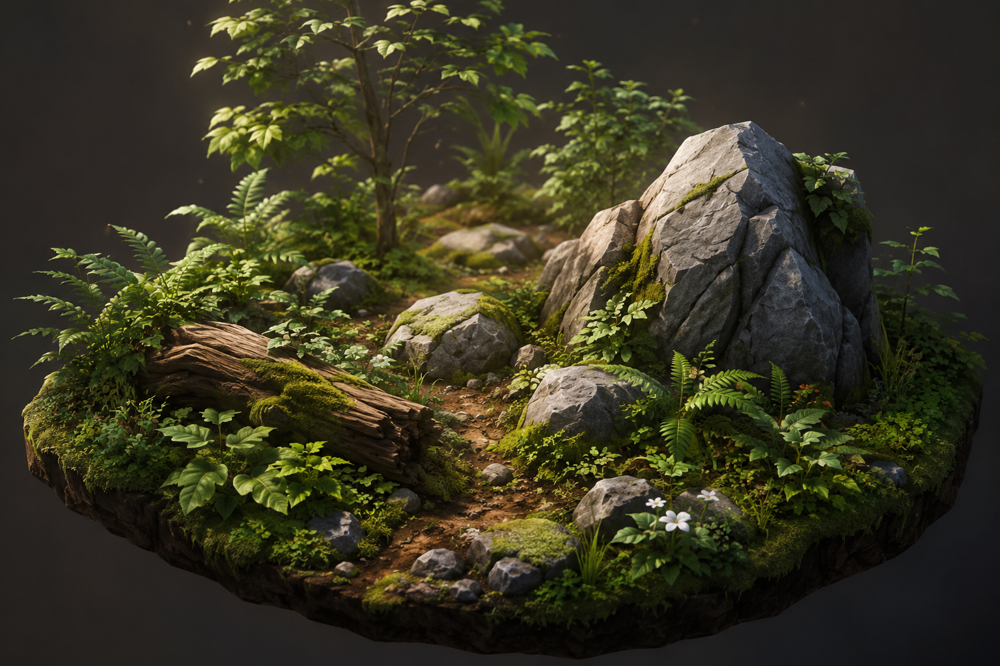

# Understory — Objects, Scatter & Foliage

> Successor to **Lichen**. Where Foxfire decided how the world is _lit_ and Lichen decided what
> the light _lands on_, _Understory_ — the living layer between bare ground and canopy — decides
> what actually **stands on** the terrain.

## Overview

Rewild has an endless, sculptable, biome-driven world ([Strata](./strata.md)) shaded by a single
physical material model ([Lichen](./lichen.md)). What it does not have is anything growing on it.

Three gaps hold that back:

- **The glTF importer is a stub.** [`core/GltfLoader.ts`](../../packages/rewild-renderer/lib/core/GltfLoader.ts)
  is 75 lines that take `meshes[0].primitives[0]`, ignore node transforms entirely, and never look
  at glTF materials. A model with two materials, a parented part, or a normal map that needs
  tangents cannot be loaded. Lichen deferred this here by name.
- **There is no scatter system.** Every object in a level is an actor placed by hand, one draw
  call each. `StandardInstancedPass` exists and was built for this — its own header says _"a field
  of ferns is one draw, not one per blade"_ — but nothing produces the instance lists.
- **Placement stores absolute Y.** `PropertyTemplates.position` is a world-space vec3, so sculpting
  the ground leaves everything on it floating or buried, with no mechanism to notice.

Understory closes all three. It brings glTF models in properly, generates vegetation from the
biome tables the same way Strata generates surfaces, lets an author paint scatter where the biome
would not have put it, streams physics colliders around the player, and makes foliage move in the
wind the weather system is already simulating.

**The organising idea is Strata's, applied to objects:** an instance's existence and its height are
_derived_, not stored. Unedited scatter costs nothing to save. A sculpt does not need a fix-up pass,
because there is no stored Y to fix up.

---

## Goals

- **A real glTF importer** — node hierarchy with transforms, multi-primitive meshes as
  multi-material submeshes, tangents, GLB-embedded textures, and `standard` materials created
  automatically from the file's own material definitions.
- **Terrain-relative placement.** Objects store `(x, z, yOffset)` plus a `conform` flag; Y is
  derived from the heightfield at chunk build. Sculpting re-places everything for free.
- **Biome-driven scatter.** A scatter-layer library and per-biome placement rules, reusing the
  `SelectorBand` / `NoiseSelector` vocabulary the material layers already use. Adding vegetation to
  a biome is a table edit.
- **One draw per layer per chunk**, through `StandardInstancedPass` — including in the shadow pass,
  which draws the same instance buffer through its own depth-only vertex stage.
- **Distance LOD with impostors**, so a forest reaches the horizon instead of ending at 200m.
- **A scatter brush** in the editor whose palette is the _whole_ layer library, so an author can
  paint a pine grove into a desert.
- **Streamed physics.** Colliders activate in a distance band around the player against a fixed
  budget, using proxy shapes authored on the layer rather than the render mesh.
- **Foliage that moves**, driven by the weather system's existing wind state and per-vertex bend
  weights, with no new vertex attribute and no new shading model.

---

## Key technical decisions

| Decision                | Choice                                                                     | Why                                                                                                                                                                                                                             |
| ----------------------- | -------------------------------------------------------------------------- | ------------------------------------------------------------------------------------------------------------------------------------------------------------------------------------------------------------------------------- |
| Object Y                | **Derived from the heightfield**, never stored                             | A stored Y must be fixed up on sculpt, on snapshot load, on seed change and on preset re-tune — four places to forget. A derived Y is correct in all four by construction. See [Placement](#placement-conform-not-coordinates). |
| Scatter generation      | **Pure function of (seed, chunk, biome weights, heights)**                 | Same contract as terrain. Unedited scatter stores nothing, regenerates identically, and needs no sync.                                                                                                                          |
| Where scatter runs      | **In the terrain worker**, beside mesh generation                          | The heightfield and resolved layer weights are already there. Doing it on the main thread would mean shipping both back.                                                                                                        |
| Painted scatter storage | **A `PaintMask` with layer-slot channels**, not stored instance transforms | `PaintMask` is already "N channels of u8 weight" and its header anticipates a third user. A mask is ~3.7KB/channel/chunk and keeps instances derived; transforms would be ~8 bytes each and break that.                         |
| Paint palette           | **The whole scatter-layer library**, not the biome's subset                | Deliberately wider than Strata's biome painter. Painting a layer the biome never emits _is_ the answer to non-biome mass placement — no special case.                                                                           |
| Scatter layer content   | **A code table** (`ScatterLayers.ts`), like `TERRAIN_MATERIALS`            | A layer is a model _plus_ LOD chain, impostor, collider proxy, jitter ranges and wind params. That is authored content, not a raw template.                                                                                     |
| Instanced draw          | **Per chunk, per layer**                                                   | Gives frustum culling a chunk-sized granularity for free and keeps instance buffers aligned to the streaming unit that already exists.                                                                                          |
| Far LOD                 | **Octahedral impostors**                                                   | The single biggest range lever. Mesh LODs alone cannot carry a forest to the horizon at web budgets.                                                                                                                            |
| Collider shapes         | **Authored proxies on the layer**                                          | A trunk capsule, not a trimesh of a 40k-triangle tree. The `physics.shape` block in `template-library.json` is already the right shape for this.                                                                                |
| Collider eviction       | **Distance bands with hysteresis**, not frustum                            | Frustum eviction deletes the tree you are leaning on when you turn around. Distance is view-independent and stable.                                                                                                             |
| Wind                    | **Vertex-stage only**, driven by `COLOR_0` bend weights                    | Wind never reaches `shadeStandardSurface()`, so this is a vertex variant of an existing pass, not a new shading model. And `COLOR_0` is already plumbed end to end.                                                             |
| Wind inputs             | **The weather system's `windiness` / `windDirection`**                     | Already exist on `SkyRenderer`. Foliage tracks the weather with nothing to author — the same free ride Lichen took with ambient.                                                                                                |
| Foliage transparency    | **`MASK` cutout, never `BLEND`**                                           | Cutout is order-independent, which is the whole point. Lichen #196 already shipped `alphaMode` / `alphaCutoff` / `doubleSided`.                                                                                                 |

---

## Architecture sketch

```
templates/ ──▶ GltfImporter ──┬─▶ Geometry (+ tangents, COLOR_0 bend weights)
  (.glb)                      ├─▶ submeshes  (one per primitive)
                              └─▶ standard materials (auto-created, Lichen schema)
                                        │
                                        ▼
                              ScatterLayers.ts ──── model + LOD chain + impostor
                                        │             + collider proxy + wind params
                    ┌───────────────────┤
                    │                   │
              Biomes.ts            scatter density
          (density + slope/          PaintMask
           height/noise rules)     (author override)
                    │                   │
                    └────────┬──────────┘
                             ▼
        ┌────────── terrain worker: scatterChunk() ──────────┐
        │  heights ─┐                                        │
        │  layer    ├─▶ deterministic placement ─▶ instances │
        │  weights ─┘   (position, yaw, scale, phase)        │
        └────────────────────────┬───────────────────────────┘
                                 │  per chunk, per layer
                 ┌───────────────┼────────────────┬────────────────┐
                 ▼               ▼                ▼                ▼
        instance buffer    SceneBVH cull    collider band     shadow pass
                 │          (chunk-level)    (distance +       (instanced)
                 ▼                            hysteresis)
        StandardInstancedPass ──▶ wind vertex variant ──▶ shadeStandardSurface()
                 │                                              (unchanged)
                 ▼
        LOD tier: mesh ▸ mesh ▸ impostor ▸ cull   (cross-faded)
```

The shape worth noticing: **nothing downstream of `scatterChunk()` knows whether an instance came
from a biome rule or from a painted mask.** Rendering, culling, LOD and physics see one instance
list. That is what makes non-biome mass placement fall out for free rather than needing a parallel
system.

---

## Phases & issues

This section is the **running order**. Phases run in sequence; within a phase, anything without a
listed dependency can be picked up in parallel.

The tables below are the authoritative running order — the
[milestone board](https://github.com/MKHenson/rewild/milestone/6) itself is unordered, though each
issue names its own prerequisites.

Phase 1 is the unblocker — no model more complex than a single-material box can enter the engine
until it lands. Phase 2 is small but deliberately early: building scatter on derived Y from day one
is much cheaper than retrofitting it.

### Phase 1 — The glTF importer

| #                                                     | Issue                                                                                                                                | Depends on                                                                                                   |
| ----------------------------------------------------- | ------------------------------------------------------------------------------------------------------------------------------------ | ------------------------------------------------------------------------------------------------------------ |
| [#209](https://github.com/MKHenson/rewild/issues/209) | Walk the glTF node hierarchy and apply node transforms; multi-primitive meshes become multi-material submeshes                       | —                                                                                                            |
| [#210](https://github.com/MKHenson/rewild/issues/210) | Import `TANGENT`, and generate tangents from UVs when the file omits them (normal maps are wrong without them)                       | [#209](https://github.com/MKHenson/rewild/issues/209)                                                        |
| [#211](https://github.com/MKHenson/rewild/issues/211) | Extract GLB-embedded textures into the texture manager, taking sampler state and colour space from the glTF rather than the filename | —                                                                                                            |
| [#212](https://github.com/MKHenson/rewild/issues/212) | Auto-create `standard` materials from glTF material definitions, mapping metallic-roughness onto Lichen's schema                     | [#209](https://github.com/MKHenson/rewild/issues/209), [#211](https://github.com/MKHenson/rewild/issues/211) |

### Phase 2 — Terrain-relative placement

| #                                                     | Issue                                                                                                                          | Depends on                                            |
| ----------------------------------------------------- | ------------------------------------------------------------------------------------------------------------------------------ | ----------------------------------------------------- |
| [#213](https://github.com/MKHenson/rewild/issues/213) | `conform`, `alignToNormal` and `yOffset` on placed objects; Y derived from the heightfield instead of stored                   | —                                                     |
| [#214](https://github.com/MKHenson/rewild/issues/214) | Drag-drop placement and the existing actor library adopt conformed placement; migrate levels that store an absolute `position` | [#213](https://github.com/MKHenson/rewild/issues/213) |
| [#215](https://github.com/MKHenson/rewild/issues/215) | Re-derive conformed transforms whenever a chunk's heights change — sculpt, snapshot load, seed change, preset re-tune          | [#213](https://github.com/MKHenson/rewild/issues/213) |

### Phase 3 — Scatter core

| #                                                     | Issue                                                                                                                         | Depends on                                            |
| ----------------------------------------------------- | ----------------------------------------------------------------------------------------------------------------------------- | ----------------------------------------------------- |
| [#216](https://github.com/MKHenson/rewild/issues/216) | `ScatterLayers.ts` — the layer library: model, LOD chain, impostor, collider proxy, scale/yaw jitter ranges, wind params      | [#209](https://github.com/MKHenson/rewild/issues/209) |
| [#217](https://github.com/MKHenson/rewild/issues/217) | Per-biome scatter rules in `Biomes.ts` — density plus `slope` / `height` / `noise` selectors, reusing the existing vocabulary | [#216](https://github.com/MKHenson/rewild/issues/216) |
| [#218](https://github.com/MKHenson/rewild/issues/218) | Deterministic `scatterChunk()` in the terrain worker; per-chunk, per-layer instance lists from seed + heights + layer weights | [#217](https://github.com/MKHenson/rewild/issues/217) |
| [#219](https://github.com/MKHenson/rewild/issues/219) | Per-chunk instanced draw through `StandardInstancedPass`                                                                      | [#218](https://github.com/MKHenson/rewild/issues/218) |
| [#220](https://github.com/MKHenson/rewild/issues/220) | Instanced path in `DirectionalShadowRenderer` — without it a forest casts no shadows, or one draw per tree                    | [#219](https://github.com/MKHenson/rewild/issues/219) |

### Phase 4 — LOD & culling

| #                                                     | Issue                                                                                             | Depends on                                            |
| ----------------------------------------------------- | ------------------------------------------------------------------------------------------------- | ----------------------------------------------------- |
| [#221](https://github.com/MKHenson/rewild/issues/221) | Per-layer mesh LOD chain with distance-based tier selection                                       | [#219](https://github.com/MKHenson/rewild/issues/219) |
| [#222](https://github.com/MKHenson/rewild/issues/222) | Octahedral impostor bake and the far tier that draws it                                           | [#221](https://github.com/MKHenson/rewild/issues/221) |
| [#223](https://github.com/MKHenson/rewild/issues/223) | Chunk-level instance culling through `SceneBVH`, and cross-fade between LOD tiers to kill the pop | [#222](https://github.com/MKHenson/rewild/issues/222) |

### Phase 5 — The editor's scatter brush

| #                                                     | Issue                                                                                                          | Depends on                                            |
| ----------------------------------------------------- | -------------------------------------------------------------------------------------------------------------- | ----------------------------------------------------- |
| [#224](https://github.com/MKHenson/rewild/issues/224) | Scatter density mask as a third `PaintMask` user — channels are layer slots, overriding the _input_ to scatter | [#218](https://github.com/MKHenson/rewild/issues/218) |
| [#225](https://github.com/MKHenson/rewild/issues/225) | Scatter brush toolbar — paint / erase / exclude, brush size and strength, palette drawn from the whole library | [#224](https://github.com/MKHenson/rewild/issues/224) |
| [#226](https://github.com/MKHenson/rewild/issues/226) | Per-instance kill-set so an author can pluck one tree; persisted and synced beside the height and paint blobs  | [#224](https://github.com/MKHenson/rewild/issues/224) |

### Phase 6 — Physics streaming

| #                                                     | Issue                                                                                                     | Depends on                                                                                                   |
| ----------------------------------------------------- | --------------------------------------------------------------------------------------------------------- | ------------------------------------------------------------------------------------------------------------ |
| [#227](https://github.com/MKHenson/rewild/issues/227) | Authored collider proxies on scatter layers, following `template-library.json`'s existing `physics.shape` | [#216](https://github.com/MKHenson/rewild/issues/216)                                                        |
| [#228](https://github.com/MKHenson/rewild/issues/228) | Distance-banded collider activation with hysteresis and a hard collider budget                            | [#227](https://github.com/MKHenson/rewild/issues/227), [#218](https://github.com/MKHenson/rewild/issues/218) |

### Phase 7 — Foliage

| #                                                     | Issue                                                                                                           | Depends on                                            |
| ----------------------------------------------------- | --------------------------------------------------------------------------------------------------------------- | ----------------------------------------------------- |
| [#229](https://github.com/MKHenson/rewild/issues/229) | Wind vertex variant — `COLOR_0` bend weights × weather wind × per-instance phase, applied in scene _and_ shadow | [#220](https://github.com/MKHenson/rewild/issues/220) |
| [#230](https://github.com/MKHenson/rewild/issues/230) | Alpha mip erosion — mip-aware cutoff rescale or alpha-to-coverage, so distant grass stops thinning away         | [#219](https://github.com/MKHenson/rewild/issues/219) |
| [#231](https://github.com/MKHenson/rewild/issues/231) | Foliage normals blended toward terrain-up, plus the scatter debug commands                                      | [#229](https://github.com/MKHenson/rewild/issues/229) |

**Worth pulling forward:** [#220](https://github.com/MKHenson/rewild/issues/220) is listed in
Phase 3 but is the prerequisite for [#229](https://github.com/MKHenson/rewild/issues/229) in
Phase 7, and a forest without shadows reads as wrong long before anyone notices the wind.
[#230](https://github.com/MKHenson/rewild/issues/230) is independent of everything after
[#219](https://github.com/MKHenson/rewild/issues/219) and can be picked up any time the grass
starts vanishing.

**This is a larger milestone than Strata (17) or Lichen (17).** If it needs cutting, phases 6 and 7
are the clean break — everything through Phase 5 is a complete, usable feature.

---

## Placement: conform, not coordinates

The engine already knows how to drop an object on the ground.
[`WorldPlacement.ts`](../../src/ui/application/project-editor/editors/utils/WorldPlacement.ts) has
`raycastToSurface`, `placeOnSurface` and `computeRotationFromNormal` — a down-ray, a hit point, and
a quaternion from the surface normal. Drag-drop uses it today.

The problem is not placement. It is **what gets stored**. `PropertyTemplates.position` is an
absolute vec3, so the instant the ground moves under an object, the object is wrong — and nothing
knows.

The obvious fix is a re-placement pass that runs after a sculpt. That fix is wrong, because a sculpt
is only one of four ways the ground changes: loading a chunk snapshot, changing the world seed, and
re-tuning a climate preset in code all move it too. Four call sites, four chances to forget one, and
the symptom (a tree hovering a metre up, three chunks away) is exactly the kind of thing nobody
notices until a screenshot.

**So Understory does not store Y.** A conformed object stores:

| Field           | Meaning                                                                                                     |
| --------------- | ----------------------------------------------------------------------------------------------------------- |
| `x`, `z`        | World position on the horizontal plane. The only position data that is authoritative.                       |
| `yOffset`       | Metres above the sampled surface. Usually 0, or half the object's height for something resting on its base. |
| `conform`       | Whether Y is derived at all. `false` restores today's absolute behaviour.                                   |
| `alignToNormal` | 0 → always upright (trees, fence posts); 1 → fully aligned to the slope (boulders, fallen logs).            |

Y is then evaluated from the heightfield at chunk build. Sculpt the ground and everything on it
moves with it — not because a pass ran, but because there was never a stale number to correct. The
same mechanism covers snapshot loads, seed changes and preset re-tunes without a line of extra code.

Two escape hatches the doc commits to:

- **`conform: false`** for anything that must stay world-locked regardless of the ground. Absolute
  placement stays available; the editor does not choose it, because an object left behind by rising
  ground is a bug far more often than an intent.
- **Dynamic rigid bodies conform at spawn only.** After that Rapier owns the transform —
  `RigidBodyBehaviour.onUpdate` already writes it every frame — and re-deriving Y under a body would
  fight the solver. Fixed and static bodies conform normally.

The same rule governs hand-placed actors and scattered instances alike, which is the point: one
placement model, not two.

### The raycast is a tool; `conform` is a contract

These are separate concerns, and conflating them is the trap.

An author placing a crate on a platform still does not want to type coordinates — and does not have
to. `raycastToSurface` already casts against the **whole scene**, not just terrain, and takes an
exclusion list. Drag a crate onto a platform and the drop lands it on the platform's surface with
the right Y, exactly as it does today. That convenience is unconditional and applies to every
object, conformed or not.

What differs is what gets **stored**.

A crate dropped on a platform stores `conform: true`, with its `yOffset` measured **against the
terrain, not against the platform**. The platform is anchored to the terrain too, so raising the
ground lifts both by the same amount and the crate stays sitting on it. Nothing has to know the
platform exists.

That indirection is what makes it safe. Conforming *to* arbitrary geometry would mean tracking a
dependency the engine cannot maintain: if the platform is moved, re-scaled or deleted, nothing
re-derives the crate. Re-anchoring both ends to the heightfield needs no dependency at all, because
the heightfield is re-sampled at chunk build — a trigger that already exists and fires on every path
that changes the ground. Arbitrary scene geometry has no equivalent, and inventing one — a
dependency graph between placed objects — is a much larger feature than this milestone wants.

It is an approximation, and holds while the ground moves by the same amount under both, which is the
ordinary case for a brush wider than the object. A sculpt gradient running across the gap between
them pulls them apart, and neither follows a platform dragged by hand.

Alignment keys off the surface rather than the heightfield: only terrain drops tilt to the slope, so
a crate keeps its platform's orientation rather than tipping to match ground it is not touching.

`conform: false` covers a placement made where no heights are resident. With nothing to measure an
offset against, claiming one would resolve to `yOffset` 0 and drop the object to the ground the
moment its chunk arrived.

So:

| Dropped on     | Y at placement time | Stored as                                     |
| -------------- | ------------------- | --------------------------------------------- |
| Terrain        | Raycast hit         | `conform: true` + `yOffset`, aligned to slope |
| Another object | Raycast hit         | `conform: true` + `yOffset`, no tilt          |
| No heights yet | Raycast hit         | `conform: false` + absolute Y                 |

The Properties panel keeps its numeric vec3 throughout, so an absolute object can be nudged by hand
to whatever the artistic intent requires. `conform` is a checkbox beside it, not a mode the author
has to think about before placing something.

---

## Scatter: one instance list, two sources

Scatter has to serve two jobs that look unrelated and are not:

1. **"Forests grow in temperate wet regions."** A rule, applied over unlimited terrain, that should
   cost nothing to store.
2. **"I want a pine grove _here_, in the desert."** An author's specific intent, which the rules
   would never produce.

Building these as separate systems would mean two instance formats, two culling paths, two LOD
implementations and two physics registrations. Understory builds one:

```
instances(chunk, layer) = place(seed, chunk, heights, biomeDensity(layer) ⊕ paintedDensity(layer))
```

Both sources feed the **same input** — a density field — and the generator runs once. Downstream,
nothing can tell them apart.

**Why a density mask rather than stored instance transforms.** The instinct is to store the trees
the author painted: position, yaw, scale, per instance. At roughly 8 bytes quantised, a thousand
painted trees is 8KB per chunk, which is affordable but wrong in a subtler way — it breaks the
"instances are derived" contract, so painted trees stop tracking a sculpt, stop responding to a
layer's jitter ranges being re-tuned, and need their own migration story.

A density mask keeps the contract. And the container already exists:
[`PaintMask`](../../packages/rewild-renderer/lib/renderers/terrain/PaintMask.ts) is deliberately
generic — "N channels of u8 weight over a square grid at a stated resolution" — and its own header
anticipates a third user. Scatter density is exactly that: channels are layer slots, at a coarser
`step` than the biome mask because density is a low-frequency field. That is one format, one
sampler, one serialiser and one brush shared with the biome painter, and it lands in the same
per-chunk blob that already syncs through [Mycelium](./mycelium-network.md).

**The palette is the whole library, not the biome's subset.** Strata constrains biome painting to
the current preset's biomes, because a biome is a whole rulebook and painting one from another
preset is meaningless. Scatter deliberately goes the other way: every layer in `ScatterLayers.ts` is
paintable anywhere. Painting a layer the local biome never emits is not a special case in the code —
it is the ordinary case with a biome density of zero.

**Removal gets its own small blob.** Painting density to zero clears an area, which handles
clearings, building sites and paths. Deleting _one specific_ tree cannot be expressed in a
low-frequency mask, so a per-chunk kill-set of instance ids covers it — small, sparse, and only
allocated for chunks where someone actually plucked something.

---

## Foliage & wind

Foliage is where scatter earns its keep: a scatter system with no grass in it is one you cannot
judge. Most of what it needs shipped in Lichen #196 — `alphaMode: MASK`, `alphaCutoff` and
`doubleSided` are the cutout leaves want.

**Cutout has no depth-ordering problem.** That is the reason to use `MASK` over `BLEND`: an
alpha-tested fragment either writes depth or does not exist, so leaves sort correctly against each
other and against the world with no per-instance sorting whatsoever. The real foliage problems are
different ones:

- **Mip alpha erosion.** Averaging alpha down the mip chain drives more and more texels below the
  cutoff, so distant grass thins out and then vanishes. Fixed by rescaling the cutoff per mip level
  or by alpha-to-coverage ([#230](https://github.com/MKHenson/rewild/issues/230)).
- **LOD popping**, which is a transition problem, solved by the cross-fade in [#223](https://github.com/MKHenson/rewild/issues/223).
- **Dark blades.** A grass card's geometric normal faces sideways, so it shades as though it were a
  wall. Blending the normal toward terrain-up is the standard fix ([#231](https://github.com/MKHenson/rewild/issues/231)).

**Wind is cheaper than it looks, for two reasons.**

First, **the bend weight needs no new vertex attribute.** `COLOR_0` is already plumbed end to end:
[`Geometry.colors`](../../packages/rewild-renderer/lib/geometry/Geometry.ts) carries it, the
geometry builder uploads it as a GPU buffer, and the importer already normalises all six glTF
encodings into float RGBA. An artist weight-paints stiffness in Blender — trunk base 0, branch tips
1 — and it arrives with the model. The channel convention:

| Channel | Meaning                                                             |
| ------- | ------------------------------------------------------------------- |
| **R**   | Bend weight. 0 = rigid (trunk), 1 = free (leaf tip).                |
| **G**   | Phase offset, so clusters on one tree do not sway in lockstep.      |
| **B**   | Flutter amount — high-frequency per-leaf motion on top of the sway. |

Second, **wind is purely vertex-stage.** It displaces a position and never reaches
`shadeStandardSurface()`, which Lichen made the single funnel for every lit surface. So this is a
_vertex variant_ of `standard-instanced`, not a new shading model, and shading stays identical to
everything else in the world by construction:

```
worldPos += windVector(time, windiness, windDirection) * bend² * phase(instanceId, COLOR_0.g)
```

`windiness` and `windDirection` are already weather state on `SkyRenderer`, so foliage responds to a
storm rolling in with nothing to author — the same trick Lichen used to get ambient from the sky.

Three costs stated rather than discovered:

- **The shadow pass needs the same displacement**, or shadows stay rigid while the geometry sways.
  That pass needs instancing anyway ([#220](https://github.com/MKHenson/rewild/issues/220)), so it is one piece of work, not two.
- **Normals are not rotated by the bend.** Correct-ish; nobody has ever noticed a leaf's normal
  lagging its position.
- **`COLOR_0` cannot be both a tint and a bend weight** on the same mesh. For foliage materials,
  bend wins — `vertexColors` tinting and wind are mutually exclusive, declared here rather than
  discovered as a bug.

---

## Scope boundary with Sinew

The line is drawn at **whether the mesh deforms per-vertex from data**:

- **Understory** imports and draws **static** meshes. A rigged model loads as its bind pose; its
  skin weights and animation channels are parsed-and-ignored, not rejected. Foliage wind is a
  procedural vertex offset from a painted weight — no skeleton, no joint matrices, no clips.
- **Sinew** owns skinning: joint hierarchies, skin matrix palettes, glTF animation sampling, and
  blending. Understory's instance buffer is deliberately a plain transform array so that a skinned
  instanced path is an addition rather than a rewrite.

The practical test: if it needs a bone, it is Sinew.

---

## Performance notes (web budget)

- **Draw calls are the budget that matters.** A chunk with six scatter layers is six draws
  regardless of instance count. The failure mode is not triangles — it is a thousand single-instance
  draws, which is exactly what `StandardInstancedPass` was built to prevent.
- **Impostors are the range lever, not LOD meshes.** Mesh LODs buy maybe 2–3× before vertex cost
  wins. A billboard tier is what makes the horizon affordable, which is why [#222](https://github.com/MKHenson/rewild/issues/222) is not optional
  polish.
- **Scatter generation is worker-side and amortised**, riding the chunk streaming that already
  exists in `TerrainWorkerPool`. It must stay allocation-free in its inner loop — see the same
  constraint the deformation switch in `Noise.ts` documents.
- **Alpha-tested foliage disables early-Z** for the fragments it covers. There is no depth prepass
  in the renderer today, so the cost is straightforward overdraw, worst at ground level looking
  through grass. The impostor tier caps it.
- **Physics is the hard cap.** Rapier colliders are not free at any count, and a forest has
  effectively unbounded trees. The band is a **budget**, not a radius — when the budget is hit,
  nearer colliders win and further ones stay unregistered.
- **No new per-frame compute passes**, consistent with Foxfire and Lichen. Instance buffers are
  rebuilt on chunk load, not per frame.

---

## Debugger / console functions

Following the existing conventions in `src/core/debug/`:

| Function                             | What it does                                                                                                        |
| ------------------------------------ | ------------------------------------------------------------------------------------------------------------------- |
| `showScatterStats()`                 | Per-frame instance count, draw count and LOD-tier breakdown by layer — the first thing to look at when frames drop. |
| `setScatterLayerEnabled(name, bool)` | Toggle one layer scene-wide. Isolates which layer is costing what.                                                  |
| `setScatterLodBias(n)`               | Push every layer up or down its LOD chain, to see the impostor tier up close or force full meshes to the horizon.   |
| `showScatterLodTiers()`              | Colour instances by LOD tier — makes transition distances and pop-through visible rather than arguable.             |
| `showColliderBands()`                | Draw the physics activation and deactivation radii, and which instances currently hold a collider.                  |
| `setWindOverride(strength, dirDeg)`  | Force wind independently of the weather, to tune bend weights without waiting for a storm.                          |
| `showBendWeights()`                  | Render `COLOR_0.r` as colour, so a badly weight-painted model is obvious the moment it loads.                       |
