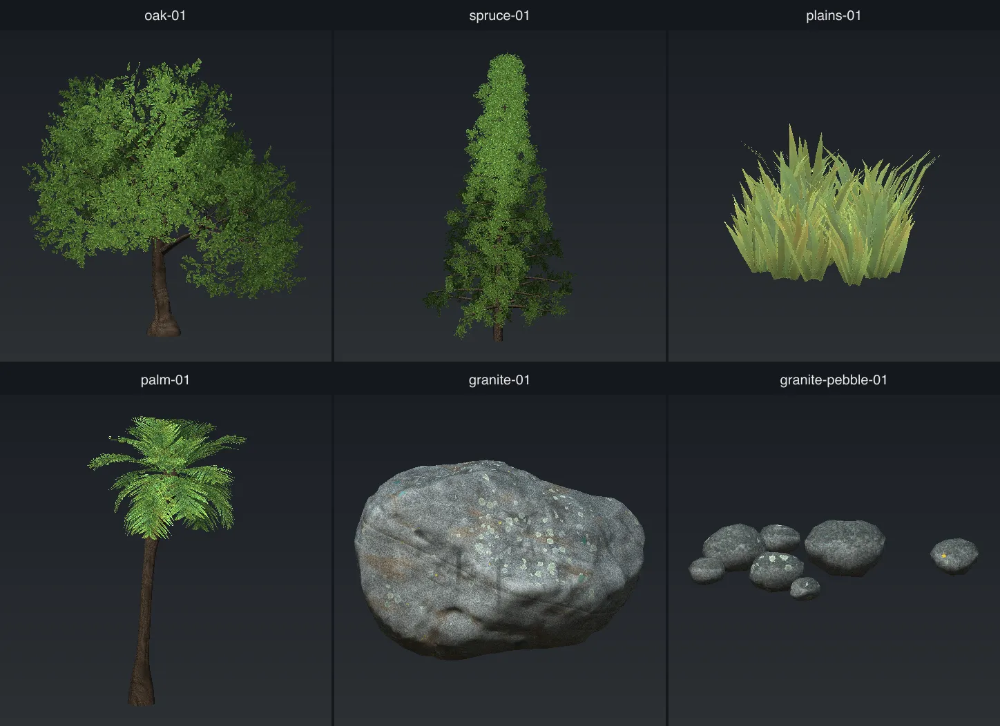

# scatter-forge

scatter-forge makes the models that the [Understory](../milestones/understory.md) scatter system
places in the world: trees, grass, palms, ferns, rocks and pebbles.

You give it one JSON config file. It writes a glTF model, the textures for that model and the
registry entries the engine needs to place it. The same config and the same seed always make the
same model. This lets you make many variants of one species quickly.

The tool is in [`tools/scatter-forge/`](../../tools/scatter-forge/).



## Types

The `type` key selects what the tool grows. A type is a structure, not a species. An oak and a
birch are the same type with different keys.

| `type`  | What it grows | Use it for | Page |
| ------- | ------------- | ---------- | ---- |
| `tree`  | A trunk that branches, with leaf cards on the outer branches. This is the default type. | Oak, birch, poplar, shrubs and conifers | [Trees](tree.md) |
| `clump` | Cards that come out of one point on the ground. It has no stem. | Grass, clover, wildflowers, reeds | [Clumps](clump.md) |
| `crown` | One stem with a ring of long, curved cards at the top. The stem can be 0m tall. | Palms, ferns, cycads | [Crowns](crown.md) |
| `rock`  | One solid stone with a baked texture. It has no cards. | Boulders, cobbles | [Rocks](rock.md) |
| `pebble` | Many small stones in one model. | Pebbles, gravel, scree | [Pebbles](pebble.md) |

Each type has its own keys. If you set a key that belongs to a different type, the run stops and
tells you which type uses that key.

## Other pages

- [Accents](accents.md): extra cards such as fruit, catkins, spires and dead fronds.
- [In the game](in-game.md): the keys that control how the engine places and draws the model, and
  how to add a model to the world.
- [Authored art](authored-art.md): how to use your own bark, leaf, grass and frond images.

## Run it

You need **node 22.18 or newer**. Node runs the TypeScript source directly, so there is no build
step. On an older node, the tool does not start and shows an error about the file extension.

```
node tools/scatter-forge/cli.ts tools/scatter-forge/templates/oak-01.json
node tools/scatter-forge/cli.ts tools/scatter-forge/templates/oak-01.json --watch
node tools/scatter-forge/cli.ts tools/scatter-forge/templates/oak-01.json --write-template
node tools/scatter-forge/cli.ts --help
```

- `--watch` builds the model again each time you save the file.
- `--write-template` adds the model to `templates/geometries.json` and
  `templates/scatter-layers.json`. See [In the game](in-game.md#add-a-model-to-the-world).
- `--help` lists every key, its default value and the types that use it.

All other options are keys in the config file. `name` is the only required key.

## Make a model

1. Copy a template from [`tools/scatter-forge/templates/`](../../tools/scatter-forge/templates/)
   that is near to what you want. Give it a new `name`.
2. Set `"preview": 1024` so the run writes a preview image.
3. Run the tool with `--watch`.
4. Change a key, save the file and look at the preview. Do this again until the model looks
   correct.
5. Run the tool once with `--write-template`, then add a biome rule. See
   [In the game](in-game.md#add-a-model-to-the-world).

### The seed

The keys set the species. The `seed` selects one plant or stone of that species.

- If the config has no `seed`, each run makes a different model. The run prints the seed it used.
- To keep a model that you like, copy that seed into the config.
- With `--watch`, the seed stays the same for the full session. Only the keys that you change have
  an effect.

All templates set a seed.

### The sidecar file

Each run writes `<name>.forge.json` next to the model. This is the **sidecar**. It holds every key
that made the model, including the seed. To make the same model again, or to change it, run the
tool on the sidecar:

```
node tools/scatter-forge/cli.ts assets/shared/nature/trees/oak/oak-01.forge.json
```

A run never changes a template file. It only writes the sidecar.

### Errors

The tool stops if a key is unknown, if a value is out of its range, or if a key belongs to a
different type. The message tells you what is wrong. A key that was removed from the tool is
ignored, so an old sidecar still opens.

## What a run writes

The files go into `<out>/<textureSet>/`. The default `out` for each type is:

| Type | Folder |
| ---- | ------ |
| `tree` | `assets/shared/nature/trees` |
| `clump` | `assets/shared/nature/clumps` |
| `crown` | `assets/shared/nature/crowns` |
| `rock` | `assets/shared/nature/rocks` |
| `pebble` | `assets/shared/nature/pebbles` |

| File | What it is |
| ---- | ---------- |
| `<name>.glb` | The model. |
| `<name>.lod1.glb`, `<name>.lod2.glb` | Simpler versions of the model for far distances. Only when `lods` is set. |
| `<name>.forge.json` | The sidecar. |
| `<name>.preview.png` | A preview image from four sides. Only when `preview` is set. |
| `<name>.lods.preview.png` | The model next to each LOD tier. Only when `preview` and `lods` are set. |
| `<set>_<piece>_diff.webp` and others | The textures. |
| `<set>.textures.json` | A record of how the textures were made. Variants that share the textures read it. |

A **piece** is one part of the model with its own material and its own textures:

| Type | Pieces |
| ---- | ------ |
| `tree` | `bark`, `leaf` |
| `clump` | `blade` |
| `crown` | `bark` (only if it has a stem), `frond` |
| `rock`, `pebble` | `stone` |

Each piece has these texture maps:

| Map | What it holds |
| --- | ------------- |
| `_diff` | Colour. The alpha channel is the cutout shape for leaves, blades and fronds. |
| `_nor` | Normal map, made from the height. |
| `_arm` | Ambient occlusion (red), roughness (green) and metallic (blue). |
| `_disp` | Height. The engine does not use this map yet. A clump and a crown's fronds do not write it. |

All maps are lossless WebP. They pass `npm run textures:audit -- --strict`.

## Share textures across a family

`name` names one model. `textureSet` names its textures. Give a family of models the same
`textureSet`, and they all use the same textures. The family then costs only one set of texture
downloads.

```json
{ "name": "oak-01", "textureSet": "oak" }
{ "name": "oak-02", "textureSet": "oak", "skipTextures": true, "seed": 91, "height": 9 }
{ "name": "oak-03", "textureSet": "oak", "skipTextures": true, "seed": 42, "splits": 4 }
```

The first config writes the textures. The others set `skipTextures: true` and use the textures
that are already there. A variant with `skipTextures` builds in about a tenth of a second.

Run the config that writes the textures first. For example, run `plains-01.json` before
`plains-02.json`.

## Templates

Each template is a full config. Run it as it is, or copy it to start a new model.

| Template | Type | What it is |
| -------- | ---- | ---------- |
| `oak-01` | tree | A broad oak with a heavy trunk and a wide crown. |
| `birch-01` | tree | A thin, tall birch. It sets `skipTextures`, so the `birch` textures must already exist. |
| `poplar-01` | tree | A tall, dense poplar with catkins. |
| `shrub-01` | tree | A 2m shrub. |
| `spruce-01` | tree | A 24m spruce with a pointed top. |
| `redwood-01` | tree | A 42m redwood with a bare lower trunk. |
| `larch-01` | tree | An open conifer with hanging foliage. |
| `juniper-01` | tree | A small, untidy conifer. |
| `cypress-01` | tree | A tall, narrow column. |
| `plains-01` | clump | A patch of 12 grass tufts. |
| `plains-02` | clump | A second patch that shares the `plains` textures. Run `plains-01` first. |
| `thistle-01` | clump | A patch of three thistles. |
| `palm-01` to `palm-04` | crown | Palms. `palm-03` has a skirt of dead fronds. `palm-01` writes the textures. |
| `fern-01`, `fern-02` | crown | Ferns with no stem. `fern-02` has spires. |
| `cardinal-flower-01` | crown | A wildflower with no stem, from colour-only art. |
| `granite-01` to `granite-03` | rock | Granite boulders. `granite-03` has snow. |
| `sandstone-01` to `sandstone-04` | rock | Sandstone rocks. `sandstone-04` has clear layers. |
| `granite-pebble-01` | pebble | Seven granite cobbles. |
| `granite-scree-01` | pebble | Twelve sharp fragments for steep ground. |
| `granite-pebble-snow-01` | pebble | Cobbles with snow on top. |
| `sandstone-cobbles-01` | pebble | Sandstone cobbles. |

Many templates use authored art from `tools/scatter-forge/sources/`. That art is not in git. If a
source folder is missing, the run stops. To build without the art, set the source list to `[]`
(for example `"bark": []`). The tool then makes the art itself. See [Authored art](authored-art.md).

## About the images in these docs

Each comparison image changes one key and keeps all other keys the same. The label on each panel
gives the key and its value. The label also names the template or says `default` on the panel that
shows the starting value. All panels in one image use the same scale, so a change in size shows.

The images use the tool's own generated art, not the authored art. So they do not look the same as
the shipped models. The preview shows colour and shape only. It does not show roughness, metallic
or normal maps.
