# Clumps

`type: clump` grows a tuft: a group of cards that come out of one point on the ground. It has no
stem. Use it for grass, clover, wildflowers and reeds.

[Back to scatter-forge](README.md)

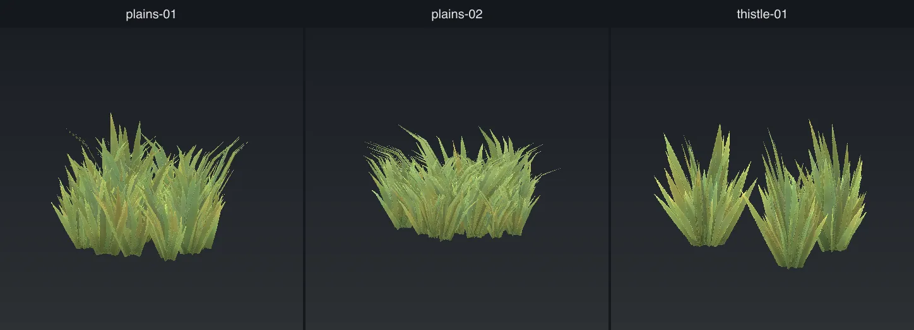

## How a clump is built

- Each tuft has several cards. Each card faces out from the centre. One card alone shows that it is
  flat when you walk round it.
- Each card has segments up its length, so the wind can bend it like a blade.
- The cards are lit as if they face up, not sideways. This stops the tuft from looking dark.
- One model can hold many tufts. This is a **patch**. See [Patches](#patches).

A clump has no collider, no shadow and no LOD tiers. It has no impostor unless the config sets one.
See [In the game](in-game.md).

The images for one tuft start from the default keys. The images for patches start from
`plains-01`.

## The tuft

### `height`

The height of the tuft, in metres.

Default: `0.35`.

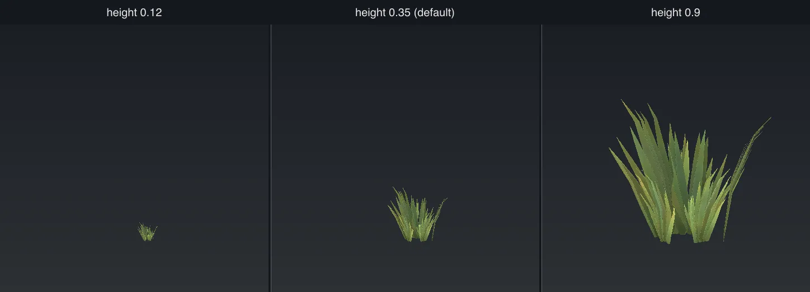

### `cardsPerTuft`

How many cards are in each tuft. Increase this key before you make `footprint` smaller. It costs
much less. See [In the game](in-game.md#density).

Default: `5`.

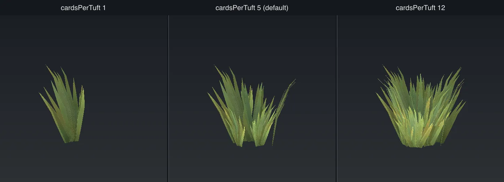

### `cardLean`

How far each card leans out from upright, in degrees.

Default: `18`.

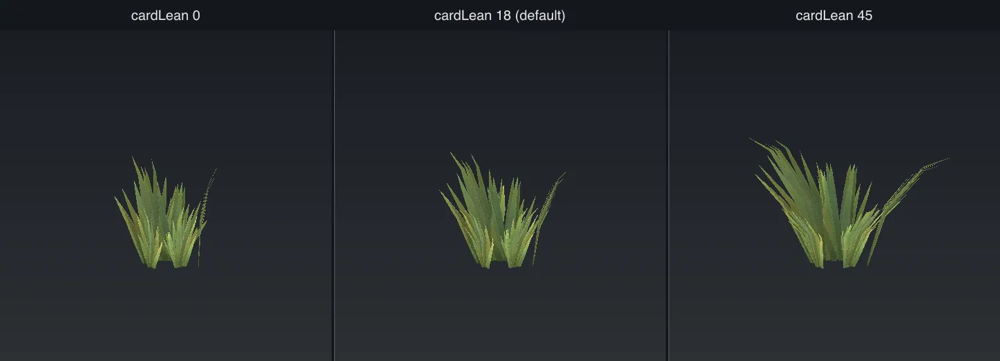

### `cardCurve`

How far each card bends over its length, in degrees. The card stays straight near the ground and
bends near the tip.

Default: `26`.

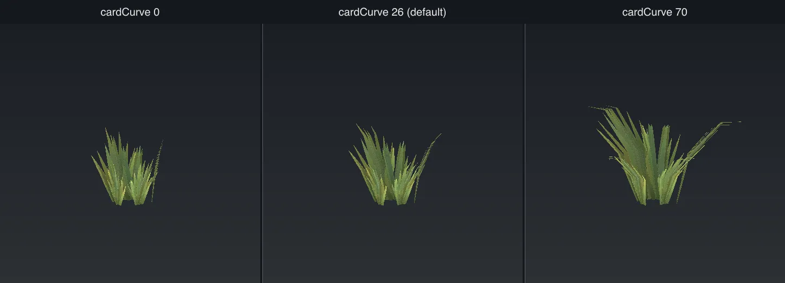

### `cardSegments`

How many segments go up each card. With `1`, the card is a flat plank and the wind tips it over as
one piece. With `3` or more, the card can bend.

Default: `3`.

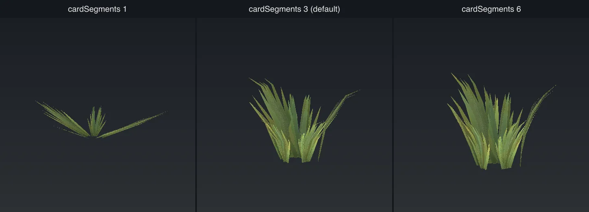

### `cardSpread`

How far the card bases are from the centre of the tuft, as a fraction of `height`. `0` puts all
cards on one point. `0.5` makes a ring.

Default: `0.22`.

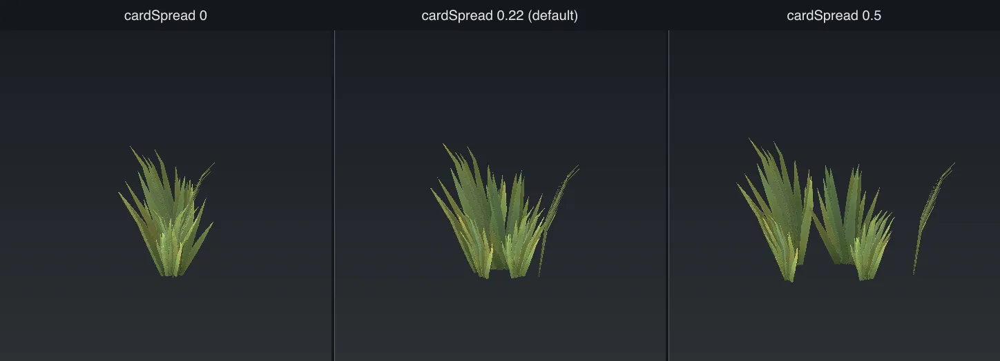

### `cardAspect`

The width of a card as a fraction of its height.

Default: `1`.

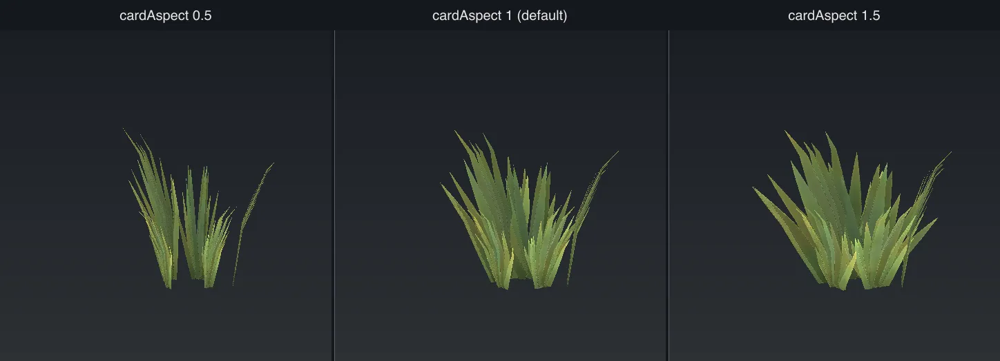

### `normalLean`

How far the lighting direction of each card leans out from straight up. `0` lights the whole tuft
as if it faces the sky, so all cards look the same. This is best for ground cover that must look
good at every time of day. Higher values give more light and dark between cards.

Default: `0.45`. `plains-01` uses `0`.

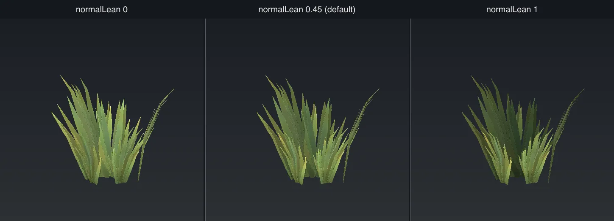

## Patches

A patch is one model that holds many tufts. It is the best way to get dense grass.

The placer does work for each model it places, not for each tuft. So 9 tufts in one model cost the
same placement work as 1 tuft. The engine draws more grass for less work.

The problem is repetition. The eye sees a repeated group of tufts quickly. Make two or three
patch variants that share one texture set, and split the biome density between them.

A patch is placed from one height sample of the terrain. Terrain samples are 2m apart. So keep a
patch small, or its edges float above the ground or go below it.

### `tuftsPerModel`

How many tufts are in one model. Above 1, the model is a patch.

Default: `1`. `plains-01` uses `12`. Range: 1 to 64.

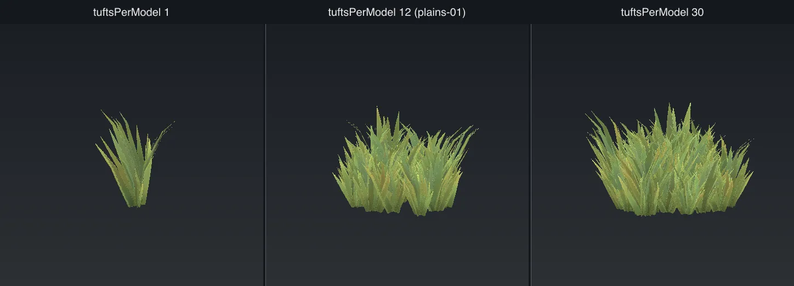

### `patchRadius`

The radius of the patch, in metres. `0` lets the tool choose from the number of tufts and their
height. It has no effect when `tuftsPerModel` is 1.

Default: `0`. `plains-01` uses `2.1`. Maximum: `2.2`.

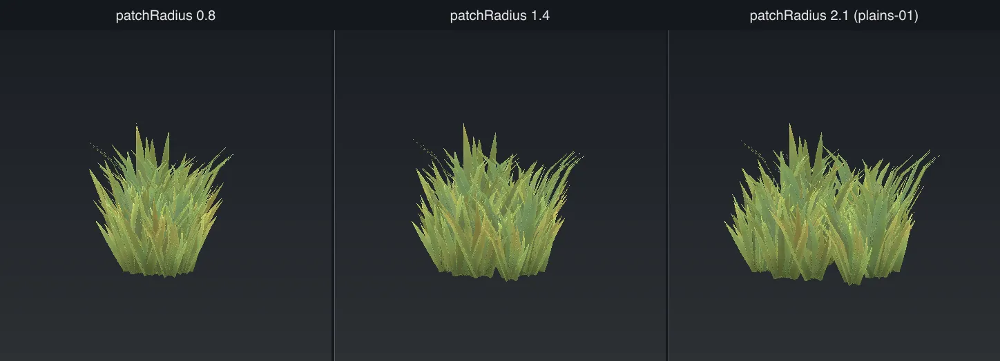

## Textures

| Key | Default | What it does |
| --- | ------- | ------------ |
| `blades` | `[]` | The folders under `sources/clump/` for the tuft art. `[]` makes nine tufts. See [Authored art](authored-art.md#clumps-and-fronds). |
| `textureSize` | `2048` | The size of the texture in pixels. It holds every tuft picture, so it starts larger than a tree's. |
| `leafAlphaCutoff` | `0.4` | The transparency level below which a pixel is cut away. See [Trees](tree.md#leafalphacutoff). |

Each tuft picture gets one square cell in the texture. The run prints the cell size. Try for 512
pixels a cell for anything the camera goes near.

A card picks its cell when the model is made. So all copies of one model look the same, apart from
their rotation and size. To get variety, make two or three variants from one texture set.

## Other keys

These keys work on more than one type. The defaults here are the ones for `clump`.

### Files and preview

| Key | Default | What it does |
| --- | ------- | ------------ |
| `name` | required | The model name. It names the `.glb`, the preview and the geometry id. |
| `textureSet` | `name` | The name of the texture set. See [Share textures](README.md#share-textures-across-a-family). |
| `seed` | new each run | The seed for every random choice. See [The seed](README.md#the-seed). |
| `out` | `assets/shared/nature/clumps` | The folder that the files are written under. |
| `assetsRoot` | `assets/shared` | The folder that the template URLs are relative to. |
| `preview` | `0` | The size in pixels of each preview panel. `0` writes no preview. |
| `previewAngles` | `4` | `4` shows four sides in a 2x2 grid. `1` shows one view. |
| `skipTextures` | `false` | Use the textures that are already in the set, and do not write new ones. |
| `writeTemplates` | `false` | Change `geometries.json` and `materials.json` in place. `--write-template` is the newer option. |
| `templatesDir` | `templates` | The folder that holds `geometries.json`, `materials.json` and `scatter-layers.json`. |

### Game keys

| Key | Default | What it does |
| --- | ------- | ------------ |
| [`cullDistance`](in-game.md#layer-keys) | `50` | The distance in metres past which the engine does not draw the model. |
| [`castShadow`](in-game.md#layer-keys) | `false` | Whether the model casts a shadow. |
| [`foliage`](in-game.md#layer-keys) | `true` | Light the cutout piece as leaves. Set `false` for a cutout that is not a leaf. |
| [`footprint`](in-game.md#density) | `0.7` | The clear space in metres round each model. `0` lets the tool choose. |
| [`scaleMin`](in-game.md#layer-keys) | `0.75` | The smallest random size of a copy. |
| [`scaleMax`](in-game.md#layer-keys) | `1.3` | The largest random size of a copy. |
| [`impostor`](in-game.md#impostors) | none unless set | The flat pictures drawn at far distances. |
| [`accents`](accents.md) | `[]` | Extra cards such as fruit or spires. |
| [`windAmplitude`](in-game.md#wind) | `0.18` | How far the model moves in the wind. |
| [`windFrequency`](in-game.md#wind) | `1.1` | How fast the model moves in the wind. |
| [`windFlutter`](in-game.md#wind) | `0.7` | Fast, small movement of the cutout cards. |
| [`bendCurve`](in-game.md#wind) | `1` | How the wind bend grows from the base to the tip. |
