# Crowns

`type: crown` grows one stem with a ring of long, curved cards at its top. The cards are
**fronds**. Use it for palms, tree ferns and cycads. With `stemHeight: 0`, the fronds come out of
the ground, which makes a fern.

A crown is not a tree, because the stem never divides. A crown is not a clump, because each frond
is long, curved and placed on its own.

[Back to scatter-forge](README.md)

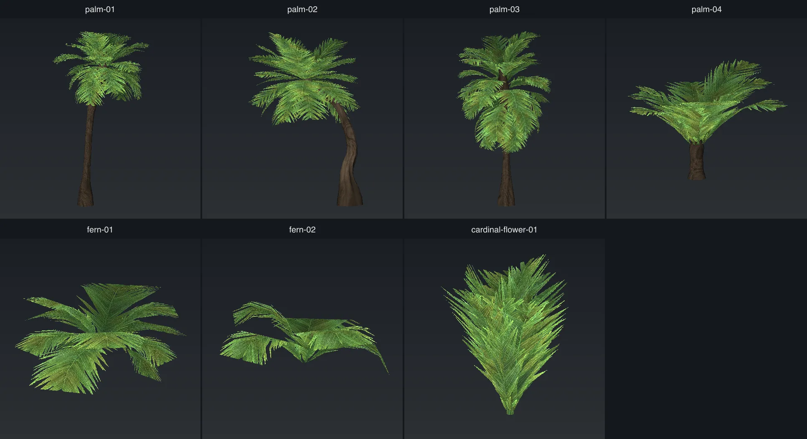

The comparison images start from `palm-01`, unless the label says `fern-01`.

## The stem

A crown has no `height` key. Its height is the stem plus the fronds. The run prints it.

The stem uses the same trunk keys as a [tree](tree.md#trunk-shape), with different defaults. The
stem images below use `palm-01` on a 4m stem with the fronds removed. They also set `crownBulge`,
`stemLean`, `trunkFlare`, `trunkWander` and `trunkFlute` to 0, so that only one key changes in each
image. The label `(palm-01)` marks the value that `palm-01` uses.

### `stemHeight`

The length of the stem, in metres. `0` makes no stem. A crown with no stem has no bark texture,
no collider and no shadow, the same as a clump.

Default: `6`. `palm-01` uses `12`.

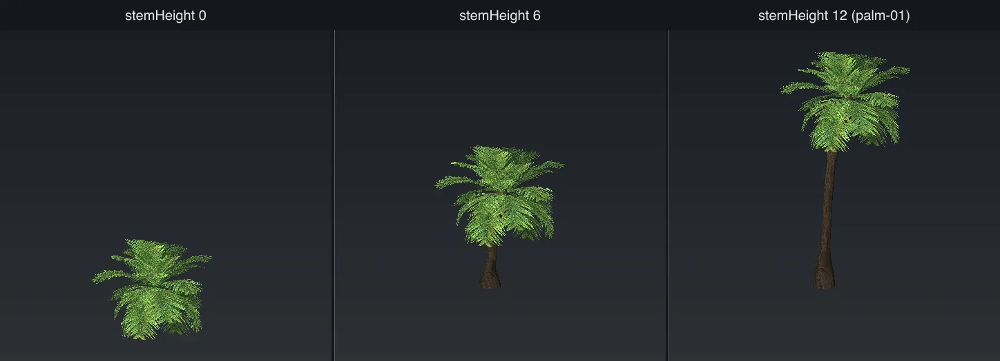

### `stemLean`

How far the stem has bent from upright at its top, in degrees. The lower stem stays straight and
the bend is near the top.

Default: `10`. `palm-01` uses `20`.

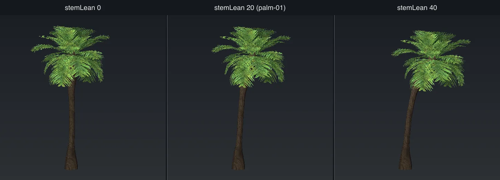

### `crownBulge`

How much the stem swells under the fronds, as a fraction of `trunkRadius`.

Default: `0.2`. `palm-01` uses `0.8`.

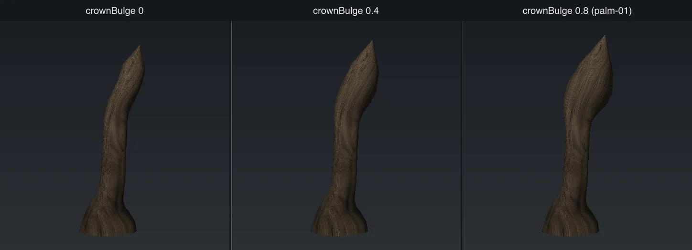

### `trunkRadius`

The radius of the stem at the ground, in metres.

Default: `0.22`. `palm-01` uses `0.32`.

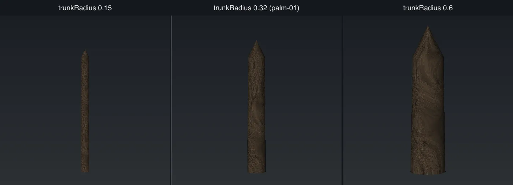

### `trunkTaper`

How thin the stem becomes at its top, as a fraction of its radius at the ground. A palm stem
becomes only a little thinner.

Default: `0.8`. `palm-01` uses `0.9`. Range: 0 to 1.

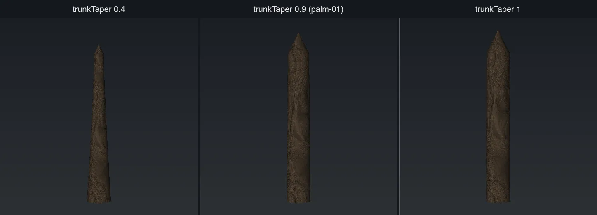

### `trunkFlare`

How much the foot of the stem spreads out, as a fraction of `trunkRadius`. The spread is gone at
one quarter of the stem's height.

Default: `0.25`. `palm-01` uses `1.2`.

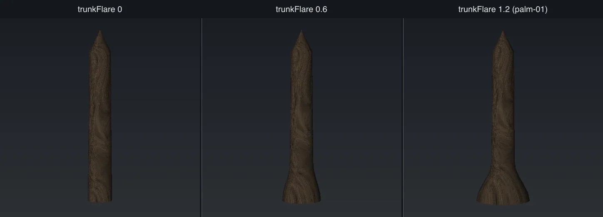

### `trunkFlute`

How deep the vertical grooves up the stem are, as a fraction of its radius. It needs `trunkSides`
of 12 or more.

Default: `0`. `palm-01` uses `0.1`. Range: 0 to 0.5.

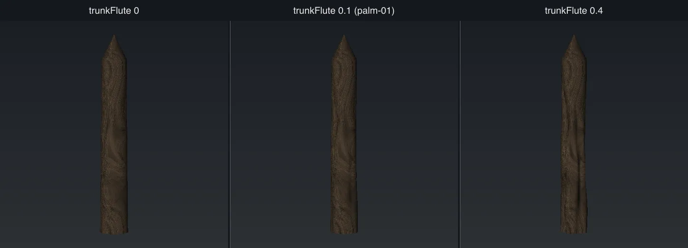

### `trunkWander`

How far the stem moves away from its lean as it goes up, in metres. `stemLean` sets the main bend.
This key adds an uneven wave on top of it.

Default: `0`. `palm-01` uses `0.2`.

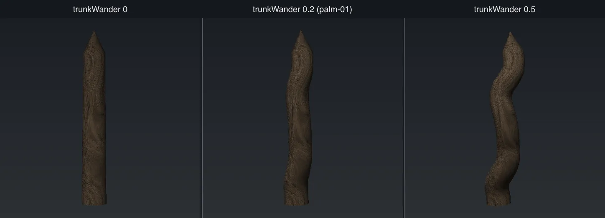

### `trunkSides`

The number of sides around the stem. `0` uses `radialSegments`.

Default: `0`. `palm-01` uses `24`.

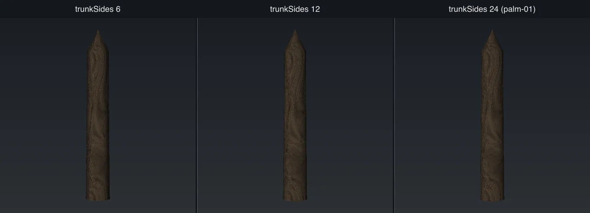

### `trunkSegments`

The number of rings up the stem. `0` uses `segments + 2`. More rings give `trunkWander` a smoother
curve.

Default: `0`. `palm-01` uses `20`.

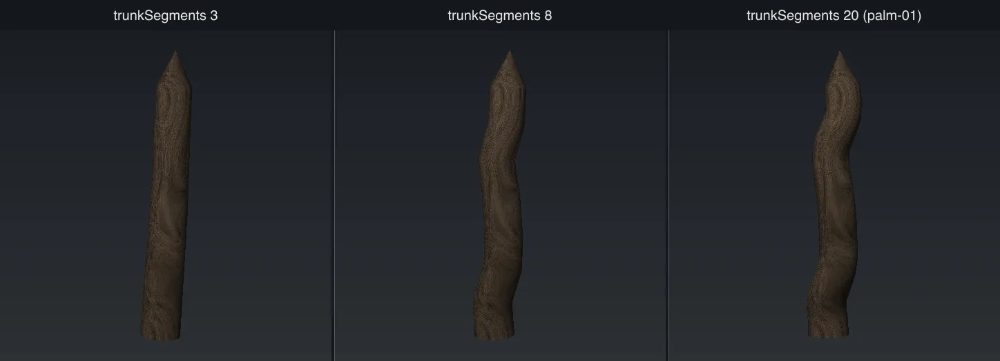

### `segments`

The number of rings along the stem when `trunkSegments` is `0`. More rings make a smoother bend.

Default: `8`. Range: 2 to 32.

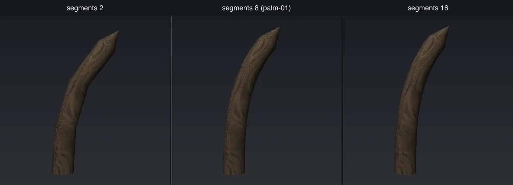

### `radialSegments`

The number of sides around the stem when `trunkSides` is `0`.

Default: `10`. Range: 3 to 24.

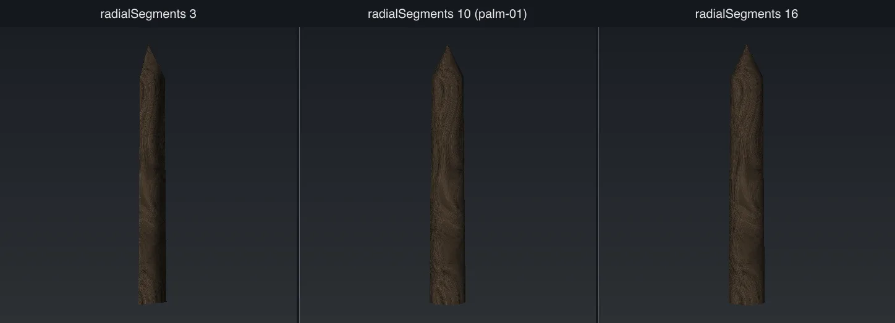

## The fronds

### `frondCount`

How many fronds are in the crown.

Default: `14`. `palm-01` uses `24`. Range: 1 to 48.

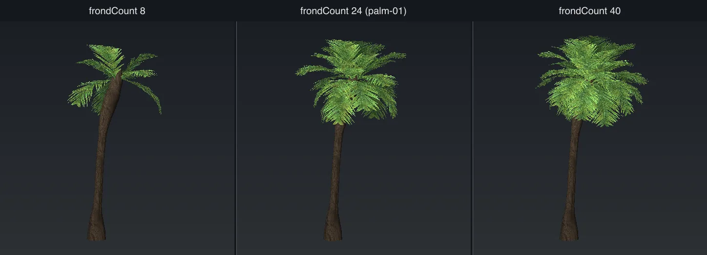

### `frondLength`

The length of the longest frond, in metres. The other fronds are a little shorter, so the edge of
the crown is not even.

Default: `3`. `palm-01` uses `4.2`.

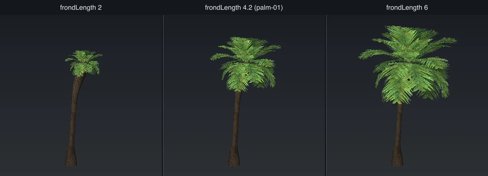

### `frondAngle`

The angle above level at which each frond leaves the stem, in degrees. `cardCurve` then bends it
down.

Default: `45`. `palm-01` uses `25`. Range: -90 to 90.

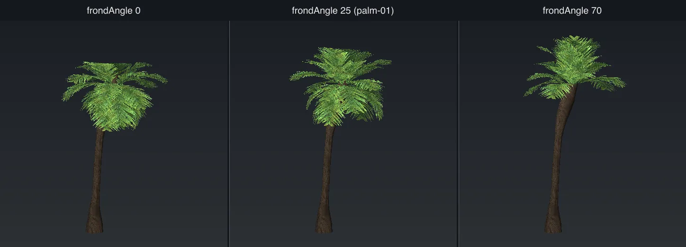

### `frondVariance`

How far the frond angles spread above and below `frondAngle`, in degrees. This makes the young
fronds stand up and the old fronds hang down. `0` makes every frond the same.

Default: `20`. `palm-01` uses `65`.

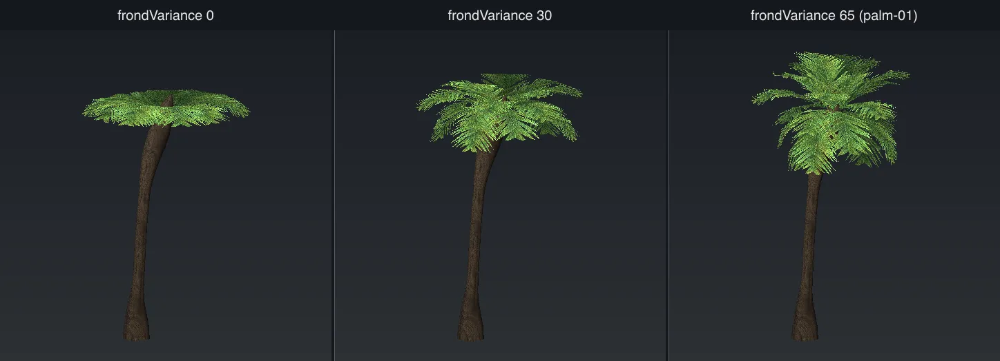

### `frondSpan`

How far down the stem the fronds attach, as a fraction of the stem from the top. `0` puts all
fronds at the top. `1` puts fronds from the ground to the top, like a cycad. The lowest fronds hang
the most. It needs a stem.

Default: `0`.

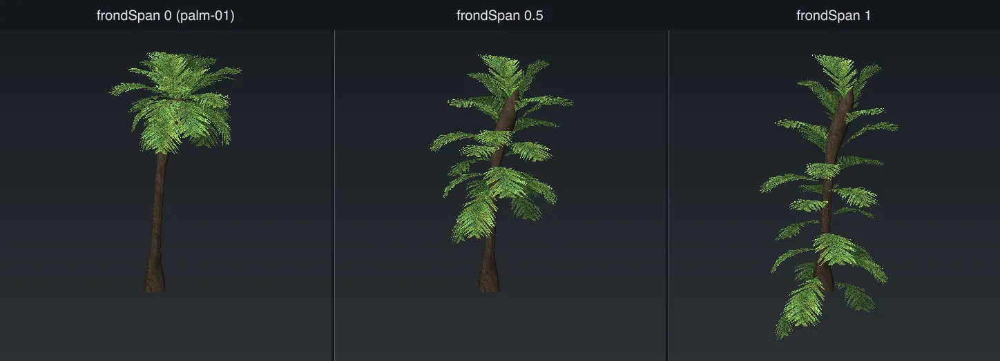

### `cardCurve`

How far each frond bends down over its length, in degrees.

Default: `80`. `palm-01` uses `60`.

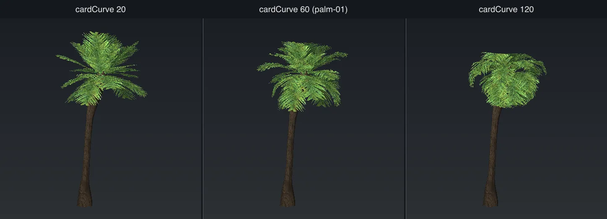

### `cardAspect`

The width of a frond as a fraction of its length. A frond uses only this part of its texture cell,
so the picture is not stretched.

Default: `0.3`. `palm-01` uses `0.7`.

If an authored frond is wider than `cardAspect`, the card cuts off its sides. The run tells you the
value to use.

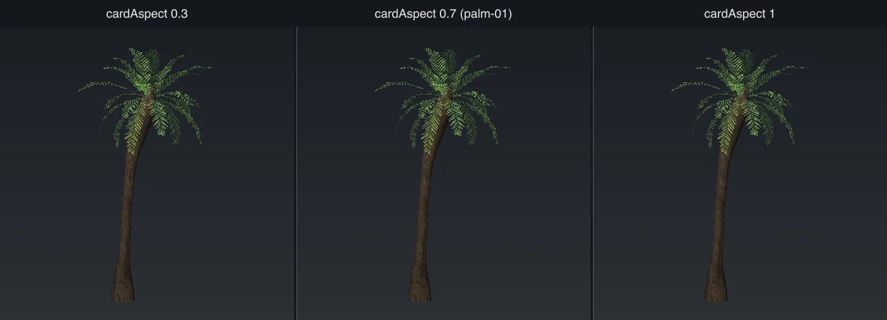

### `normalLean`

How far the lighting direction of each frond leans out from straight up. `0` lights all fronds as if
they face the sky. Higher values light the crown more like a dome.

Default: `0.6`.

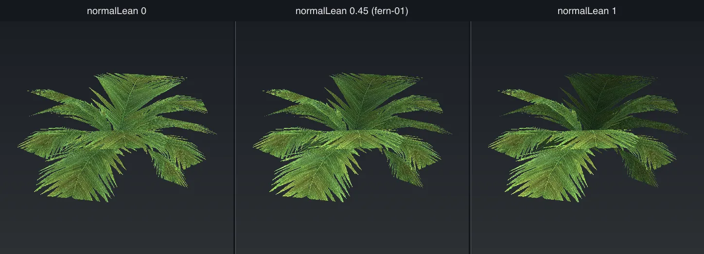

### `cardSegments`

How many segments go along each frond. More segments make a smoother bend.

Default: `5`.

## Textures

| Key | Default | What it does |
| --- | ------- | ------------ |
| `fronds` | `[]` | The folders under `sources/fronds/` for the frond art. `[]` makes four fronds. See [Authored art](authored-art.md#clumps-and-fronds). |
| `bark` | `[]` | The folder under `sources/bark/` for the stem art. |
| `textureSize` | `2048` | The size of the frond texture in pixels. Use 1024 for a model the camera never goes under. |
| `barkTextureSize` | `0` | The long edge of the stem texture. `0` uses `textureSize`. |
| `barkAspect` | `2` | How many times taller than wide the made stem texture is. It has no effect on authored bark. |
| `leafAlphaCutoff` | `0.45` | The transparency level below which a frond pixel is cut away. See [Trees](tree.md#leafalphacutoff). |

## In the game

A crown with a stem is placed like a tree. It stands upright, has a collider up to the fronds, casts
a shadow and has an impostor. A crown with no stem is placed like a clump. See
[In the game](in-game.md).

## Other keys

These keys work on more than one type. The defaults here are the ones for `crown`.

### Files and preview

| Key | Default | What it does |
| --- | ------- | ------------ |
| `name` | required | The model name. It names the `.glb`, the preview and the geometry id. |
| `textureSet` | `name` | The name of the texture set. See [Share textures](README.md#share-textures-across-a-family). |
| `seed` | new each run | The seed for every random choice. See [The seed](README.md#the-seed). |
| `out` | `assets/shared/nature/crowns` | The folder that the files are written under. |
| `assetsRoot` | `assets/shared` | The folder that the template URLs are relative to. |
| `preview` | `0` | The size in pixels of each preview panel. `0` writes no preview. |
| `previewAngles` | `4` | `4` shows four sides in a 2x2 grid. `1` shows one view. |
| `skipTextures` | `false` | Use the textures that are already in the set, and do not write new ones. |
| `writeTemplates` | `false` | Change `geometries.json` and `materials.json` in place. `--write-template` is the newer option. |
| `templatesDir` | `templates` | The folder that holds `geometries.json`, `materials.json` and `scatter-layers.json`. |

### Game keys

| Key | Default | What it does |
| --- | ------- | ------------ |
| [`cullDistance`](in-game.md#layer-keys) | `160` | The distance in metres past which the engine does not draw the model. |
| [`castShadow`](in-game.md#layer-keys) | on with a stem | Whether the model casts a shadow. |
| [`foliage`](in-game.md#layer-keys) | `true` | Light the cutout piece as leaves. Set `false` for a cutout that is not a leaf. |
| [`collider`](in-game.md#layer-keys) | `true` | Stop the player at the stem. Set `false` for a plant low enough to walk through. A crown with no stem never has one. |
| [`footprint`](in-game.md#density) | `0` | The clear space in metres round each model. `0` lets the tool choose. |
| [`scaleMin`](in-game.md#layer-keys) | `0.8` | The smallest random size of a copy. |
| [`scaleMax`](in-game.md#layer-keys) | `1.25` | The largest random size of a copy. |
| [`impostor`](in-game.md#impostors) | with a stem, or if set | The flat pictures drawn at far distances. |
| [`lods`](in-game.md#lod-tiers) | `[]` | Simpler versions of the model for far distances. |
| [`accents`](accents.md) | `[]` | Extra cards such as fruit or spires. |
| [`windAmplitude`](in-game.md#wind) | `0.4` | How far the model moves in the wind. |
| [`windFrequency`](in-game.md#wind) | `0.45` | How fast the model moves in the wind. |
| [`windFlutter`](in-game.md#wind) | `0.35` | Fast, small movement of the cutout cards. |
| [`bendCurve`](in-game.md#wind) | `1.6` | How the wind bend grows from the base to the tip. |
