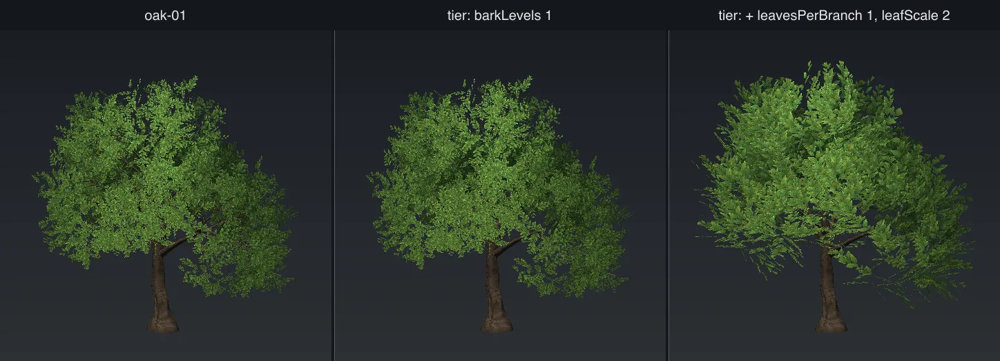

# In the game

This page covers the keys that control how the engine places and draws a model, and the steps to add
a model to the world.

Most of these keys do not change the model. The tool copies them into the model's entry in
`templates/scatter-layers.json`. That entry is the **scatter layer**: the model plus everything the
engine needs to plant thousands of it.

[Back to scatter-forge](README.md)

## Add a model to the world

The engine does not look in the assets folder. A model is not in the world until these files name it.
The run prints each block you need, ready to paste.

### 1. Register the model and its layer

Run the tool with `--write-template`:

```
node tools/scatter-forge/cli.ts tools/scatter-forge/templates/oak-01.json --write-template
```

This adds or replaces two entries each time the model builds, also with `--watch`:

- **`templates/geometries.json`**: the model file and its LOD files, under an id such as `oak-01`.
- **`templates/scatter-layers.json`**: the layer, under a name such as `oak_01`.

The two names are different on purpose. The geometry id uses hyphens (`oak-01`). The layer name uses
underscores (`oak_01`), and it must be the same as the key the layer is under.

A new layer always goes at the end of the file, because the order of the layers is the order of the
paint mask slots. `--write-template=<path>` writes to a different file.

### 2. Add a biome rule

A layer in the file places nothing yet. A biome must ask for it. Add a rule to the biome's `scatter`
list in `Biomes.ts`:

```ts
scatter: [
  { layer: 'oak_01', density: 0.6, slope: { from: 20, to: 4 } },
],
```

- `layer` is the layer name with underscores.
- `density` is a fraction of what `footprint` allows. `1` packs the models as close as they fit.
- `slope`, `height` and `noise` limit where the models grow. Each is a smooth change, not a hard
  cut. If `from` is higher than `to`, the change goes the other way. So `{ from: 20, to: 4 }` means
  none on ground of 20 degrees or more, and all on ground of 4 degrees or less.

### 3. Materials (optional)

The `.glb` file has its own materials, so you do not need `templates/materials.json`.

Do not set `materialId` on a tree or a crown. It replaces every material in the model with one
material. The bark and the leaves need different materials: the bark is solid and draws one side,
and the leaves are cut out and draw both sides. With one material, the leaves become solid
rectangles or the bark turns inside out.

## Layer keys

| Key | Default | What it does |
| --- | ------- | ------------ |
| `cullDistance` | tree `160`, clump `50`, rock `800`, pebble `60` | The distance in metres past which the engine does not draw the model. |
| `castShadow` | on for trees, rocks and crowns with a stem | Whether the model casts a shadow. Off for clumps, pebbles and crowns with no stem, because a small shadow costs a lot and shows little. |
| `foliage` | `true` | Light the cutout piece as leaves: no shine, and light comes through from behind. Set `false` for a cutout that is not a leaf, such as a flower spike or a stalk. The bark is not changed. |
| `footprint` | `0` (clump `0.7`) | The clear space in metres that the engine keeps round each model. `0` lets the tool choose. See [Density](#density). |
| `scaleMin`, `scaleMax` | `0.8`, `1.25` | The range of random sizes for each copy. Rocks use `0.6` to `1.6`, so one model can be a stone or a boulder. |
| `impostor` | see [Impostors](#impostors) | The flat picture that the engine draws at far distances. |
| `lods` | `[]` | Simpler versions of the model. See [LOD tiers](#lod-tiers). |

### Wind

Trees, clumps and crowns move in the wind. Rocks and pebbles do not.

| Key | Default | What it does |
| --- | ------- | ------------ |
| `windAmplitude` | `0.4` (clump `0.18`) | How far the model moves. The shipped trees use about `8`. |
| `windFrequency` | `0.45` (clump `1.1`) | How fast it moves. A blade is light and moves faster than a branch. |
| `windFlutter` | `0.35` (clump `0.7`) | Fast, small movement of the leaf cards only. |
| `bendCurve` | `1.6` (clump `1`) | How the bend grows from the base to the tip. `1` bends evenly along the full length, which suits a blade. `3` keeps the base still and moves only the tips. |

The tool writes the wind weights into the model's vertex colours (`COLOR_0`):

| Channel | What it holds |
| ------- | ------------- |
| R | The bend. `0` at the base, `1` at a leaf tip. |
| G | The phase. One value for each branch and its leaves. |
| B | The flutter. `0` on the bark, rising to `1` at a leaf tip. |
| A | The leaf phase. One random value for each leaf card. |

Because the vertex colours hold wind data, they cannot hold a colour tint.

## LOD tiers

A LOD tier is a simpler version of the model that the engine draws at a distance. `lods` is a list
of tiers, nearest first. Each tier gives the distance where it starts and the keys it changes:

```json
"lods": [
  { "distance": 60, "radialSegments": 4, "barkLevels": 1, "leavesPerBranch": 1, "leafScale": 2 }
]
```

A tier can change only these keys:

| Type | Keys a tier can change |
| ---- | ---------------------- |
| `tree` | `radialSegments`, `trunkSides`, `barkLevels`, `leavesPerBranch`, `leafScale` |
| `crown` | `radialSegments`, `cardSegments` |
| `rock`, `pebble` | `subdivisions` |

A clump and a crown with no stem have no tiers. They cull.

Every tier uses the same branch shape and the same seed as the model. So a change to a tier changes
only detail, not the outline.

For a tree, `barkLevels` removes the most triangles. `leafScale` makes the fewer leaf cards larger,
so the crown stays full. The row above takes the oak from 39,844 triangles to 2,828.



With `preview` set, the run writes `<name>.lods.preview.png`: the model and each tier next to each
other at the same scale. Check that the outline and the mass stay the same, and only the detail
goes.

## Impostors

An impostor is a set of flat pictures of the model from several sides. At far distances, the engine
draws the picture and not the mesh. This costs much less.

```json
"impostor": { "fromDistance": 192, "views": 8, "tileSize": 128 }
```

| Key | Default | What it does |
| --- | ------- | ------------ |
| `fromDistance` | `0` | The distance in metres where the impostor starts. `0` uses 60% of `cullDistance`. Every LOD `distance` must be less than this. |
| `views` | `8` | How many pictures go round the model. At least 2. |
| `tileSize` | `128` | The size of each picture, in pixels. |

A tree, a crown with a stem and a rock always have an impostor. A rock's starts at 120m. A clump or
a crown with no stem has one only if the config sets `impostor`.

### Choose `fromDistance`

The impostor looks correct only while the model covers fewer pixels on screen than `tileSize`. At
1080p with a 50 degree field of view, a good start is:

```
fromDistance ≈ 145 × height / tileSize
```

An 18m oak with a 128 pixel tile gives about 160m. The shipped trees use 192m. A lower value costs
less, because the engine draws fewer meshes.

## Density

`footprint` has the largest effect on cost of all the keys.

The placer tests possible spots on a grid. The grid cell is two times `footprint`. A terrain chunk
is 480m across. So the number of spots to test in each chunk is:

```
spots per chunk = (480 / (2 × footprint))²
```

| `footprint` | Spots per chunk |
| ----------- | --------------- |
| 0.25m | 921,600 |
| 0.5m | 230,400 |
| 0.7m | 117,600 |
| 1.0m | 57,600 |
| 2.5m | 9,216 |

The cost is the testing and the overdraw near the ground, not the triangles. The smallest possible
`footprint` is about 6cm.

To get dense ground cover for less cost:

1. **Put many tufts in one model** with `tuftsPerModel`. The placer tests one spot for the full
   patch. See [Clumps](clump.md#patches).
2. **Add cards before you make `footprint` smaller.** More cards cost a little. A smaller
   footprint costs much more.
3. **Use one mixed layer, not three thin ones.** Each layer tests every spot in the chunk. Put grass,
   clover and daisies into one texture set and one layer.

## Known limits

- **Displacement is not used.** glTF has no slot for a displacement map, so the engine never reads
  the `_disp` map. Trunk relief is cut into the mesh with `trunkFlute` and the other trunk keys.
- **All copies of one model look the same**, apart from their size and rotation. Each card picks its
  texture cell when the model is made. To get variety, make two or three variants from one texture
  set.
- **Clumps cannot take a ground colour**, because the vertex colours hold wind data.
- **Distant leaves do not thin out.** The engine changes the alpha cutoff for each mip level, so
  `leafAlphaCutoff` only changes how the leaves look up close.
