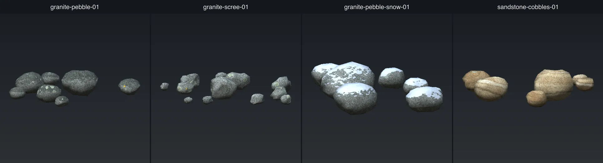
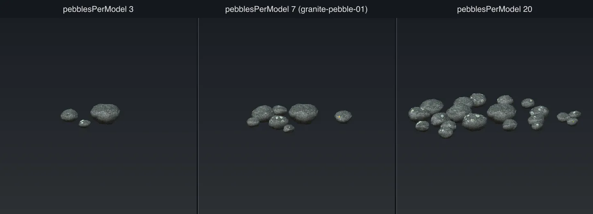
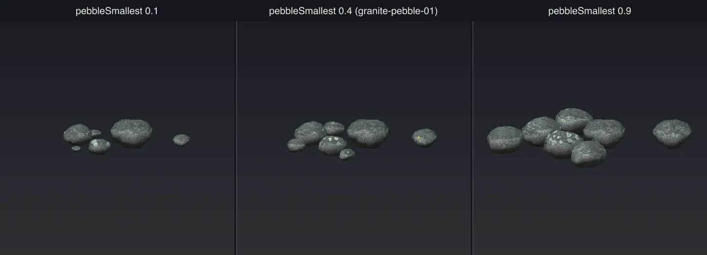
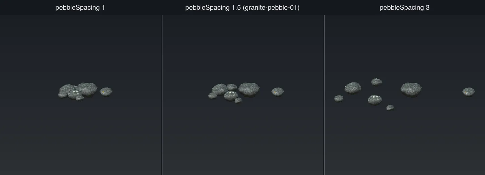
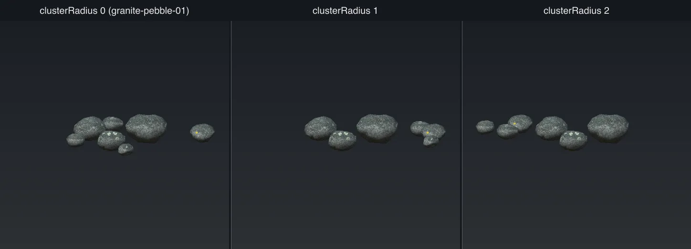

# Pebbles

`type: pebble` puts many small stones into one model. This is a **cluster**. Use it for pebbles,
cobbles, gravel and scree.

Each stone in a cluster is a full [rock](rock.md): it has its own seed, its own shape and its own
texture bake. So all rock keys work on a pebble. Each stone gets its own lichen on its top and its
own soil at its base.

[Back to scatter-forge](README.md)

## How a cluster is built

1. The tool makes the largest stone first. Each smaller stone goes next to one that is already
   down, so the small stones sit against the large ones. No two stones overlap.
2. Each stone sinks into the ground by a part of its own height.
3. The stones are not turned after the bake. This keeps the lichen and snow on their tops.

`height`, `width` and `depth` set the size of the largest stone. The other stones get smaller, down
to `pebbleSmallest`.

Pebbles have different defaults from rocks. `cracks`, `plates`, `weathering`, `patina`, `stain`,
`veins` and `edgeWear` are all `0`, because small stones do not show them. They all still work if
you set them.

The comparison images start from `granite-pebble-01`.

### Defaults that differ from a rock

| Key | Rock | Pebble |
| --- | ---- | ------ |
| [`height`](rock.md#height) | `1.2` | `0.3` |
| [`scoops`](rock.md#scoops) | `9` | `6` |
| [`scoopSize`](rock.md#scoopsize) | `0.8` | `0.88` |
| [`scoopDepth`](rock.md#scoopdepth) | `0.35` | `0.24` |
| [`relief`](rock.md#relief) | `0.1` | `0.07` |
| [`reliefSize`](rock.md#reliefsize) | `0.9` | `0.1` |
| [`reliefOctaves`](rock.md#reliefoctaves) | `5` | `3` |
| [`plates`](rock.md#plates) | `2` | `0` |
| [`smoothing`](rock.md#smoothing) | `0.5` | `0.9` |
| [`cracks`](rock.md#cracks) | `1.2` | `0` |
| [`weathering`](rock.md#weathering-lichentint-and-soiltint) | `0.6` | `0` |
| [`patina`](rock.md#patina) | `0.5` | `0` |
| [`edgeWear`](rock.md#edgewear-and-edgetint) | `0.5` | `0` |
| [`stain`](rock.md#stain-and-staintint) | `0.5` | `0` |
| [`veins`](rock.md#veins) | `0.15` | `0` |
| [`toneSize`](rock.md#tonesize) | `0.25` | `0.06` |
| [`grainScale`](rock.md#grainscale) | `110` | `260` |
| [`undulationSize`](rock.md#surface-finish) | `0.09` | `0.03` |
| [`subdivisions`](rock.md#subdivisions) | `24` | `6` |

## Cluster keys

### `pebblesPerModel`

How many stones are in one cluster. Each stone gets its own part of the texture, so the texture
gets larger with this number. Only clusters with the same count can share one texture set.

Default: `12`. `granite-pebble-01` uses `7`.

### `pebbleSmallest`

The size of the smallest stone, as a fraction of the largest. Most stones are near the small end, so
a cluster is a few large stones with gravel round them.

Default: `0.4`. Range: 0 to 1.

### `pebbleSpacing`

How far apart the stones are. `1` puts them against each other. `2` leaves one stone's width of
ground between them. `3` makes a thin scatter.

Default: `1`. `granite-pebble-01` uses `1.5`.

### `clusterRadius`

The radius of the area the stones are in, in metres. `0` lets the tool choose from the number of
stones. This key does not space the stones out. Use `pebbleSpacing` for that.

Default: `0`.

## Fix a problem

| Problem | Key to change |
| ------- | ------------- |
| The stones in one cluster are too close together | `pebbleSpacing` |
| The clusters are too close together | `footprint`, or the `density` in the biome rule |
| The stones are too small | `height`, `width` and `depth` |
| There are too many stones in a cluster | `pebblesPerModel` |

A cluster is placed from one height sample of the terrain. If a cluster is more than about 4m wide,
the stones at its edge float above the ground or go below it. The run warns you when this happens.

## Texture size

`textureSize` defaults to `128` for a pebble. Each stone gets a block of 192x128 pixels. The
full texture grows with `pebblesPerModel`.

## In the game

A cluster has no collider, no impostor and no shadow. It culls at 60m by default. The templates
cull at 120m and change to a simpler LOD tier at 50m. See [In the game](in-game.md).

The templates use `subdivisions 3`, which is 108 triangles a stone. At this size, the normal map
carries the shape, not the mesh.

## Other keys

These keys work on more than one type. The defaults here are the ones for `pebble`.

### Files and preview

| Key | Default | What it does |
| --- | ------- | ------------ |
| `name` | required | The model name. It names the `.glb`, the preview and the geometry id. |
| `textureSet` | `name` | The name of the texture set. See [Share textures](README.md#share-textures-across-a-family). |
| `seed` | new each run | The seed for every random choice. See [The seed](README.md#the-seed). |
| `out` | `assets/shared/nature/pebbles` | The folder that the files are written under. |
| `assetsRoot` | `assets/shared` | The folder that the template URLs are relative to. |
| `preview` | `0` | The size in pixels of each preview panel. `0` writes no preview. |
| `previewAngles` | `4` | `4` shows four sides in a 2x2 grid. `1` shows one view. |
| `skipTextures` | `false` | Use the textures that are already in the set, and do not write new ones. |
| `writeTemplates` | `false` | Change `geometries.json` and `materials.json` in place. `--write-template` is the newer option. |
| `templatesDir` | `templates` | The folder that holds `geometries.json`, `materials.json` and `scatter-layers.json`. |

### Game keys

| Key | Default | What it does |
| --- | ------- | ------------ |
| [`cullDistance`](in-game.md#layer-keys) | `60` | The distance in metres past which the engine does not draw the model. |
| [`castShadow`](in-game.md#layer-keys) | `false` | Whether the model casts a shadow. |
| [`footprint`](in-game.md#density) | `0` | The clear space in metres round each model. `0` lets the tool choose. |
| [`scaleMin`](in-game.md#layer-keys) | `0.7` | The smallest random size of a copy. |
| [`scaleMax`](in-game.md#layer-keys) | `1.4` | The largest random size of a copy. |
| [`impostor`](in-game.md#impostors) | none unless set | The flat pictures drawn at far distances. |
| [`lods`](in-game.md#lod-tiers) | `[]` | Simpler versions of the model for far distances. |
