# Rocks

`type: rock` grows one solid stone. It has no cards and no transparency. It has one material, a
hull collider and LOD tiers. The engine lays it on the slope and sinks it a little into the ground.

To put many small stones in one model, use [Pebbles](pebble.md). Pebbles use all the keys on this
page.

[Back to scatter-forge](README.md)

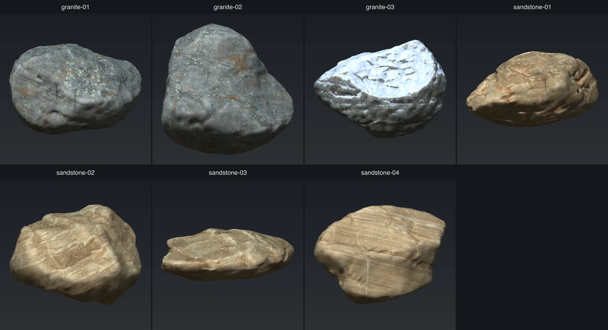

## How a rock is built

The tool builds the rock from one 3D shape function. It uses this function for the mesh and also
for the texture. This is why a crack on the texture follows the shape of the mesh, and why cracks
cross texture seams with no break.

1. **The block**: an egg shape, `width` by `height` by `depth`.
2. **The scoops**: large spheres cut hollow faces into the egg. The faces meet at ridges.
3. **The plates**: flat slabs push up the surface, the way rock breaks along flat planes.
4. **The lumps**: noise adds bumps.
5. **The cracks**: grooves cut into the mesh.
6. **The holes**: large gas holes cut pits into the mesh.
7. **The texture**: colour, grain, cracks, stains, lichen and snow are painted.

Keys that are fractions of "the radius" use the average half-size of the rock. So a rock that is
two times larger has bumps that are two times deeper. Keys in metres use the rock's own size. So a
rock that the engine scales up 1.6 times also shows lumps that are 1.6 times larger.

Most keys change the texture, so a change makes a new texture bake. A rock takes more time to build
than a tree. `subdivisions` is the only key that changes the mesh and not the texture.

The comparison images start from `granite-01`.

## The block

### `height`

The height of the rock in metres, before the bumps. The run prints the height it reached.

Default: `1.2`. `granite-01` uses `2.4`.

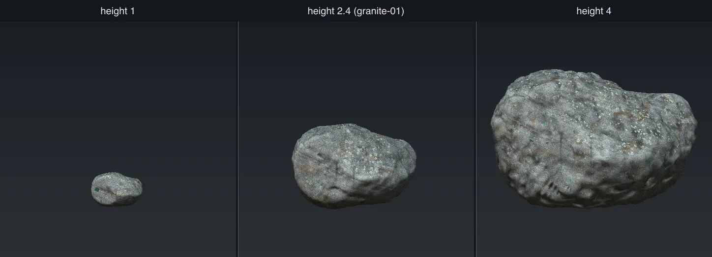

### `width` and `depth`

The size of the rock across (x) and from front to back (z), in metres. `0` sets the size from
`height`: `width` is 1.3 times `height`, and `depth` is the same as `height`.

Default: `0`.

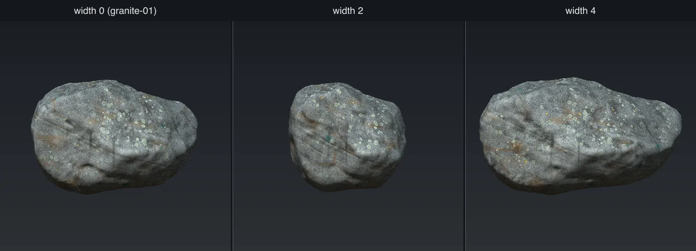

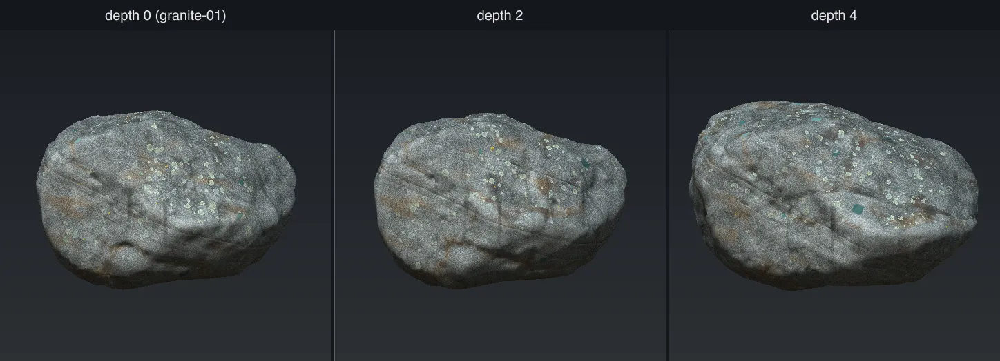

## The scoops

The scoops give the rock its main shape. Each scoop is a large sphere cut out of the egg. The
surface is then many hollow faces that meet at ridges. This looks like stone that has broken and
then worn down.

Examples:

- A broken boulder: `scoops 12`, `scoopSize 0.75`, `scoopDepth 0.45`
- A river cobble: `scoops 9`, `scoopSize 0.85`, `scoopDepth 0.3`, `smoothing 1`
- A block: `scoops 6`, `scoopSize 0.95`, `scoopDepth 0.4`, `smoothing 0.2`
- An egg: `scoops 0`

### `scoops`

How many scoops are cut out of the rock. `0` leaves an egg.

Default: `9`. `granite-01` uses `12`. Range: 0 to 24.

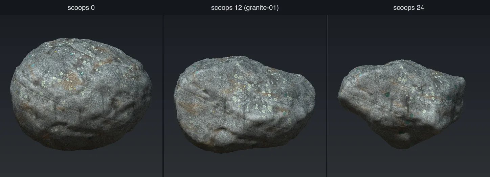

### `scoopSize`

How broad each scoop is. `0.5` is a small, deep bite. `0.95` is a wide face that is almost flat.

Default: `0.8`. Range: 0.3 to 0.97.

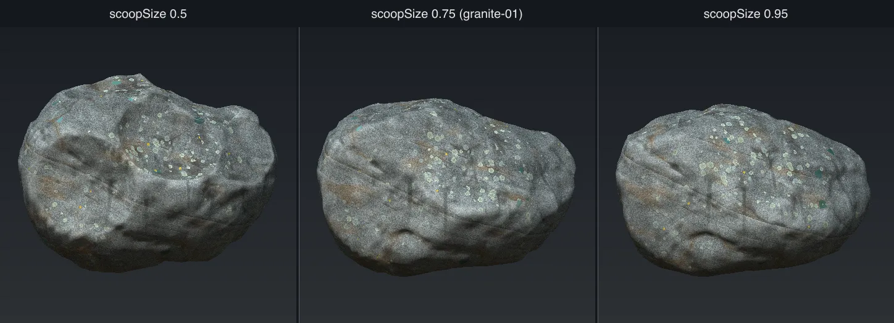

### `scoopDepth`

How far the deepest scoop cuts in, as a fraction of the radius. Each scoop cuts in by a different
part of this value, so no two faces are the same. The tool limits how deep a small scoop can go.

Default: `0.35`. Range: 0 to 0.6.

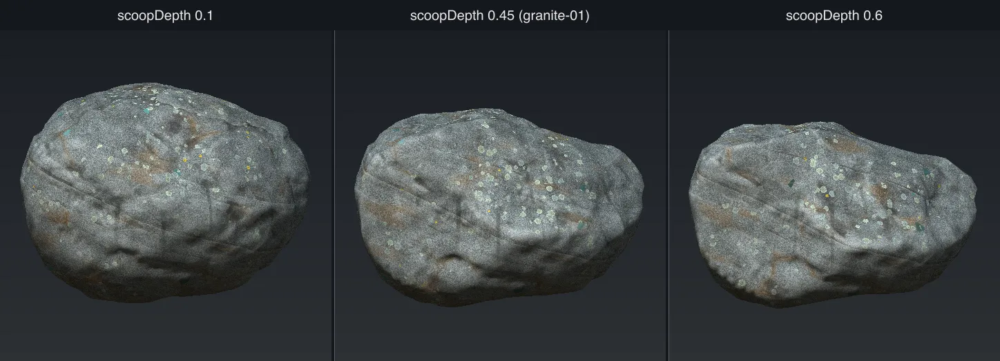

### `smoothing`

How much the sharp edges are rounded: the ridges between scoops, the edges of the plates and the
creases in the noise. `0` leaves every edge sharp. `1` makes the rock look worn and round. Smoothing
makes the rock about one tenth smaller.

Default: `0.5`. Range: 0 to 1.

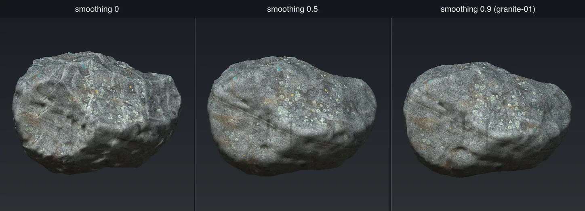

## The plates

Rock breaks along flat planes. The plates add those planes to the surface.

A **plate** is a flat slab with sloped edges. The tool fills the rock with a 3D grid of slabs. Each
slab is a little larger than its grid cell, so the slabs overlap. At each point, the highest slab
pushes the surface out.

### What makes the slabs show

The slabs are only visible when they stand at different heights. Four keys decide that:

- **`plateLean` makes the steps.** All slab tops are at the same height. With no lean, the
  overlapping tops join into one smooth surface, and you see almost nothing. A lean tilts each
  slab, so its low edge sits below its neighbour's top. That makes a step.
- **`plateBevel` separates the slabs.** A larger bevel makes each flat top smaller and its sloped
  sides wider. At `1`, the tops are gone and each slab is a pyramid.
- **`smoothing` rounds the slabs away.** It rounds the slab edges and the joins between them. At
  `0.5` the steps are already soft lumps. `granite-01` uses `0.9`, which is why its slabs do not
  show.
- **`relief` × `plateShare` is the step height.** A slab top stands out by this fraction of the
  radius, and a gap goes in by the same amount.

The mesh must also be fine enough to carry the slab edges. Use `subdivisions` 48 or more.

### The slab study

The images in this section do not start from a template. They start from a **slab study**: an egg
with no scoops, `smoothing 0`, slabs only (`plateShare 1`), `plateLean 0.4`, `plateBevel 0.4`,
`relief 0.12` and `subdivisions 96`. The cracks, layers, veins and weathering are off. `plateTint`
is `0.5`, so that each slab has its own shade and you can see where it ends.

Examples:

- Stepped, layered stone: `bedding 1`, `plateLean 0.4`, `plateBevel 0.3`, `plates 2`
- Rough blocks: `bedding 0.3`, `plateBevel 0.6`, `plates 1.5`
- Cobbled: `plates 4`, `plateLayers 1`, `plateBevel 0.8`
- A smooth boulder: `plates 0`

### `plates`

How many slabs there are per metre. This sets the size of each slab. On the 2.4m slab study, `1.5`
gives about four slabs across the rock, and `3` gives about eight. `0` turns the plates off, so the
noise makes all of the relief.

Default: `2`.

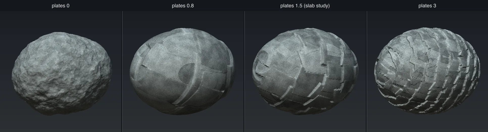

### `plateLean`

How much each slab tilts across its width. This is what makes the steps between slabs. `0` makes
all slab tops level, so they join into a smooth surface.

Default: `0.3`. Range: 0 to 1.

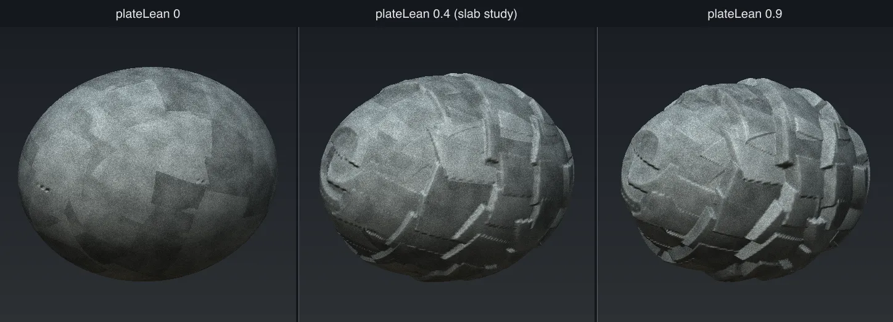

### `plateBevel`

How much of each slab slopes down to its edge. A low value gives wide, flat tops with sharp edges.
A high value gives small tops and wide slopes, so each slab stands apart. `1` makes pyramids.

Default: `0.35`. Range: 0 to 1.

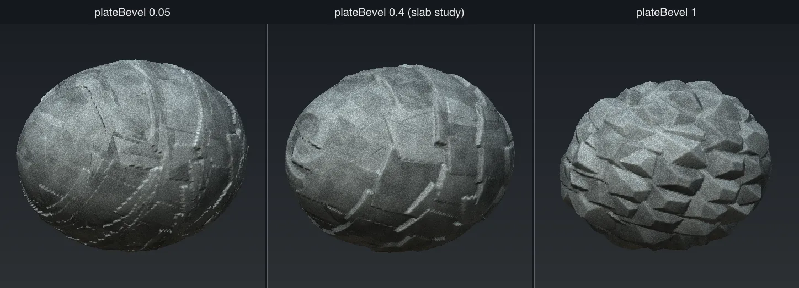

### `smoothing` on plates

`smoothing` is described under [The scoops](#smoothing). On plates, it rounds the steps and the
joins. Keep it low if you want the slabs to show.

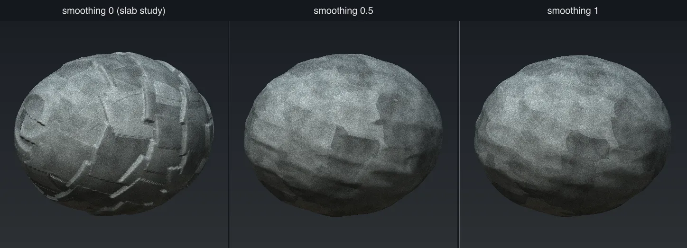

### `relief` on plates

`relief` is described under [The lumps](#relief). With plates on, it sets the step height. Keep it
between `0.05` and `0.15`. Higher values make tall, torn steps.

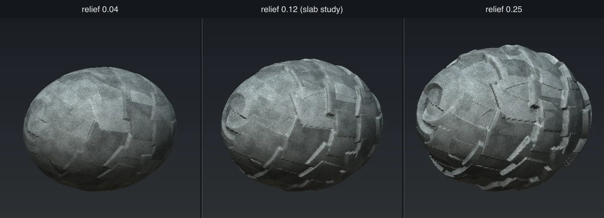

### `plateShare`

How much of `relief` the slabs make. The noise makes the rest. `0` is noise only. `1` is slabs
only.

Default: `0.7`. Range: 0 to 1.

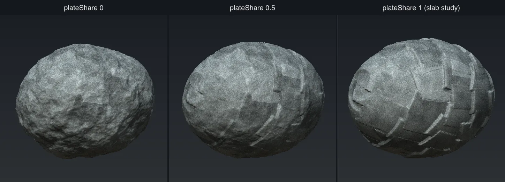

### `bedding`

How much the slabs line up with each other. At `1`, all slabs lie along one tilted plane, like the
layers of sedimentary rock. At `0`, each slab is turned to its own angle. The change is small on an
egg. It shows more on a rock with flat faces from the scoops.

Default: `0.6`. `granite-01` uses `0.3`. Range: 0 to 1.

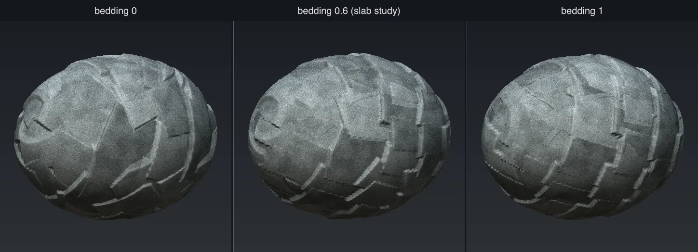

### `plateLayers`

How many layers of slabs there are. Each extra layer has smaller slabs, 1.7 times finer, and cuts
half as deep. The extra layers chip the edges of the large slabs. The effect is small: it adds
detail to the edges, not new steps.

Default: `2`. Range: 1 to 4.

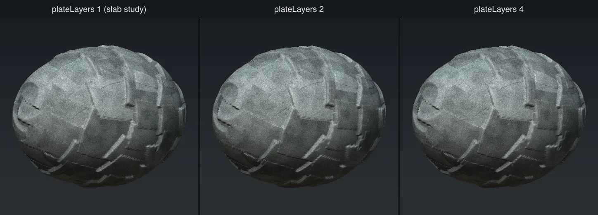

### `plateTint`

How much each slab changes the stone colour, so that no two slabs are the same grey. It changes the
colour only, not the shape.

Default: `0.25`. Range: 0 to 1.

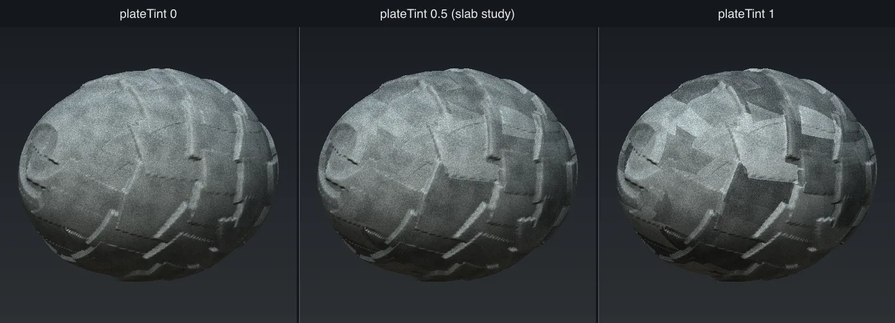

## The lumps

Noise adds bumps to the surface. The noise makes the part of `relief` that the plates do not use.
With `plates 0`, the noise makes all of it.

The noise is a stack of layers. The first layer has the largest bumps, `reliefSize` across. Each
next layer has bumps half as wide and half as deep. `reliefOctaves` is how many layers there are.

The images in this section start from a **lump study**: an egg with no scoops, no plates,
`smoothing 0` and `subdivisions 96`, with `relief 0.2`, `reliefSize 1` and `reliefOctaves 3`. The
cracks, layers and weathering are off.

Examples:

- A boulder: `reliefSize 0.7`, `reliefOctaves 4`, `relief 0.2`
- Smooth and worn: `reliefSize 1`, `reliefOctaves 2`, `relief 0.12`
- Pitted: `reliefSize 0.25`, `reliefOctaves 3`, `relief 0.25`

### `relief`

How deep the bumps are, as a fraction of the radius. With plates on, it also sets the step height of
the slabs. Keep it under about 0.3. Near 0.5, the bumps all reach the same height and the rock
looks like a pile of cobbles.

Default: `0.1`. `granite-01` uses `0.29`. Range: 0 to 0.5.

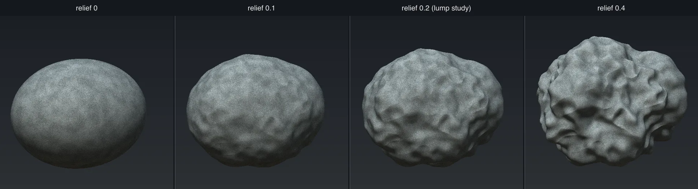

### `reliefSize`

How wide the largest bumps are, in metres. Compare it with the size of the rock:

- Much smaller than the rock: many small bumps all over it.
- About half the rock: a few large bumps.
- The size of the rock or larger: one slow swell, so the rock looks almost smooth.

Default: `0.9`. `granite-01` uses `2.8`.

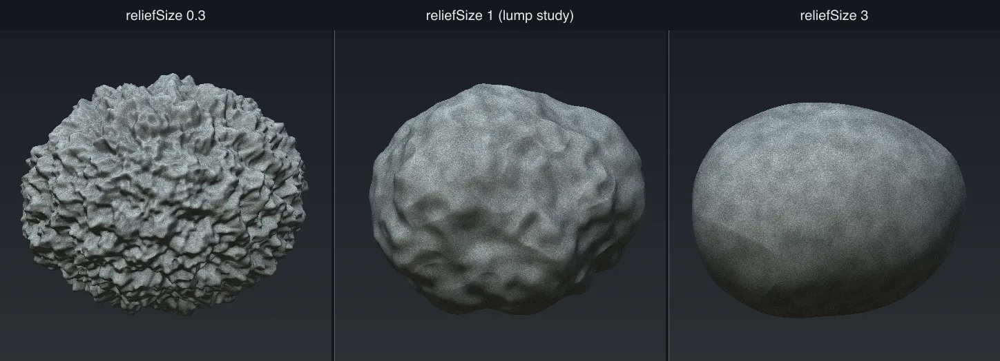

### `reliefOctaves`

How many layers of bumps there are. `1` gives only the large bumps. Each extra layer adds smaller
bumps on top, so the surface looks rougher. It does not move the large bumps.

The mesh cannot show bumps smaller than about two of its quads. More octaves than that go into the
normal map only.

Default: `5`. Range: 1 to 8.

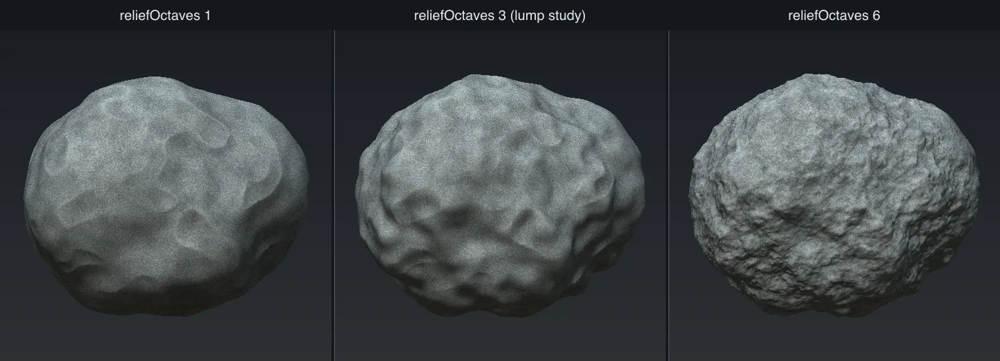

## The layers

Layers are the thin beds of a sedimentary rock such as sandstone. They are off by default
(`laminae 0`), because granite has no layers.

The layers are grouped. Eight thin layers make one thick band, and each band weathers as one. In the
images, the thin layers are the fine lines, and the dark lines are the edges between bands. On a
steep side, the layers show as stripes. On a top face, they show as rings.

There are two separate controls:

- `laminae` sets how strong the layers are in the **texture**.
- `laminaeRelief` sets how far the hard bands stand out in the **mesh**.

So `laminae 0.2` with `laminaeRelief 0` gives light stripes in the colour and no change to the
shape.

The images in this section start from a **layer study**:
- an egg with only a little noise and no scoops or plates;
- the sandstone colours, `subdivisions 96`, and no cracks or weathering;
- `laminae 1`, `laminaeSize 0.08` and `laminaeRelief 0.08`.

Examples:

- Wind-cut sandstone: `laminae 1`, `laminaeSize 0.055`, `laminaeRelief 0.075`, `laminaeVary 0.85`,
  `bedding 1`
- A little layering in granite: `laminae 0.2`, `laminaeRelief 0`, `laminaeTint 0.6`
- Fine shale: `laminaeSize 0.015`, `laminaeVary 0.3`, `laminaeRelief 0.02`

### `laminae`

How strong the layers are in the texture. `0` draws none. It does not change the mesh.

Default: `0`. `granite-01` uses `0.3`. Range: 0 to 1.

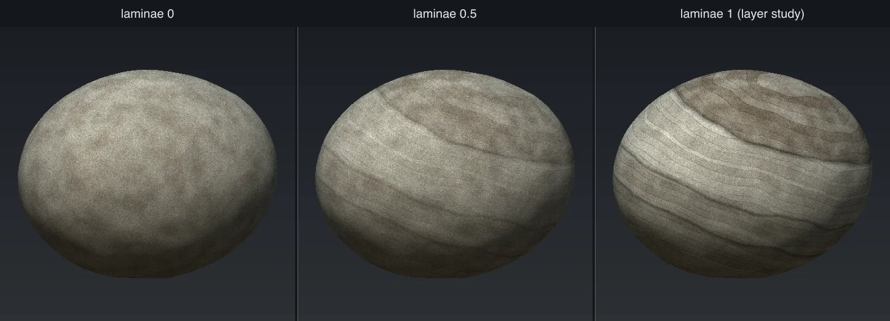

### `laminaeSize`

The thickness of one thin layer, in metres. A band is eight of them. Small values give many thin
stripes. Large values give a few wide bands.

The mesh shows only bands that are at least two mesh quads thick. Thinner bands are only in the
texture. The run tells you which.

Default: `0.06`. `granite-01` uses `0.055`.

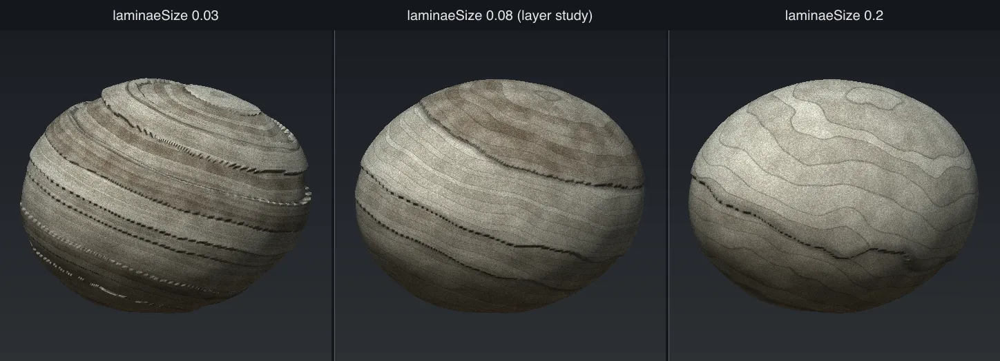

### `laminaeRelief`

How far a hard band stands out from a soft band in the mesh, as a fraction of the radius. Look at
the outline of the rock: at `0.15` it has steps. `0` does not change the mesh.

Default: `0.04`. `granite-01` uses `0.075`.

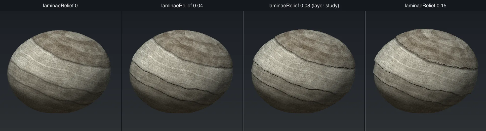

### `laminaeVary`

How much the layer thicknesses differ. `0` makes all layers the same, so the fine lines are evenly
spaced. `1` mixes thick layers with thin lines.

Default: `0.7`. Range: 0 to 1.

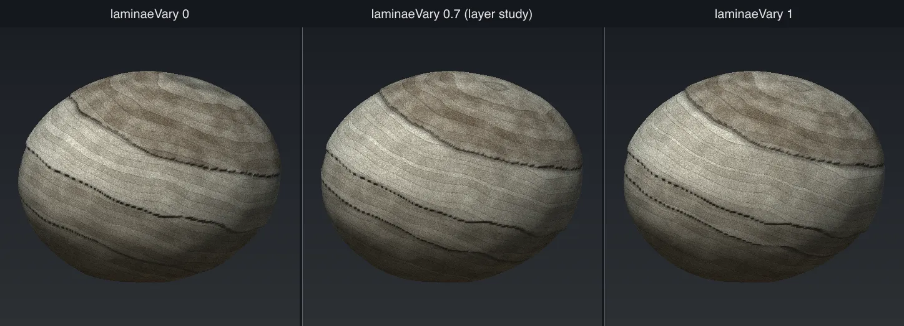

### `laminaeTint`

How much each layer changes between the stone's dark and light colours. `0` keeps the layers close
to one colour. Higher values make light and dark bands.

Default: `0.5`. Range: 0 to 1.

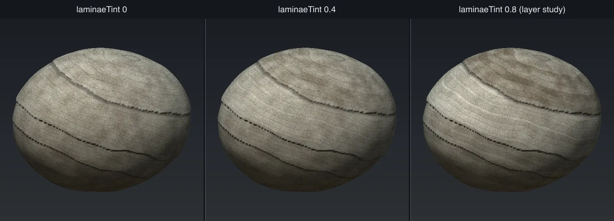

### `laminaeWarp`

How much the layers wave across the rock. `0` makes straight, parallel lines, which look printed
on. `2` makes the layers bend and fold.

Default: `0.6`.

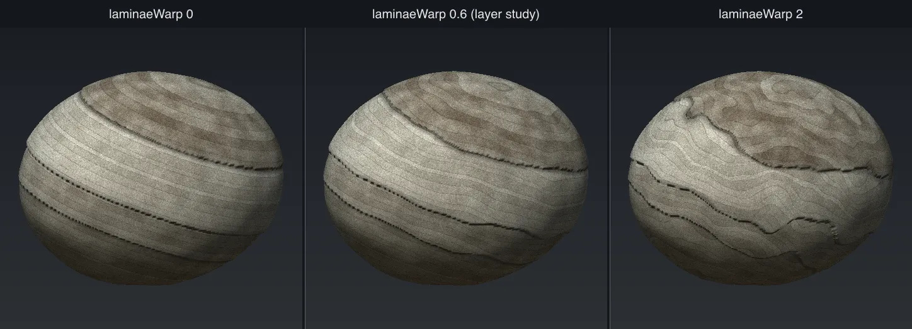

### `laminaeWarpSize`

The width of one wave, in metres. Small values make tight ripples. Values near the rock's size make
the whole stack bend in one slow curve.

Default: `1.2`. `granite-01` uses `1.6`.

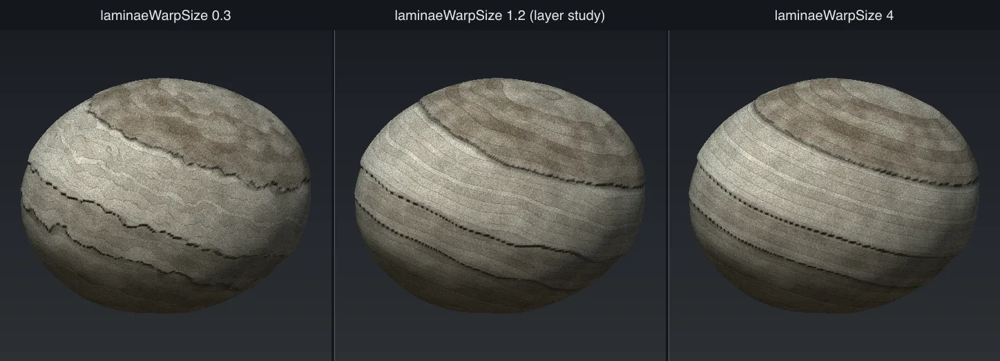

### `laminaeAccentShare` and `laminaeAccent`

`laminaeAccentShare` is the part of the layers that use the colour `laminaeAccent` and not the
stone's own colours. Use it for a pale seam or a red iron band. The images use `#b0583a`.

Default: `0` and `#d9d2c0`. `granite-01` uses `0.13` and `#e8dfc6`.

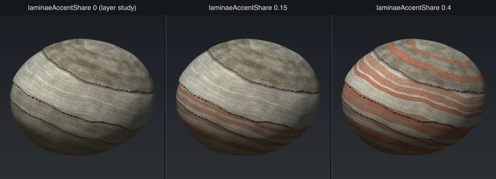

## The cracks

One crack pattern makes two separate things:

- **Lines in the texture**: `crackStrength`, `crackWidth` and `crackDepth` control them.
- **Grooves in the mesh**: `grooveDepth` and `grooveWidth` control them. Only the large cracks get
  grooves.

`cracks` sets the pattern that both use. So `cracks` changes both, and the other keys change only
one of the two.

The images in this section start from a **crack study**:
- an egg in the granite colours, with only a little noise and no scoops, plates or layers;
- `subdivisions 96`, and no weathering or stain;
- `cracks 1.2`, `crackStrength 1`, `grooveDepth 0.06` and `grooveWidth 0.15`.

Some images turn one of the two parts off, so that you see only the part that the key changes. The
caption says so.

Examples:

- Cracks in the texture only: `grooveDepth 0`
- Grooves in the mesh only: `crackStrength 0`
- Cracks you see in the outline: `grooveDepth 0.05`, `grooveWidth 0.15`
- A rock that breaks into blocks: `cracks 1`, `grooveDepth 0.15`, `grooveWidth 0.3`
- No cracks: `cracks 0`

### `cracks`

How many crack cells there are per metre. This sets the size of the pieces between the cracks.
`0.6` gives a few large pieces. `3` gives many small pieces. `0` removes all lines and all
grooves.

Default: `1.2`.

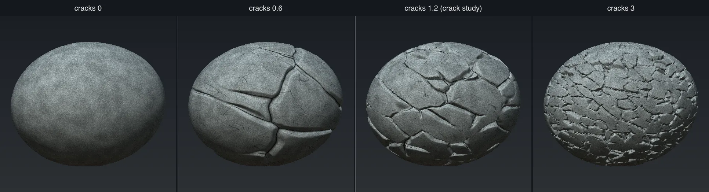

### `crackStrength`

How dark and strong the crack lines are in the texture. `0` draws no lines. It does not change the
grooves. The drip stains and the iron stain that come from the cracks also go at `0`.

Default: `1`. `granite-01` uses `0.2`. Range: 0 to 1.

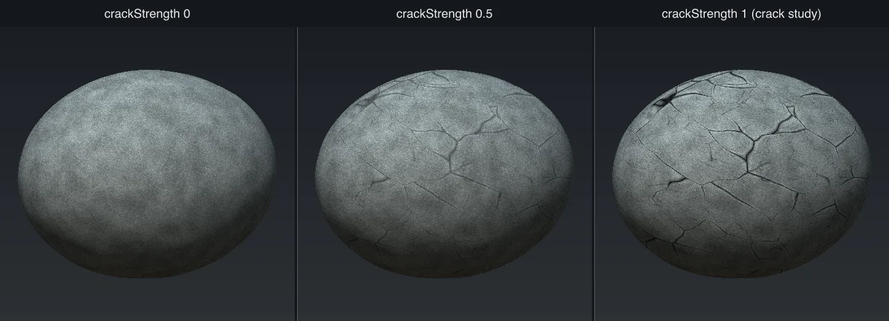

### `crackWidth`

The width of the crack lines in the texture. It does not change the grooves.

Default: `0.035`. Range: 0 to 1.

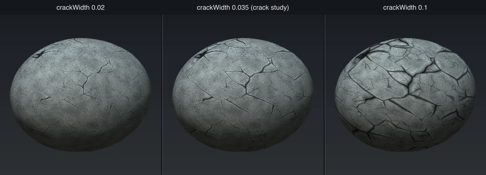

### `grooveDepth`

How deep the grooves cut into the mesh, as a fraction of the radius. Deep grooves show in the
outline of the rock. `0` leaves the mesh smooth.

Default: `0.05`. `granite-01` uses `0.03`. Range: 0 to 0.5.

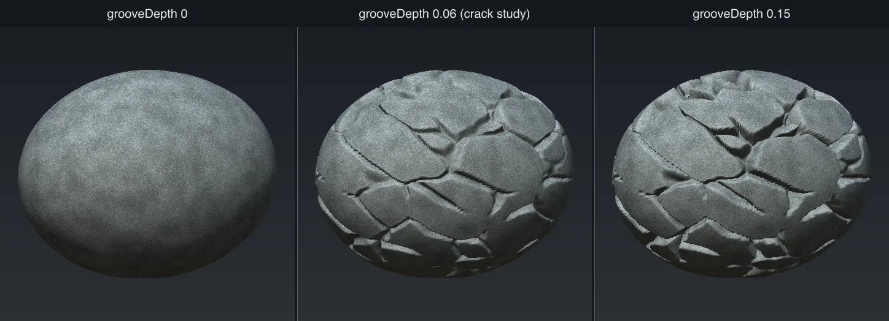

### `grooveWidth`

The width of each groove. A narrow groove makes a sharp cut. A wide groove makes a soft valley, so
the pieces look like rounded cobbles. A groove needs two or three mesh quads to show. A narrow
groove on a coarse mesh shows as a jagged tear.

Default: `0.15`. `granite-01` uses `0.4`. Range: 0 to 1.

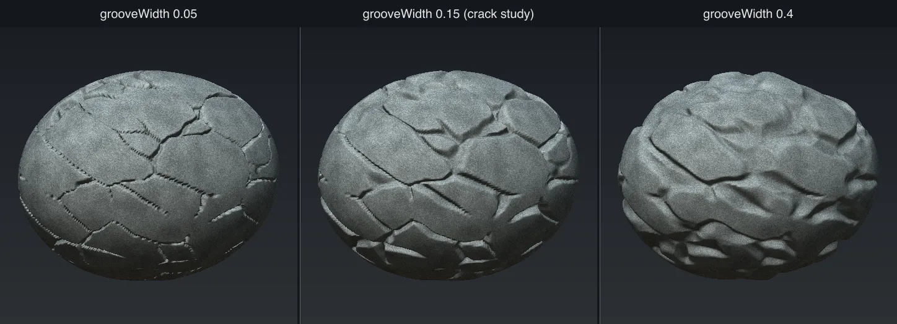

### `crackDepth`

How deep the crack lines cut into the texture height. The normal map uses this height. It has no
image, because the preview does not show normal maps.

Default: `0.6`. Range: 0 to 1.

## The holes

Lava has gas in it. When the lava cools, the gas bubbles stay in the stone as holes. A stone with
many of these holes is **vesicular**, and one hole is a **vesicle**. Basalt often has them. Scoria
is a basalt with so many holes that it looks like a sponge.

Each bubble is a sphere in 3D. The surface of the rock cuts each sphere at a different height. A
sphere cut near its middle shows a wide hole, and a sphere cut near its top shows a small one. So a
face shows holes of many sizes, even where the bubbles are all one size.

Like the cracks, the holes are in the mesh and in the texture:

- **Pits in the mesh**: only holes wider than two mesh quads, and at full depth from four quads.
  At `subdivisions 24` on a 1.2m rock, that is from 0.09m, and at full depth from 0.17m. You do not
  set this: the tool finds it from the mesh.
- **Holes in the texture**: all holes. An open hole has a dark floor, less light and a pit in the
  height map. Its colour is multiplied over the stone, so the grain still reads inside it.

The holes cannot have an overhang, and a hole cannot go through the rock. The rock must stay
star-shaped (see [How a rock is built](#how-a-rock-is-built)), so a hole is always a bowl.

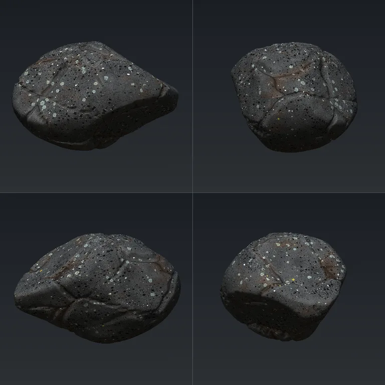

The images in this section start from a **hole study**:
- an egg in the `basalt-01` colours, with only a little noise and no scoops, plates or cracks;
- `subdivisions 64`, and no weathering or stain;
- `vesicles 0.35`, `vesicleSize 0.04`, `vesicleVary 0.6` and `vesicleDepth 0.8`.

Examples:

- Vesicular basalt: `vesicles 0.35`, `vesicleSize 0.04`, `vesicleZoning 0.5`
- Basalt from a lava flow: add `vesicleStretch 0.5`
- Scoria: `vesicles 0.6`, `vesicleSize 0.2`, `vesicleVary 0.8`, `subdivisions 64`
- Old basalt with filled holes: `amygdales 0.5`
- No holes: `vesicles 0`

### `vesicles`

How many holes there are, from 0 to 1. `0.35` is a vesicular basalt. `0.7` is almost a scoria. `0`
turns the holes off.

Default: `0`. `basalt-01` uses `0.55`. Range: 0 to 1.

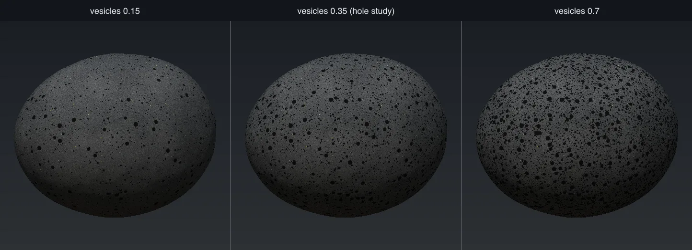

### `vesicleSize`

The width of the largest bubble in metres. The holes on the surface are this size and smaller. A
large value makes pits in the mesh as well. The value at the right in the image is large enough for
the mesh.

Default: `0.02`. `basalt-01` uses `0.045`. Range: above 0, to 0.5.

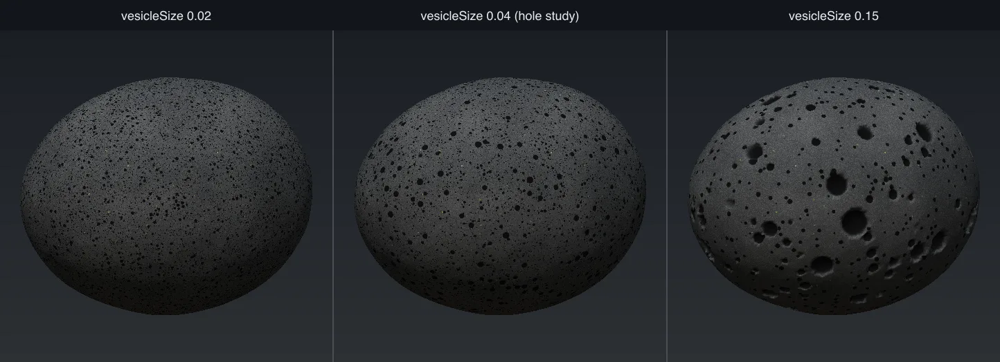

### `vesicleVary`

How much the bubble sizes are different. `0` makes all bubbles one size. `1` adds many small holes
between the large ones. This is what most basalt looks like.

Default: `0.6`. `basalt-01` uses `0.7`. Range: 0 to 1.

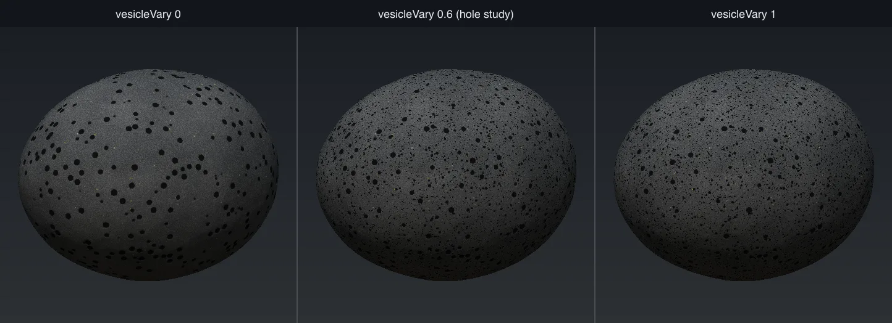

### `vesicleStretch`

How much the flow of the lava pulled the bubbles into ovals. The ovals point along the bedding, in
one direction. `1` makes a hole three times longer than it is wide.

Default: `0`. `basalt-01` uses `0.4`. Range: 0 to 1.

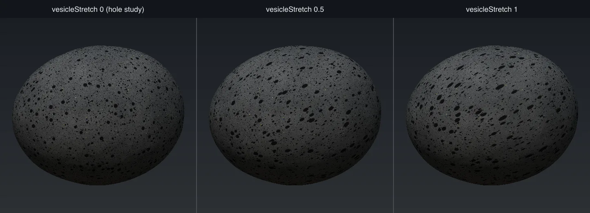

### `vesicleZoning`

How much the holes collect in zones. A lava flow has many holes near its top and few in its
middle. `0` puts holes everywhere. At `1`, bands of solid stone are between the zones of holes.
The holes become smaller at the edge of a zone, so no hole is cut in half.

Default: `0`. `basalt-01` uses `0.45`. Range: 0 to 1.

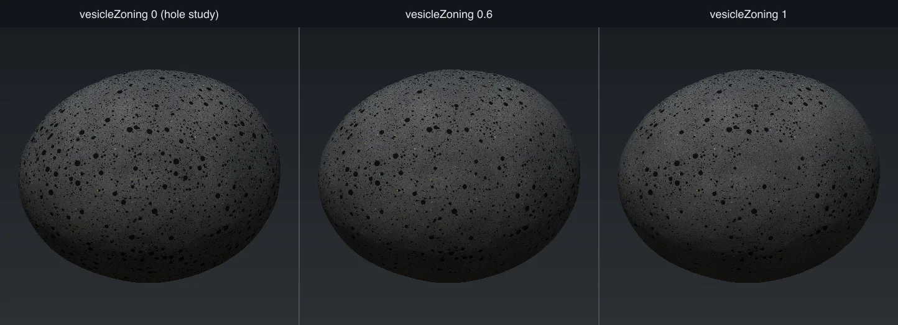

### `vesicleDepth`

How deep a hole goes, as a fraction of the radius of its bubble. `1` is the full bowl. The mesh
shows the change only on large holes, so the image uses `vesicleSize 0.15`. On small holes, it
changes only the height map.

Default: `0.8`. `basalt-01` uses `0.85`. Range: 0 to 1.

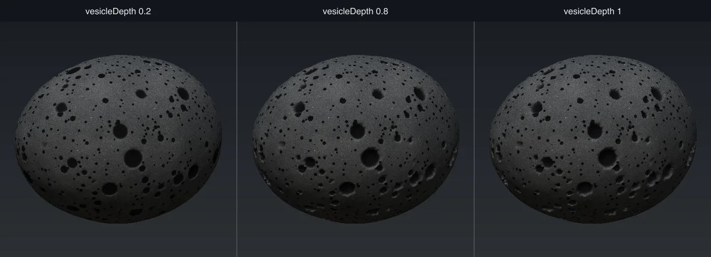

### `vesicleTint`

The colour an open hole is darkened by. It is multiplied over the stone, so the grain and the tone
still read inside the hole. Near black is the dark glass that lines a bubble in basalt. `#ffffff`
leaves the hole its own colour and only the shading marks it. A colour makes a rusted or a
mineral-stained hole.

Default: `#3d3d3d`. `basalt-01` uses `#3d3d3d`.

### `amygdales` and `amygdaleTint`

In old basalt, minerals such as calcite fill some holes. A filled hole is an **amygdale**. It is a
pale spot with a thin dark edge. It has no depth. `amygdales` is the part of the holes that are
filled: `1` fills all of them. `amygdaleTint` is the mineral, added on top of the stone, so the
grain still reads through the spot. A pale grey is calcite or zeolite. A soft green is chlorite.
`#000000` fills nothing. Bright values wash the spot out to white, so raise the tint slowly.

Default: `0` and `#8f8b7b`. `basalt-01` uses `0.08`. Range: 0 to 1.

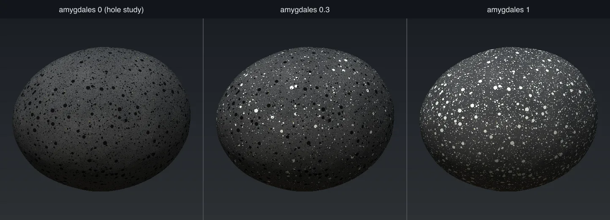

## Colour and grain

The texture has two base layers:

- The **tone** is soft, cloudy patches of colour between `stoneDark`, `stoneTint` and `stoneLight`.
- The **grain** is small crystals of three minerals, drawn on top of the tone.

The veins and the glint crystals go on top of those two.

The images in this section start from a **colour study**:
- a 0.6m plain rock with a gentle shape, so each crystal is several pixels wide;
- no cracks, layers, weathering, stain or wash;
- the default granite colours and grain.

The tone images also turn the grain off (`speckle 0`), so that you see only the tone. All the grain
and tone keys are in metres, so on a large rock the same crystals look much smaller.

### The stone colours

`stoneTint` is the middle colour. `stoneDark` and `stoneLight` are the two ends. The veins and the
minerals also use these colours. Each is a six digit hex colour.

| Stone | `stoneTint` | `stoneDark` | `stoneLight` |
| ----- | ----------- | ----------- | ------------ |
| Granite (default) | `#7f827c` | `#3e403e` | `#b3b5ae` |
| Sandstone | `#9c8f7a` | `#5a4a38` | `#c9bda6` |
| Basalt | `#5e6066` | `#2e3034` | `#8d9096` |

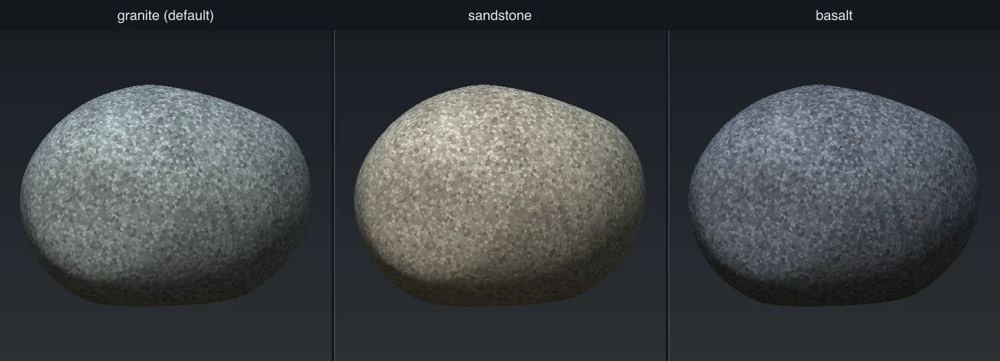

### `toneSize`

The width of the largest colour patch, in metres. Small values give many small patches. A value
near the rock's size gives one or two broad patches, so the rock looks almost one colour.

Default: `0.25`.

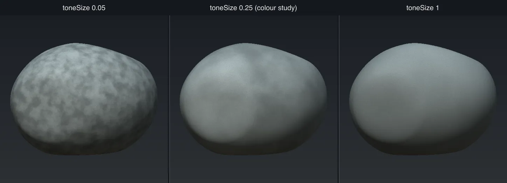

### `toneOctaves`

How many layers of finer patches go on top of the largest ones. Each layer is half the size of the
one before. `1` gives only soft, large patches. More layers add finer detail inside them.

Default: `5`. Range: 1 to 8.

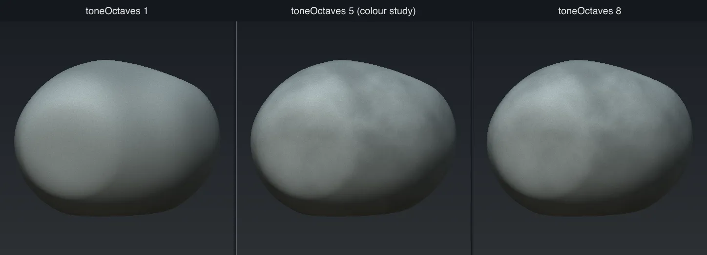

### `toneContrast`

How far the patches go from `stoneTint` toward the dark and light colours. `0` makes one flat
colour. `1` gives strong light and dark patches.

Default: `0.45`. Range: 0 to 1.

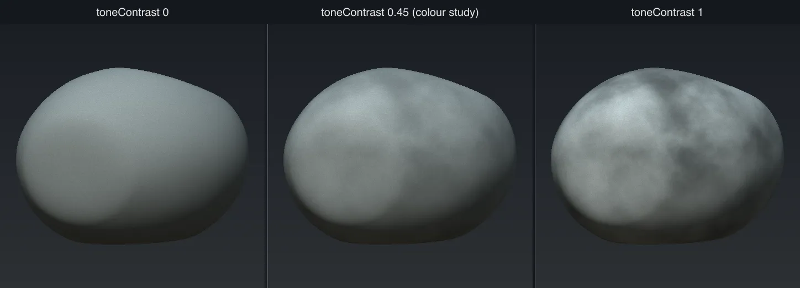

### `grainScale`

How many crystals there are per metre. A low value gives large crystals, like a coarse granite. A
high value gives a fine grain. Each crystal needs about three texture pixels. On a large rock, a
high value can be too fine for the texture and look like noise.

Default: `110`.

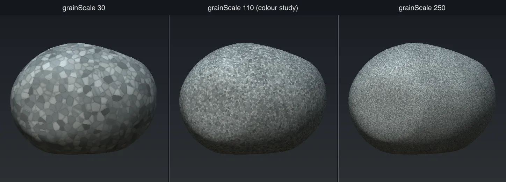

### `speckle`

How strongly the crystals are drawn. `0` shows only the tone. `1` draws each crystal at full
colour.

Default: `0.6`. Range: 0 to 1.

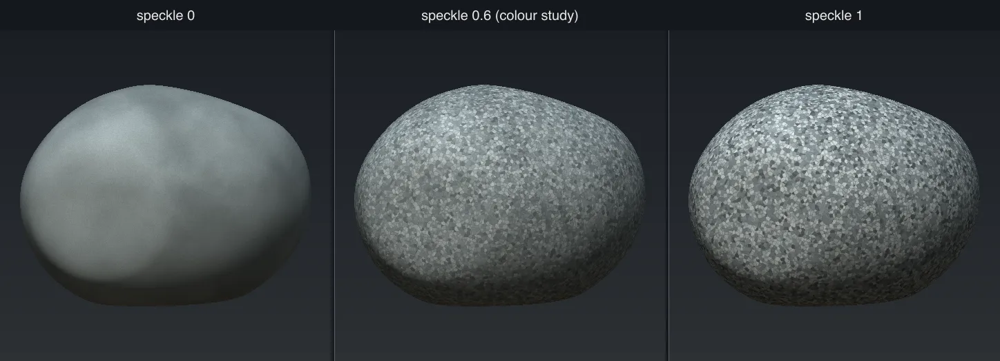

### `veins`

How much of the rock has pale quartz veins. The veins are faint on purpose: bright veins look like
chalk marks. They show clearly only at high values. `1` covers most of the rock and looks like
marble.

Default: `0.15`. `granite-01` uses `0.3`. Range: 0 to 1.

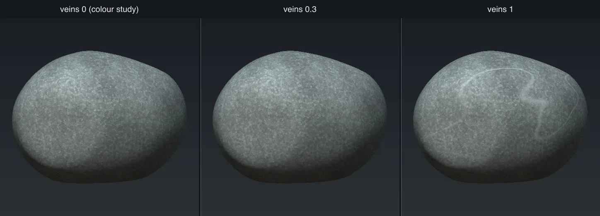

### `glint`, `glintScale` and `glintTint`

`glint` is how much of the stone holds small, shiny metal crystals, such as pyrite or mica.
`glintScale` is how many crystals there are per metre: `15` gives large crystals, `120` gives
specks. `glintTint` is their colour.

The preview does not show shine, so these images show only the colour of the crystals. They use a
gold `glintTint` (`#e0c060`) so that you can see them.

Default: `0.25`, `30` and `#d8c9a4`. `granite-01` uses `0.1`, `6` and `#47746f`.

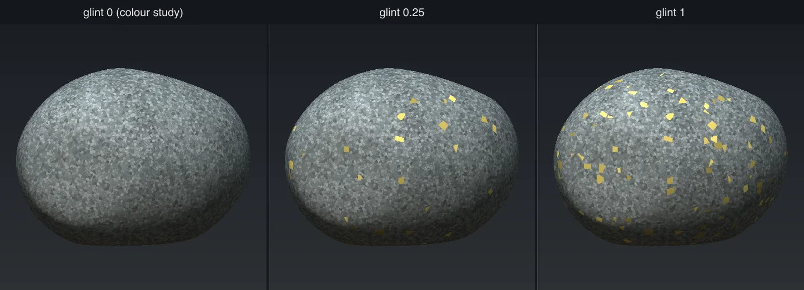

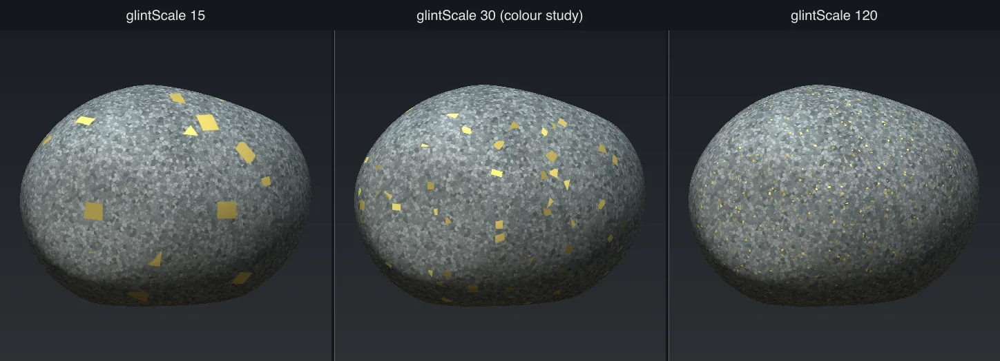

## Weathering

These keys add the marks that time leaves on a rock.

### `weathering`, `lichenTint` and `soilTint`

`weathering` controls the lichen, the dirt in the hollows, the drip stains under cracks and the soil
at the base. `0` is fresh stone. `1` puts lichen on every top and soil up the base.

`lichenTint` is the colour of most lichen. `soilTint` is the colour of the dirt and soil.

Default: `0.6`. `granite-01` uses `0.5`. Range: 0 to 1.

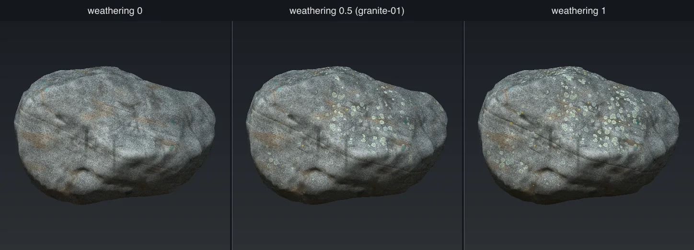

### `patina`

A dark crust that grows where water stays or runs: on the tops, in the hollows, next to cracks and
under drip lines. It does not grow on worn edges.

Default: `0.5`. Range: 0 to 1.

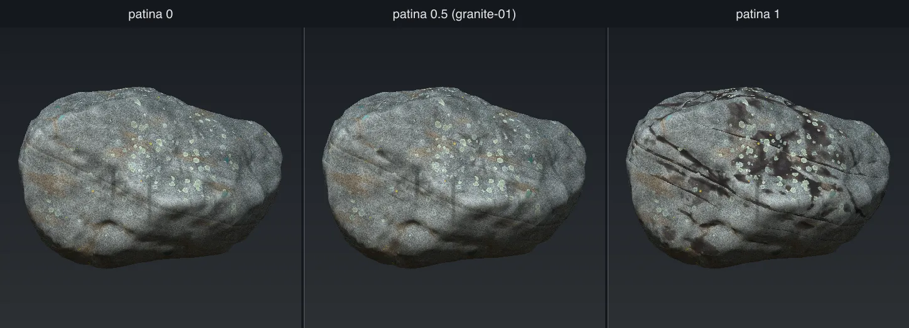

### `edgeWear` and `edgeTint`

How much the outer edges are worn. Worn edges become paler (toward `edgeTint`) and smoother, and
have no stain, patina or lichen.

Default: `0.5`. Range: 0 to 1.

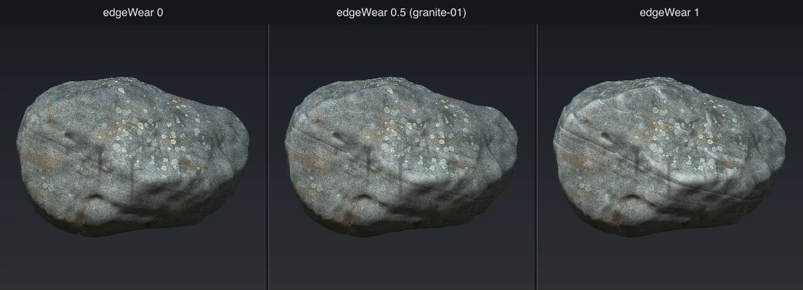

### `stain` and `stainTint`

How strong the iron stain is. The stain comes out of the cracks and lies in bands along the layers.
`stainTint` is its colour.

Default: `0.5`. Range: 0 to 1.

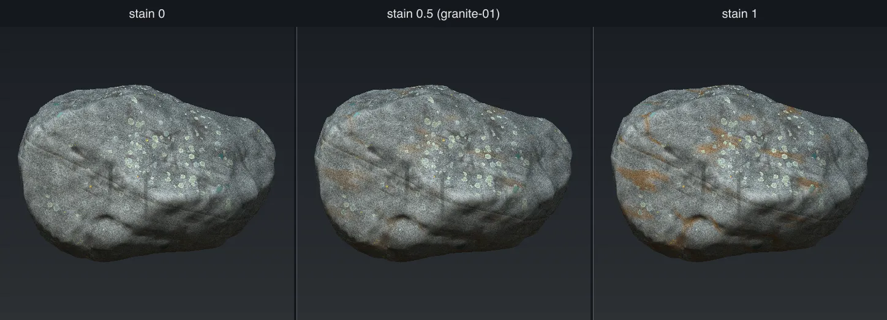

### `streaks`, `streakCount` and `streakTint`

Streaks are marks that water leaves as it runs down the sides. `streaks` is how strong they are.
`streakCount` is how many there are around the rock. `streakTint` is their colour: near black is
mould, white is bird droppings, brown is iron.

Default: `0`, `12` and `#2a2d28`. `granite-01` uses `0.4` and `16`. Ranges: 0 to 1, and 0 to 100.

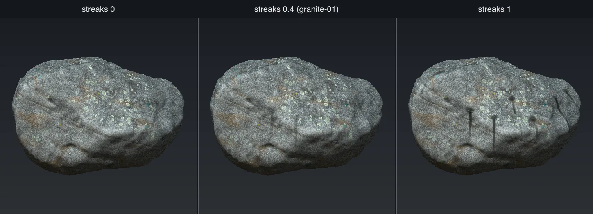

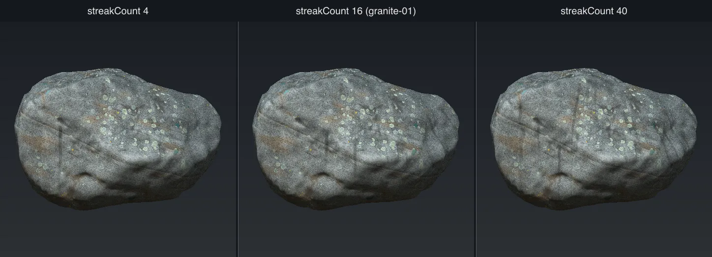

The images below set `weathering`, `stain` and `streaks` to 1 and change one colour.

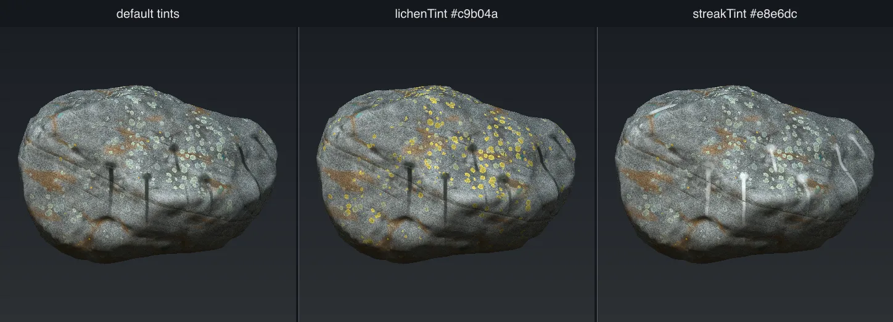

### `snow`

Snow on the faces that look up. It is deeper in hollows and thinner on edges. `0.5` covers the tops.
`1` covers all but the sides and the edges. It is painted over everything else.

Default: `0`. Range: 0 to 1.

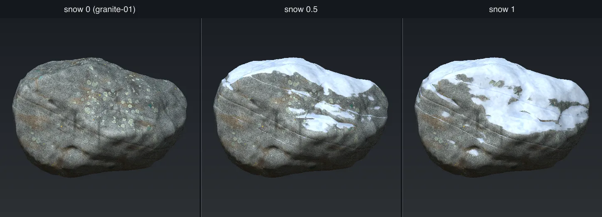

### `topWash`, `topOpacity` and `topTint`

A colour change on the faces that look up. Use it to make the tops lighter, darker, warmer or
cooler. The lichen, veins and stains are not changed by it.

- `topWash` is how far down the faces the colour goes, on the same scale as `snow`. `0` is none.
  `1` covers everything but the sides.
- `topOpacity` is how strong the colour is.
- `topTint` is the colour. `#808080` makes no change. Lighter makes the top lighter. Darker makes it
  darker. A hue makes it warmer or cooler.

Default: `0`, `1` and `#808080`. `granite-01` uses `0.3`, `0.25` and `#2a2d28`, which is a faint,
dark wash.

The images start from a **wash study**: a plain rock with scoops but no cracks, layers or
weathering, and `topWash 0.5`, `topOpacity 1` and `topTint #5a6f8c`. The strong blue is only there
so that you can see the wash.

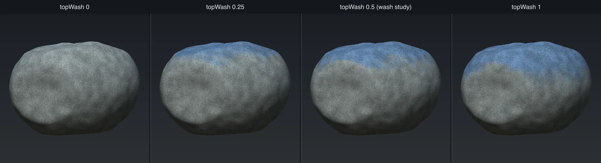

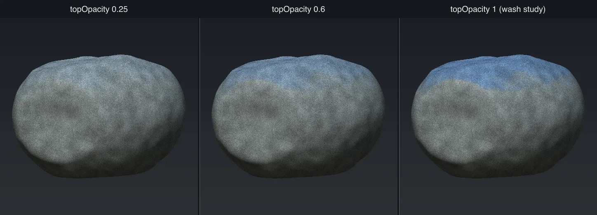

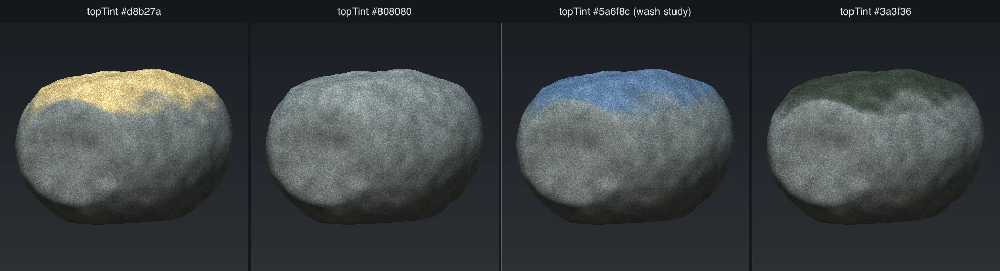

## Surface finish

These keys change the roughness, metallic and normal maps. The preview does not show these maps,
so these keys have no images. Look at the rock in the engine to see them.

| Key | Default | What it does |
| --- | ------- | ------------ |
| `roughness` | `0.82` | The base roughness. `0.9` is dry sandstone. `0.55` is wet or polished rock. |
| `metallic` | `0` | The base metalness. `0.3` looks like ore. Lichen, patina, streaks and snow set it back to 0. |
| `bump` | `1` | How strong the normal map is. `2` is two times stronger. Try this first if a rock looks too smooth. Range: 0 to 4. |
| `undulation` | `0.5` | Slow, soft waves in the texture height, finer than the mesh can show. Range: 0 to 1. |
| `undulationSize` | `0.09` | The width of those waves, in metres. |
| `crackDepth` | `0.6` | How deep the crack lines cut into the texture height. |

## The mesh

### `subdivisions`

How many quads go along each edge of the cube that the rock is made from. The triangle count is
`12 × subdivisions²`: `4` is 192 triangles, `24` is 6,912 and `48` is 27,648. Small bumps, plate
edges and grooves need more subdivisions to show.

This is the only key that does not change the texture, so a change builds quickly. A LOD tier can
change it. See [In the game](in-game.md#lod-tiers).

Default: `24`. `granite-01` uses `22`. Range: 2 to 128.

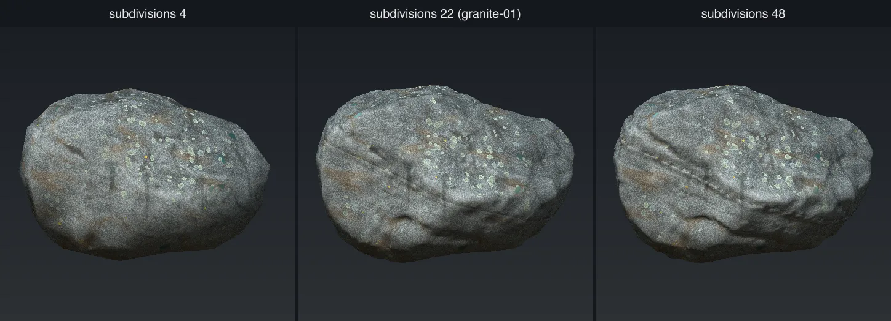

## Texture size

`textureSize` sets the texture size. The texture holds the six faces of a cube, in three columns and
two rows. Each face is half of `textureSize`. So a rock at `textureSize` 1024 has a 1536x1024
texture.

## In the game

A rock lies on the slope (`alignToNormal 1`) and sinks one fifth of its height into the ground. It
has a hull collider and an impostor from 120m. See [In the game](in-game.md).

## Other keys

These keys work on more than one type. The defaults here are the ones for `rock`.

### Files and preview

| Key | Default | What it does |
| --- | ------- | ------------ |
| `name` | required | The model name. It names the `.glb`, the preview and the geometry id. |
| `textureSet` | `name` | The name of the texture set. See [Share textures](README.md#share-textures-across-a-family). |
| `seed` | new each run | The seed for every random choice. See [The seed](README.md#the-seed). |
| `out` | `assets/shared/nature/rocks` | The folder that the files are written under. |
| `assetsRoot` | `assets/shared` | The folder that the template URLs are relative to. |
| `preview` | `0` | The size in pixels of each preview panel. `0` writes no preview. |
| `previewAngles` | `4` | `4` shows four sides in a 2x2 grid. `1` shows one view. |
| `skipTextures` | `false` | Use the textures that are already in the set, and do not write new ones. |
| `writeTemplates` | `false` | Change `geometries.json` and `materials.json` in place. `--write-template` is the newer option. |
| `templatesDir` | `templates` | The folder that holds `geometries.json`, `materials.json` and `scatter-layers.json`. |

### Game keys

| Key | Default | What it does |
| --- | ------- | ------------ |
| [`cullDistance`](in-game.md#layer-keys) | `800` | The distance in metres past which the engine does not draw the model. |
| [`castShadow`](in-game.md#layer-keys) | `true` | Whether the model casts a shadow. |
| [`footprint`](in-game.md#density) | `0` | The clear space in metres round each model. `0` lets the tool choose. |
| [`scaleMin`](in-game.md#layer-keys) | `0.6` | The smallest random size of a copy. |
| [`scaleMax`](in-game.md#layer-keys) | `1.6` | The largest random size of a copy. |
| [`impostor`](in-game.md#impostors) | from 120m | The flat pictures drawn at far distances. |
| [`lods`](in-game.md#lod-tiers) | `[]` | Simpler versions of the model for far distances. |
