# Trees

`type: tree` grows a trunk that divides into branches. Leaf cards hang on the outer branches. This
is the default type, so a config with no `type` is a tree.

One tree generator makes broadleaf trees, shrubs and conifers. They differ only in their keys.

[Back to scatter-forge](README.md)

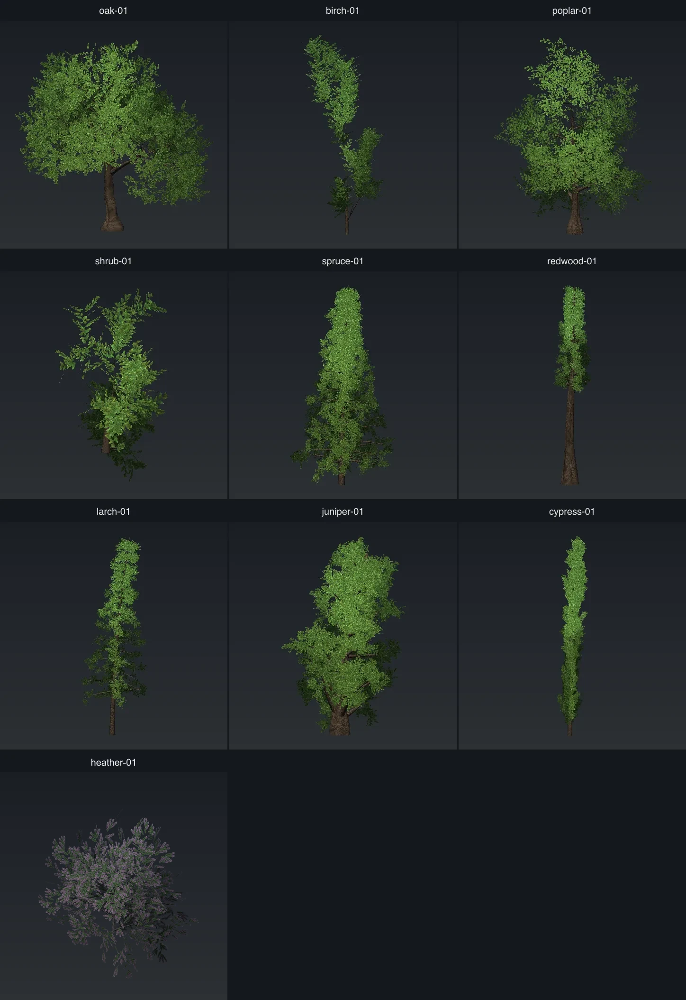

## How a tree is built

1. The trunk grows from the ground.
2. New branches grow out of the trunk. New branches then grow out of each of those, and so on.
   `branchLevels` sets how many times this happens.
3. The whole tree is scaled so that its top is at `height`.
4. Leaf cards are added to the outermost branches.

These docs call a branch that new branches grow out of the **parent**, and the new branches its
**children**. The trunk is the first parent.

A **leaf card** is a flat rectangle with a picture of a leaf spray on it. The transparent parts of
the picture are cut away.

The comparison images below start from the `oak-01` template, unless the label says a different
template. Trunk images use a short, bare trunk so that you can see the detail. Images of the
branches remove the leaves and put bark on every branch level (`barkLevels 6`), so that you can see
the branches.

## Size

### `height`

The height of the finished tree, in metres, from the ground to the top.

Default: `12`. Shrub `2.2`, birch `16`, oak `18`.

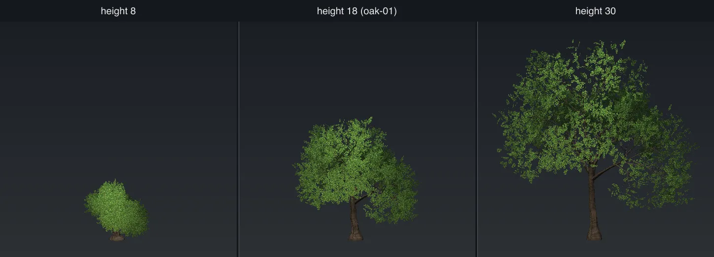

### `trunkRadius`

The radius of the trunk at the ground, in metres. `height` does not change it. So a thin tree and a
thick tree of the same height differ only in this key.

Default: `0.32`. Shrub `0.07`, birch `0.16`, oak `0.62`.

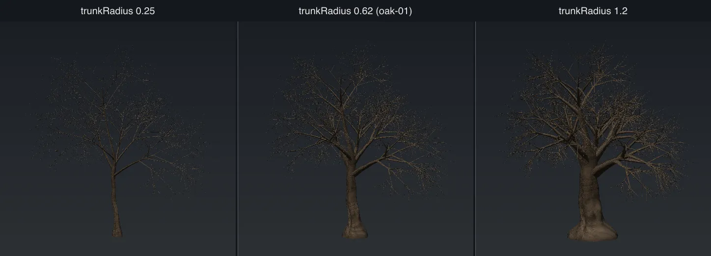

### `trunkTaper`

How thin the trunk becomes at its top, as a fraction of its radius at the ground. `0.2` makes a
thin top. `0.9` makes a trunk that is almost the same thickness all the way up.

Default: `0.22`. Range: 0 to 1.

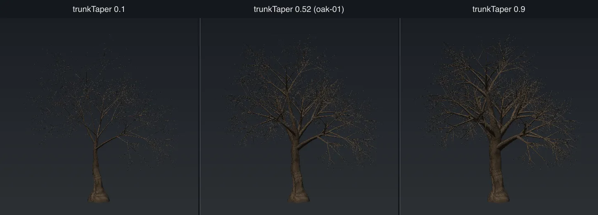

## Trunk shape

These keys stop a trunk from looking like a smooth pole. They also work on the stem of a
[crown](crown.md).

### `trunkFlare`

How much the foot of the trunk spreads out, as a fraction of `trunkRadius`. The spread is gone at
one fifth of the trunk's height.

Default: `0` (`0.25` for a crown). Redwood `0.5`.

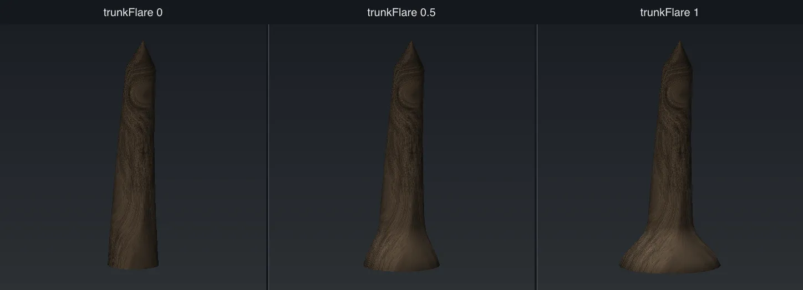

### `trunkFlute`

How deep the vertical grooves up the trunk are, as a fraction of its radius. The grooves fade out
near the top.

Default: `0`. Redwood `0.22`. Range: 0 to 0.5.

`trunkFlute` needs a trunk with at least 12 sides. Set `trunkSides` to 12 or more. If you do not,
the run stops and tells you.

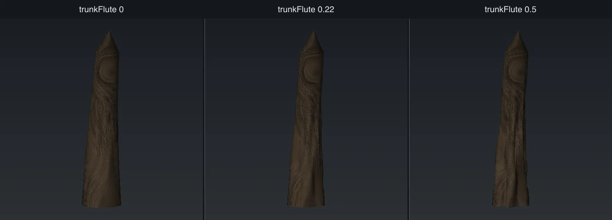

### `trunkWander`

How far the trunk moves away from a straight line as it goes up, in metres. The foot does not move.
The branches follow the trunk.

This value is in metres, so it does not change with the tree's size. `0.6` is a small lean on a
42m redwood, but a strong bend on a 7m palm.

Default: `0`. Redwood `0.6`.

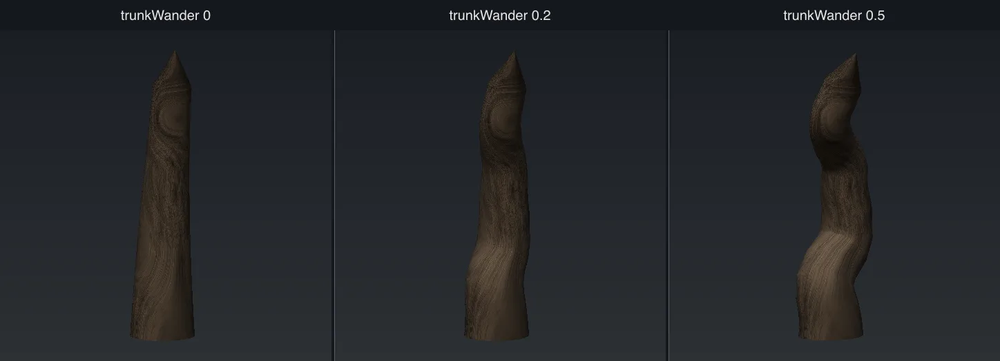

### `trunkSides`

The number of sides around the trunk only. `0` uses `radialSegments`. More sides cost few
triangles, because the trunk is one branch of hundreds.

Default: `0`. Redwood `24`.

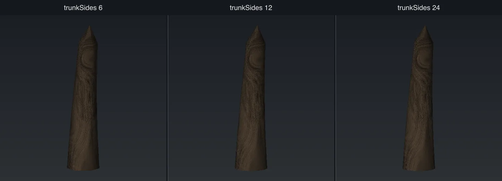

### `trunkSegments`

The number of rings up the trunk only. `0` uses `segments + 2`. More rings let `trunkWander` make
a smooth curve.

Default: `0`. Redwood `20`.

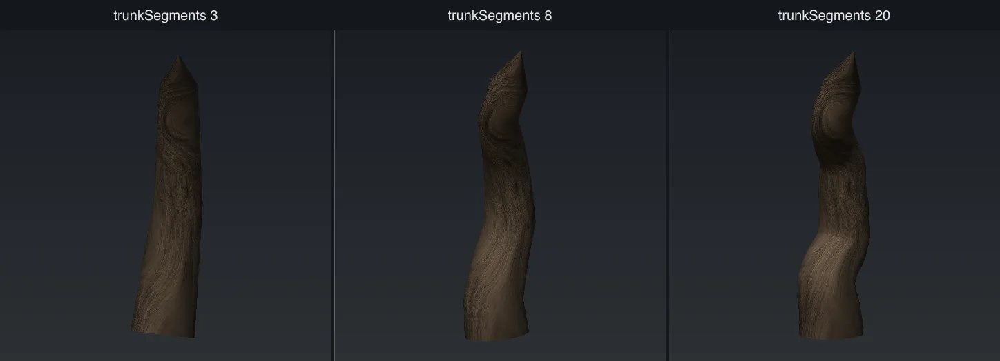

## Branches

### `branchModel`

How the trunk carries its branches.

- `fork`: the trunk divides into branches, and each branch divides again. Use this for broadleaf
  trees.
- `whorl`: the trunk goes straight up to the top. Rings of branches come out of it. Use this for
  conifers. See [Conifers](#conifers).

Default: `fork`. The branches below the trunk always use `fork`.

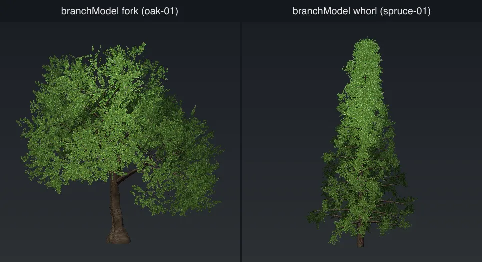

### `splits`

How many child branches grow at each fork. With `whorl`, it is how many branches are in each ring.

This key has the largest effect on the triangle count. The number of branches is `splits` to the
power of `branchLevels`. There is a limit of 4096 branches.

Default: `3`. Birch `2`, oak `6`, poplar `8`. Range: 1 to 12.

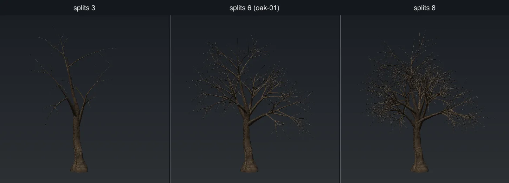

### `splitAngle`

How far each child branch turns away from its parent, in degrees.

Default: `38`. Birch `30`, oak `38`, poplar `72`.

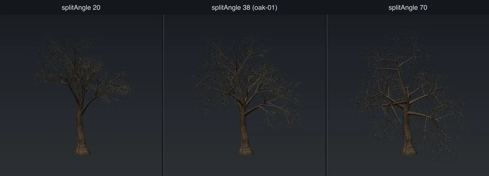

### `splitVariance`

A random amount added to each split angle, in degrees. `0` makes every fork the same, which looks
machine-made.

Default: `12`.

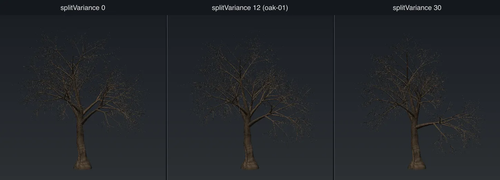

### `splitSpread`

Where the children grow from on their parent. See [How a tree is built](#how-a-tree-is-built).

`splitSpread` is the part of the parent that the children grow from, measured back from the
parent's tip:

- `0`: all children grow from the tip of the parent, like the ribs of an umbrella.
- `0.35`: the children grow from the last 35% of the parent, near its end.
- `0.9`: the children grow along 90% of the parent, some of them near its base. The leaves then
  start lower on the tree.

With `whorl`, this key has a different meaning. See [Conifers](#conifers).

Default: `0.35`. Oak `0.35`, birch `0.8`, shrub `0.95`.

`splitSpread` does not change the number of branches. It only moves them.

The first image has one level of branches: five branches come out of the trunk. At `0`, all five
come from the top of the trunk. At `0.9`, they come from almost the full height of the trunk.

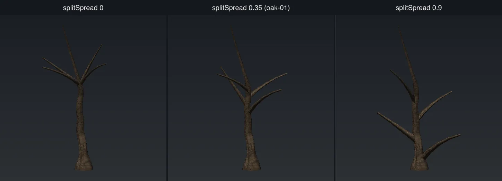

The second image adds a second level. The same rule applies to each branch and its children.

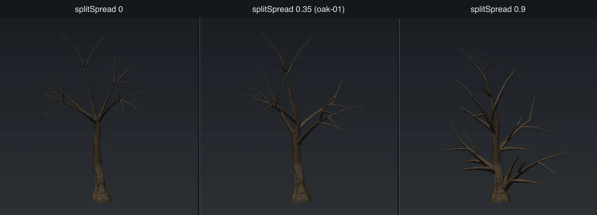

### `branchLevels`

How many times new branches grow out of branches. Each level adds a new, smaller set of branches on
the ends of the last set.

- `0`: only the trunk.
- `1`: branches grow out of the trunk.
- `2`: smaller branches also grow out of those branches.
- `4` (`oak-01`): four levels, from the large limbs out to the thin twigs.

Each level multiplies the number of branches by `splits`. So the count grows fast: at `splits` 6,
four levels give 1,296 twigs.

Default: `4`. Range: 0 to 6.

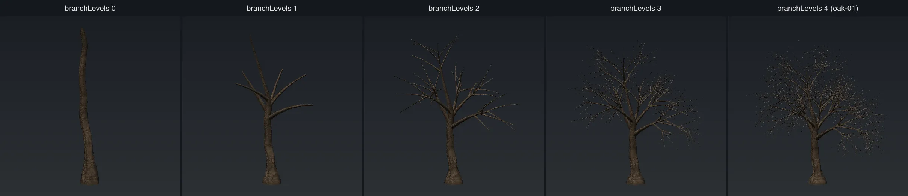

### `lengthRatio`

The length of a child branch as a fraction of its parent. Low values make a small, dense crown. At
`0.85`, the children are almost as long as their parents and the shape breaks up.

Default: `0.62`.

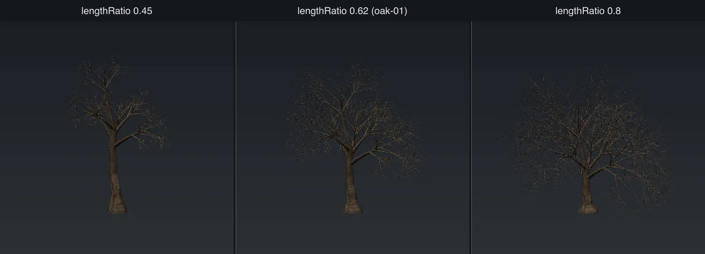

### `radiusRatio`

The thickness of a child branch as a fraction of its parent's thickness where it attaches.

Default: `0.6`.

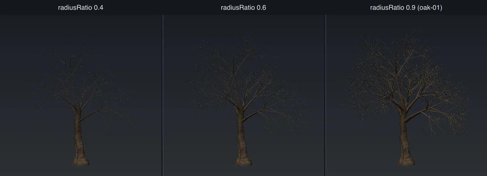

### `curve`

How far each branch bends along its length, in degrees. Above about 20, also increase `segments`,
or the bend shows corners.

Default: `14`.

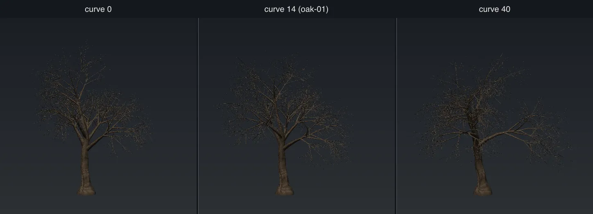

### `droop`

How far the outer branches bend toward the ground, in degrees. The thin branches bend more than the
thick ones. A negative value bends them up.

A tree with many levels spreads out flat unless `droop` is negative. The birch uses `-30`.

Default: `16`. Birch `-30`, oak `16`, weeping `45`.

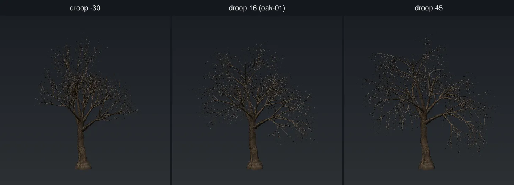

## Conifers

A conifer is a tree with `branchModel: whorl`. The trunk goes straight to the top. Rings of branches
come out of it, and each ring is shorter than the ring below. This makes the cone shape.

```json
{ "branchModel": "whorl", "whorls": 18, "splits": 5, "whorlTaper": 0.16, "splitSpread": 0.88 }
```

The images in this section start from `spruce-01`.

Tips for a good conifer:

- Change `whorlTaper` first. It sets the outline.
- Leave `leafEvenness` at `1`. It is what keeps the short top rings from filling in as a column of
  leaves around the trunk.
- Then change `splitAngle`. It sets whether the branches stand out from the trunk or stay close to
  it.
- Use more `whorls` and fewer `branchLevels`. The templates use 2 or 3 levels.
- Set `barkLevels` to `1`. The leaves hide the small branches, and this removes most triangles.
- Keep `curve` low and `trunkTaper` near `0.1`, so the trunk stays straight and pointed.

### `whorls`

How many rings of branches go up the trunk.

Default: `7`. Juniper `8`, larch `15`, spruce `18`. Range: 1 to 24.

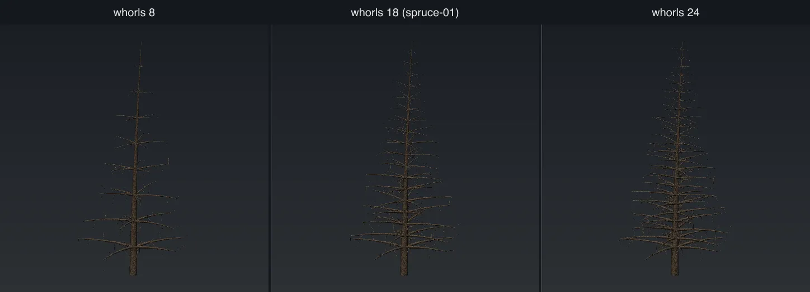

### `whorlTaper`

The length of the top ring as a fraction of the lowest ring. This makes the cone. A low value makes
a sharp point. A high value makes a column.

Default: `0.3`. Spruce `0.16`, redwood `0.45`, cypress `0.9`. Range: 0 to 1.

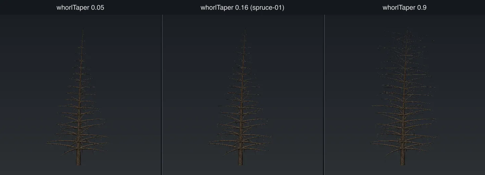

### `splitSpread` with `whorl`

The part of the trunk that has rings, measured down from the top. The rest of the trunk below is
bare. At `0.5`, the lower half of the trunk has no branches.

Spruce `0.88`, redwood `0.5`.

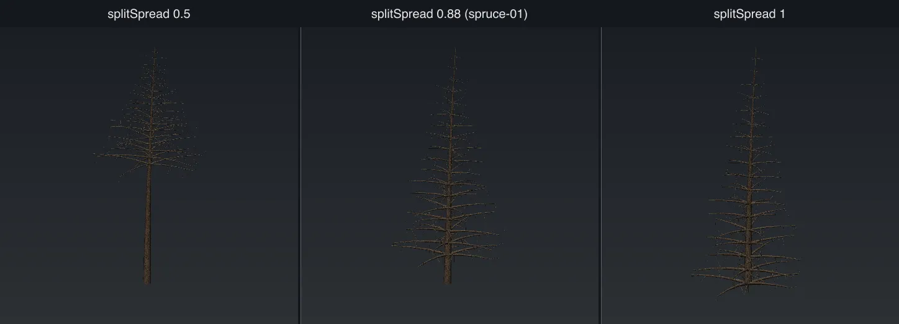

### `splitAngle` with `whorl`

The angle between the trunk and each branch. Near `80`, the branches stand out almost level. A low
value keeps them close to the trunk, as on a cypress.

Spruce `78`, cypress `24`.

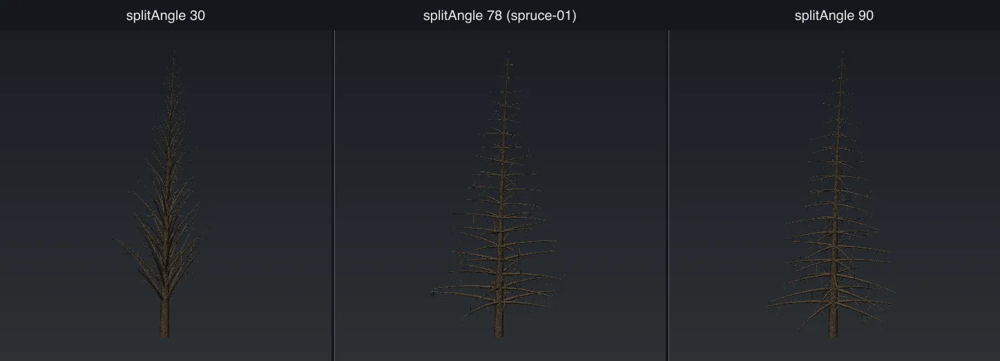

## Leaves

### `leavesPerBranch`

How many leaf cards go on each branch that has leaves. The total number of cards is this number
times the number of leaf branches.

Default: `18`. Oak `3`.

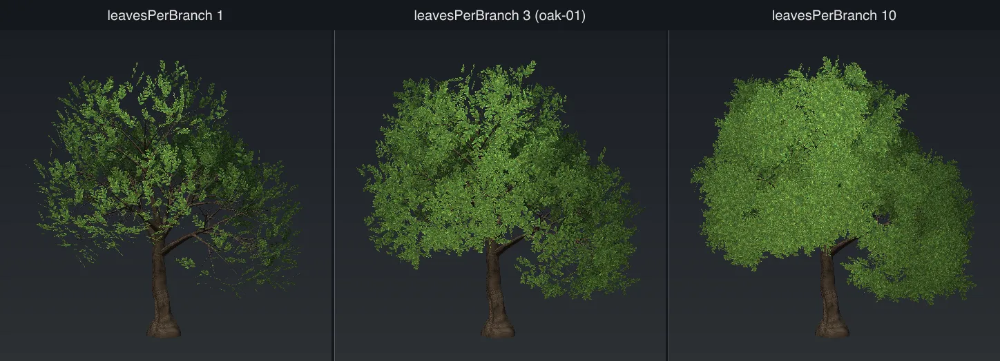

### `leafEvenness`

How much the size of a card follows the length of the branch it is on.

A card sticks out from its branch, so a row of them makes a sleeve of leaves around it. The sleeve
is half a card wide whatever the branch is. A conifer tapers its rings toward the top, so at one
card size that sleeve goes from a fifth of the length of a branch at the bottom to wider than the
whole branch at the top: the rings there stop reading as branches and fill in as a column of leaves
around the trunk.

At `1`, a card is scaled by the length of its branch, so a short branch at the top carries the same
number of cards at the same overlap as a long branch at the bottom, at a smaller size. The top of
the cone is then a small copy of the skirt, and the tree keeps its shape the whole way up. At `0`,
every card is `leafSize` wherever it sits.

`leafSize` still sets the size on a full-length branch, and the leaf texture does not change: a
smaller card shows the same leaves, smaller.

It changes nothing on a tree whose branches are all one length, which is every tree with
`branchModel: fork`.

Default: `1`. Range: 0 to 1.

### `leafLevels`

How many of the outermost branch levels have leaves. `1` puts leaves on the tips only. Higher values
also put leaves on the branches nearer to the trunk.

The highest value it takes is `branchLevels + 1`, and that one puts leaves on the trunk as well. On
a short stem that is what dresses a shrub. On a tall tree it is a column of leaves up the middle,
so keep it at `branchLevels` or below unless you want that.

Default: `2`. Oak `1`, birch `3`.

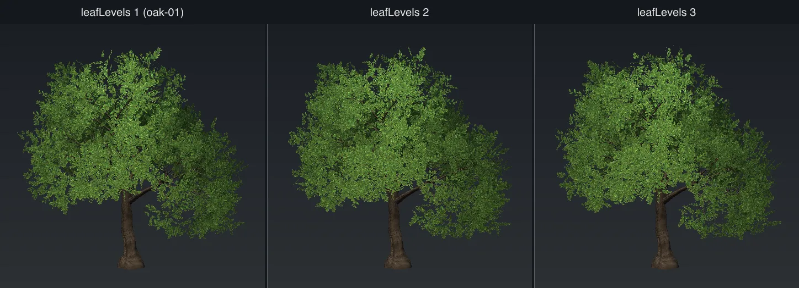

### `leafSize`

The height of one leaf card, in metres. It also sets how many authored leaves fit on one card.
Changing it makes new textures.

Default: `1`. Shrub `0.3`.

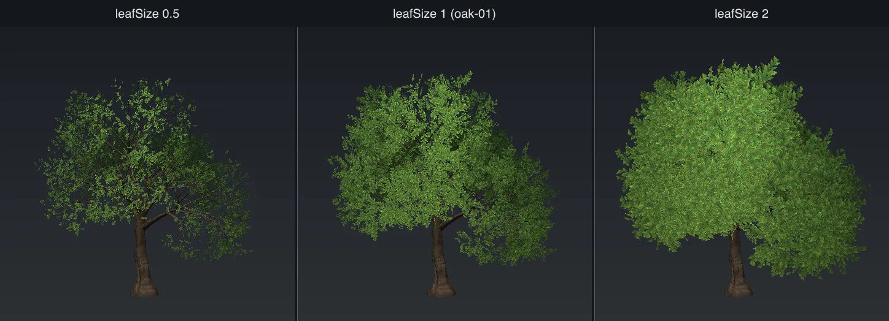

### `leafScale`

Makes each leaf card larger or smaller without changing its texture, on top of whatever
`leafEvenness` does. Use it with a low `leavesPerBranch` on a LOD tier: fewer, larger cards cover
the same area.

Default: `1`.

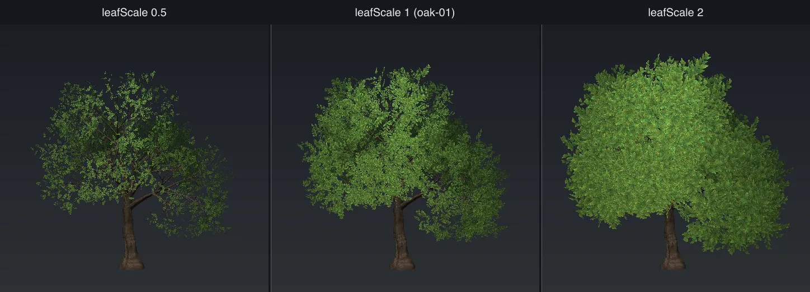

### `leafAspect`

The width of a leaf card as a fraction of its height.

Default: `0.85`.

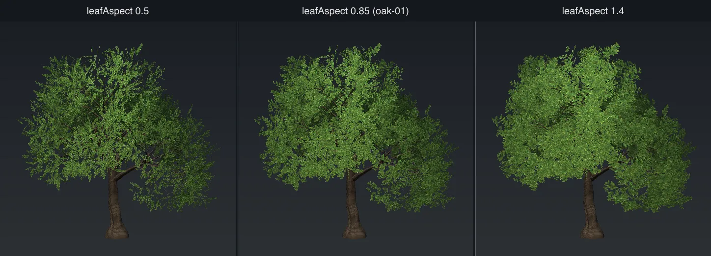

### `leafAngle`

The angle between a leaf card and its branch, in degrees. Each card starts pointing along the
branch toward its tip. `leafAngle` then tilts the card away from the branch by this angle, plus or
minus 10 degrees at random. Each card tilts to a different side, so the cards go all the way round
the branch.

- `0`: the cards lie along the branch.
- `30` to `55`: the cards open out at an angle and point toward the tip.
- `90`: the cards stick straight out from the branch.
- Above `90`: the cards point back toward the base of the branch.

The angle is measured from the branch, not from the ground. So it does not make leaves hang down.
On a branch that points down, the cards point down too.

Default: `55`. Poplar `80`.

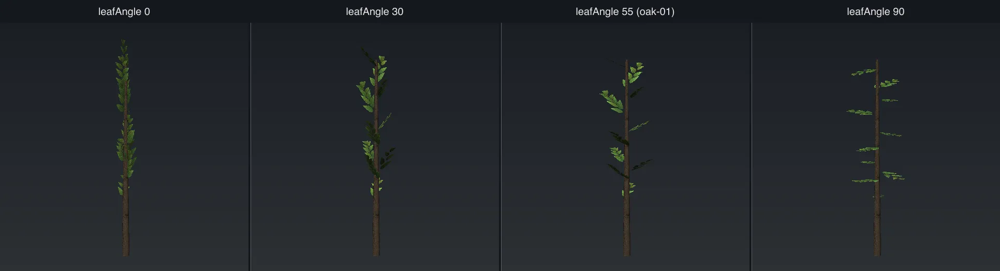

### `leafFrom`

Where the leaves start along a branch, as a fraction of its length. The leaves go from there to the
tip. A high value leaves the inner branches bare.

Default: `0.15`. Oak `0.45`.


### `leafNormalMode`

How the leaf cards are lit.

- `canopy`: the crown is lit as one round shape. Use this in most cases.
- `card`: each card is lit as a flat surface. The crown looks like many flat walls.
- `up`: every card is lit as if it faces the sky.

Default: `canopy`.

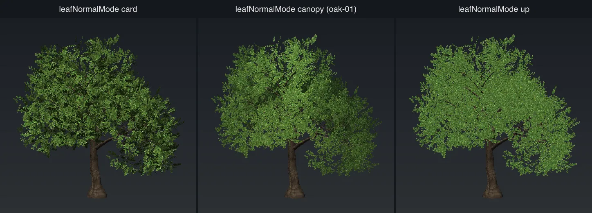

### `leafAlphaCutoff`

The transparency level below which a leaf pixel is cut away. A low value keeps more of the soft
edge. A high value makes the leaves thinner. This key also works on clumps and crowns.

Default: `0.45` (`0.4` for a clump).

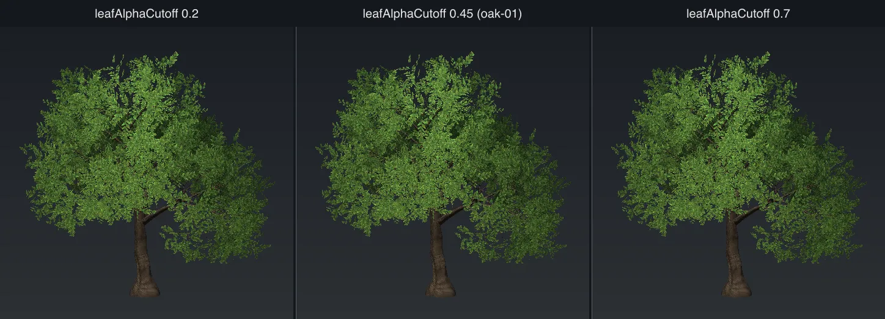

### `leafGrid`

How many cells go along each edge of the leaf texture: `1`, `2` or `4`. Fewer cells give each leaf
spray more detail. More cells give more different sprays across the crown. `0` lets the tool
choose. See [Authored art](authored-art.md#leaves).

Default: `0`. This key has no image, because it changes the texture layout.

## Mesh detail

### `segments`

The number of rings along each branch. More rings make a smoother bend.

Default: `5`. Range: 2 to 32.

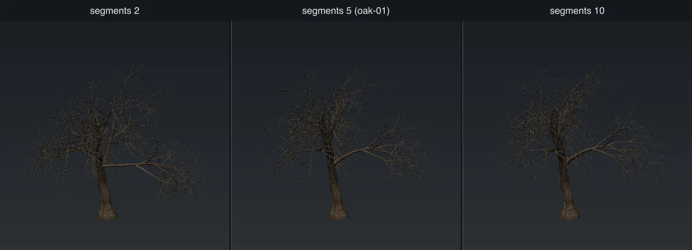

### `radialSegments`

The number of sides around each branch. Thinner branches use fewer sides. It adds sides to every
branch, so it costs more than it looks.

Default: `8`. Range: 3 to 24.

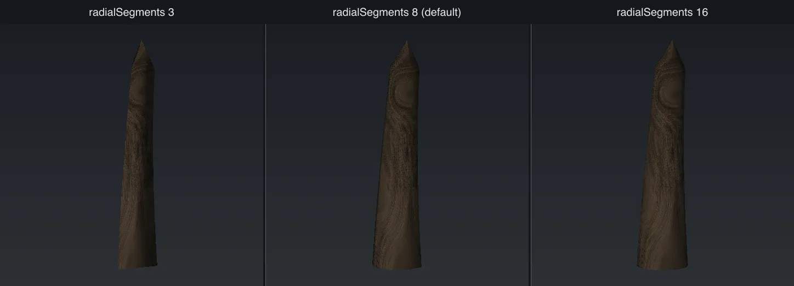

### `barkLevels`

The deepest branch level that gets a bark tube. Branches past this level have leaf cards but no
bark. The thin branches have most of the bark triangles, so this key removes the most triangles.

Default: `6`. Oak `3`, conifers `1`. Range: 0 to 6.

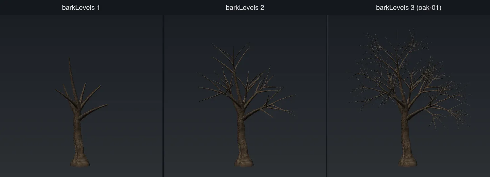

## Textures

These keys have no images, because they change the texture files and not the shape.

| Key | Default | What it does |
| --- | ------- | ------------ |
| `bark` | `[]` | The folder under `sources/bark/` for the bark art. `[]` makes the bark. See [Authored art](authored-art.md). |
| `leaves` | `[]` | The folders under `sources/leaves/` for the leaf art. `[]` makes the leaves. |
| `textureSize` | `1024` | The size of the leaf texture in pixels. Use 512 or more for a model you ship. |
| `barkTextureSize` | `0` | The long edge of the bark texture. `0` uses `textureSize`. |
| `barkAspect` | `2` | How many times taller than wide the made bark texture is. A higher value shows the repeat less often along the trunk. It has no effect on authored bark. |

## Triangle count

The run prints the triangle count. The largest keys are:

- `splits` and `branchLevels`: the number of branches is `splits` to the power of `branchLevels`,
  times `whorls` for a conifer.
- `leavesPerBranch`: each card is two triangles.
- `barkLevels`: the thin branches have most of the bark triangles.

See [In the game](in-game.md#lod-tiers) to make simpler versions for far distances.

## Other keys

These keys work on more than one type. The defaults here are the ones for `tree`.

### Files and preview

| Key | Default | What it does |
| --- | ------- | ------------ |
| `name` | required | The model name. It names the `.glb`, the preview and the geometry id. |
| `textureSet` | `name` | The name of the texture set. See [Share textures](README.md#share-textures-across-a-family). |
| `seed` | new each run | The seed for every random choice. See [The seed](README.md#the-seed). |
| `out` | `assets/shared/nature/trees` | The folder that the files are written under. |
| `assetsRoot` | `assets/shared` | The folder that the template URLs are relative to. |
| `preview` | `0` | The size in pixels of each preview panel. `0` writes no preview. |
| `previewAngles` | `4` | `4` shows four sides in a 2x2 grid. `1` shows one view. |
| `skipTextures` | `false` | Use the textures that are already in the set, and do not write new ones. |
| `writeTemplates` | `false` | Change `geometries.json` and `materials.json` in place. `--write-template` is the newer option. |
| `templatesDir` | `templates` | The folder that holds `geometries.json`, `materials.json` and `scatter-layers.json`. |

### Game keys

| Key | Default | What it does |
| --- | ------- | ------------ |
| [`cullDistance`](in-game.md#layer-keys) | `160` | The distance in metres past which the engine does not draw the model. |
| [`castShadow`](in-game.md#layer-keys) | `true` | Whether the model casts a shadow. |
| [`foliage`](in-game.md#layer-keys) | `true` | Light the cutout piece as leaves. Set `false` for a cutout that is not a leaf. |
| [`footprint`](in-game.md#density) | `0` | The clear space in metres round each model. `0` lets the tool choose. |
| [`scaleMin`](in-game.md#layer-keys) | `0.8` | The smallest random size of a copy. |
| [`scaleMax`](in-game.md#layer-keys) | `1.25` | The largest random size of a copy. |
| [`impostor`](in-game.md#impostors) | from 60% of `cullDistance` | The flat pictures drawn at far distances. |
| [`lods`](in-game.md#lod-tiers) | `[]` | Simpler versions of the model for far distances. |
| [`accents`](accents.md) | `[]` | Extra cards such as fruit or spires. |
| [`windAmplitude`](in-game.md#wind) | `0.4` | How far the model moves in the wind. |
| [`windFrequency`](in-game.md#wind) | `0.45` | How fast the model moves in the wind. |
| [`windFlutter`](in-game.md#wind) | `0.35` | Fast, small movement of the cutout cards. |
| [`bendCurve`](in-game.md#wind) | `1.6` | How the wind bend grows from the base to the tip. |
