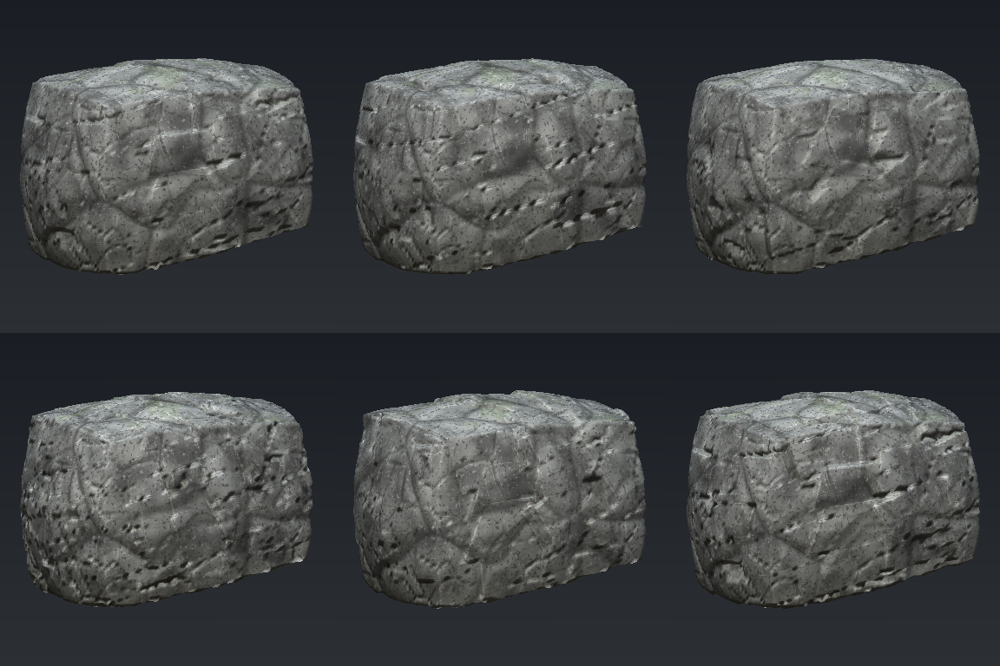
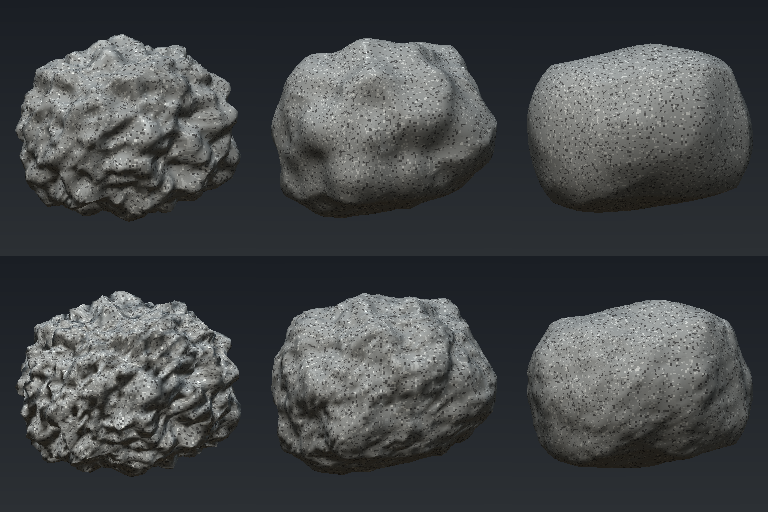
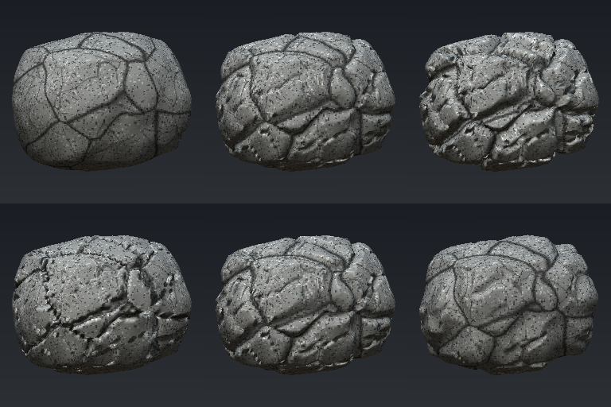
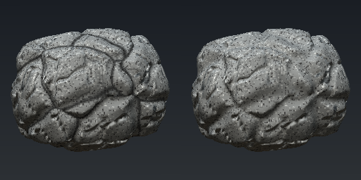
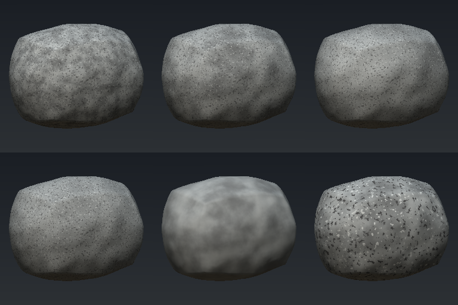

# scatter-forge

Procedural scatter assets for the [Understory](../../docs/milestones/understory.md) scatter system.
One command writes a glTF, its texture set, and the registry entries the model has to be declared
through.

It exists because a world needs variants, and hand-authoring a hundred of them is not affordable.
Every output is a pure function of the parameters plus a seed, so a recorded seed regenerates a
model identically and a family of them costs one loop.

## Types

`type` picks the **structure** to grow, not the species. Oak, birch and poplar are one structure with
different keys, which is why they are templates and not types. What earns a type is a different
shape of thing entirely:

| `type` | Is | Covers |
| ------ | -- | ------ |
| `tree` | Recursive branching. Tapered tubes with cards hung on the outermost generations, placed by one of two **branch models**. | Oak, birch, poplar and a shrub, which is the same generator at two metres. Also every conifer, which is that generator under `branchModel: whorl`. See [Conifers](#conifers) |
| `clump` | Cards radiating from one point on the ground. No stem. | Grass, wildflowers, clover, reeds |
| `crown` | One undivided stem with a rosette of long curved cards at its top. The stem may be 0m. | Palm, tree fern, cycad, and a fern, which is the same rosette on the ground |
| `rock` | A solid grown from one 3D field: a sphere with larger spheres scooped out of it, displaced by noise. No cards, no alpha, one material, a hull collider. | Boulders and cobbles. See [Rocks](#rocks) |

`tree` is the default, so a config written before types existed still opens unchanged. Two more are
planned and not written — see [Where this is going](#where-this-is-going).

Each type takes its own keys, and setting one that belongs to another is an error naming the type
that does take it. That is the same rule an unknown key gets, for the same reason: an option that
silently did nothing is a change that appears not to have worked.

## Running it

```
node tools/scatter-forge/cli.ts tools/scatter-forge/templates/oak-01.json
node tools/scatter-forge/cli.ts tools/scatter-forge/templates/plains-01.json
node tools/scatter-forge/cli.ts tools/scatter-forge/templates/oak-01.json --watch
node tools/scatter-forge/cli.ts tools/scatter-forge/templates/oak-01.json --write-template
node tools/scatter-forge/cli.ts --help
```

One file in, one model out. The config is the whole interface: every option is a key of it, and
the command line adds only `--watch` and `--write-template`, which say when to build and where to
declare the result rather than what to build. Start from a preset in
[`templates/`](./templates/) — see [Templates](#templates) — and `--help` lists every key with its
default and the types it applies to.

The sources are TypeScript and node runs them straight, stripping the types as it loads. There is no
build step and nothing to watch. That needs **node 22.18 or newer**, which is where type stripping
became the default, and the repo's `engines` says so. On anything older the tool fails to start with
an error about the file extension rather than about the node version.

`npm run ts-check` at the repo root checks this workspace along with the rest. That check is the
point of the TypeScript: `lib/templates.ts` types its output as the engine's own `ScatterLayer`,
`IGeometryTemplates` and `IMaterialsTemplate`, so a field added to any of them fails here rather
than producing a row that no longer compiles once you have pasted it in.

`name` is the only required key. Everything else has a default.

**A config with no `seed` draws a new model on every run.** The keys set the species, and the seed
picks one individual out of it, so two runs of one file give two of the same kind. The run
prints the seed it rolled and writes it into the sidecar, so one you liked is kept by copying
that number back. Pin `seed` in the file and it stops moving, which is what the five templates do.

Files land in `<out>/<textureSet>/`, which is `assets/shared/nature/trees/<set>/` for a tree and
`assets/shared/nature/clumps/<set>/` for a clump:

| File                   | What it is                                                            |
| ---------------------- | --------------------------------------------------------------------- |
| `<name>.glb`           | The model. One primitive per piece, on one node at the origin.        |
| `<name>.forge.json`    | Every key that made it, so it can be re-cut or nudged.                |
| `<name>.preview.png`   | A shaded three-quarter render. Only with `preview` set.               |
| `<name>.lods.preview.png` | The model beside every tier at one scale. Only with `preview` and `lods`. |
| `<set>_<piece>_*.webp` | One image set per piece. See [The texture template](#the-texture-template). |
| `<set>.textures.json`  | What the images were painted for, read back by variants that reuse them. |

A **piece** is one primitive: one texture set, one glTF material, one draw. It is the unit everything
downstream is keyed on, and its name is the same in the filename, in the material and on the preview
panel:

| Type    | Pieces         | Maps per piece                                       |
| ------- | -------------- | ---------------------------------------------------- |
| `tree`  | `bark`, `leaf` | Four: `_diff`, `_nor`, `_arm`, `_disp`               |
| `clump` | `blade`        | Three. No `_disp` — see [Displacement](#displacement) |

Re-running with the same `name` overwrites in place.

## The tuning loop

Every run writes `<name>.forge.json` beside the model — the **sidecar** — and prints the command that
reads it back:

```
node tools/scatter-forge/cli.ts assets/shared/nature/trees/oak/oak-01.forge.json
```

So the loop is: **edit the JSON, save, look at the preview PNG**. With `--watch` the middle step
happens on every save. The file holds every key including `preview`, `out` and the seed, so nothing
has to be repeated. A seed the CLI rolled is held for the whole watch, so only what you edit moves.

The sidecar is rewritten every run with whatever was actually built. A template is never rewritten —
see below — so a preset stays a preset and the sidecar is the record of the build.

An unknown key in the file is an error rather than being ignored, because a silently dropped typo is
a change that appears not to have worked. So is a key that belongs to another `type`, and that error
names the type that takes it. A key that used to exist and was retired is dropped with no complaint,
so an old sidecar still opens.

The sidecar only carries the keys its own type uses. A clump's never mentions `splits`, which is
what lets the file it writes be a file it can reopen.

## Templates

`templates/` holds the presets to reach for. Each is a complete config, so one command builds
the model it describes, and the file is what to copy and tweak for a new one:

```
node tools/scatter-forge/cli.ts tools/scatter-forge/templates/oak-01.json
```

A run never writes back to a template. The sidecar it rewrites is the one beside the model, under
`assets/shared/nature/trees/<set>/`. `--watch` follows whichever file was named, so a template can
be tuned live too.

| Template      | Is                                                                                  |
| ------------- | ----------------------------------------------------------------------------------- |
| `oak-01.json`    | Broad deciduous. A heavy trunk that forks low into a wide crown. Oak bark, oak leaves; writes the `oak` set. |
| `poplar-01.json` | Tall and dense, **with catkins**: 0.35 seed clumps per leaf twig from `accents/poplar`, hanging at `pitch` 175. Eight short branches per split spread over 90% of their parent, so foliage starts near the ground and carries all the way up. **Poplar bark with oak leaves**, on its own `poplar` set — the mix-and-match case. |
| `birch-01.json`  | Slender and columnar. Two-way splits climbing six generations, with a **negative** `droop` pulling every branch back toward vertical — split angles compound with depth, so without it a deep tree fans out into a disc. Reuses the `oak` set. |
| `shrub-01.json`  | Undergrowth. The same generator at two metres, on its own `shrub` set, generated art. |
| `spruce-01.json` | **A conifer.** Eighteen whorls of five limbs climbing 88% of a 24m trunk, each whorl a sixth of the length of the lowest. The `whorl` model's worked example, and the thing to copy for a fir or a pine. See [Conifers](#conifers). |
| `redwood-01.json` | **The tall conifer, and the shaped trunk.** A 42m trunk bare for half its height, under a narrow crown at `whorlTaper` 0.45. Its trunk is fluted, flared and wandering on 24 sides, which is the worked example for [The trunk](#the-trunk). Hands over to its billboard at 320m. |
| `larch-01.json`  | **The open conifer.** Limbs at 85 degrees off a 26m trunk, with steeply hanging foliage. The airy one: 9,672 triangles for a 26m tree, against the oak's 39,844 at 18m. |
| `juniper-01.json` | **The scrubby conifer.** Five and a half metres, eight loose whorls, `splitVariance` 22 and an upswept `droop`, which breaks the rings up into something irregular. |
| `cypress-01.json` | **The columnar conifer.** An Italian cypress: 24 whorls of short limbs at 24 degrees off the trunk, so they hug it, at `whorlTaper` 0.9 so the column barely narrows. 18m tall and 3.7m wide. |
| `plains-01.json` | **A clump, not a tree.** A nine-tuft patch 2.8m across, off a nine-cell generated atlas. The type's worked example, and the thing to copy for grass, clover or wildflowers. |
| `plains-02.json` | The second patch off the **same** `plains` set, with `skipTextures`. Twelve tufts and a different constellation, which is what stops six hundred copies of one patch reading as a pattern. Run `plains-01.json` first. |
| `palm-01.json`   | **A crown.** A seven metre stem leaning twelve degrees under sixteen fronds of 3.2m, on its own `palm` set, generated art. The type's worked example for anything with a trunk. |
| `fern.json`   | **A crown with no stem.** Eleven fronds of 0.9m standing up from the ground and arching over, on its own `fern` set. Emits a clump's layer, because at half a metre it is ground cover. |
| `cardinal-flower-01.json` | **A stemless crown off diffuse-only art.** Five upright stalks of 0.9m from a `fronds` folder holding nothing but three `-diff` maps: the arm and height are [derived from the diffuse](#maps-derived-from-the-diffuse). The thing to copy for any wildflower that comes as a cutout photograph. |
| `palm-03.json` | **The heavy crown, with a tier.** Thirty-six fronds of 4m attaching down the top half of a stout stem — `frondSpan` — so the old ones hang below the young. 792 triangles, and the one crown template that carries a `lods` tier, at 70m. Also **the skirt**: fourteen dead fronds from `accents/palm` hanging at `pitch` 155 down the band of stem just under the living ones — see [Accents](#accents). `palm-01.json` and `palm-04.json` write the set, so each carries the same accent at `count` 0. |
| `fern-02.json` | **The fern with spires.** Five fronds arching over and three fertile spires from `accents/fern` standing up out of the centre at `pitch` 8, arching outward by `curve` 25. `fern-01.json` writes the `fern` set and carries the accent at `count` 0. |


The tool prints the triangle count on every run. Watch it: branch count is `splits` to the power of
`branchLevels`, times `whorls` under the whorl model, and leaf cards multiply that again by
`leavesPerBranch`.

**Run `oak-01.json` before `birch-01.json`, and `plains-01.json` before `plains-02.json`.** Each of the
second ones carries `skipTextures: true` and names the first one's set, so the images have to exist
before it does. Sharing one set is what makes a species cost two fetches
however many variants it has. See [Sharing one texture set](#sharing-one-texture-set-across-a-family).

`templatesDir` inside these files is unrelated: it names the engine's `templates/` at the repo root,
where `writeTemplates` patches `geometries.json` and `materials.json`.

## The parameters

Every key of the config, grouped by what it touches. `--help` prints the same list with its
defaults. A value outside a stated range stops the run with the range in the message, so tuning by
feel is safe.

Keys marked **tree**, **clump**, **crown** or **rock** below belong to those types alone. Everything
else is shared, and a few of the shared ones default differently per type — `cullDistance` is 160
for a tree and 50 for a clump, and neither is a sensible fallback for the other.

**The skeleton** — `tree`, with the tube keys shared by `crown`

The last column reads low to high. Values named after a template are the ones that template ships.

| Key | Default | Does | What the values mean |
| --- | --- | --- | --- |
| `height` — `tree`, `clump`, `rock` | 12 | Finished height in metres, to the topmost point. The skeleton grows first, then scales to land on this, so it sizes the tree and not the trunk. A crown has no `height`: it is a stem plus a frond, each in metres. | `2.2` shrub · `12` default · `16` birch · `18` oak and poplar |
| `trunkRadius` — `tree`, `crown` | 0.32 | Radius at the ground, in metres. `height` never scales it, so a slender tree and a stout one of the same height differ only here. | `0.07` shrub · `0.16` birch, a whip at 16m · `0.22` the crown default and the palm · `0.62` oak, stout at 18m. The oak is `height / 29`, the birch `height / 100` |
| `trunkTaper` — `tree`, `crown` | 0.22 | Trunk radius at the top as a fraction of the base. Branches always taper to 0.28 of their own base, which this does not touch. | `0.22` birch and poplar, down to a thin leader · `0.42` oak, carries weight high · `0.8` the crown default, a palm barely thins · `0.9` a near-parallel pole. Within 0..1 |
| `branchModel` | `fork` | How the **trunk** carries its children. Nothing below the trunk changes: a limb always forks. See [Conifers](#conifers). | `fork` divides: the trunk's first child is a leader that carries it on, and every generation splits again · `whorl` does not divide: the trunk runs unbroken to the tip and carries rings of near-horizontal limbs up it, which is a conifer |
| `trunkFlare` — `tree`, `crown` | 0, and 0.25 for a crown | How far the foot swells past `trunkRadius`, as a fraction of it. Gone by a fifth of the way up a trunk and a quarter of the way up a stem, because a stem is seven metres and a trunk is forty. A trunk is mostly a bare pole and defaults to none; a palm's stem never is. | `0` a tube meeting the ground at a right angle · `0.2` the date palm · `0.3` the palm · `0.5` the redwood, a buttressed foot · `1` a fig |
| `trunkFlute` — `tree`, `crown` | 0 | Depth of the grooves cut up the trunk or stem, as a fraction of its radius. **The one that stops a trunk reading as a turned pole.** See [The trunk](#the-trunk). | `0` a plain tube · `0.22` the redwood · `0.5` the ceiling, where the grooves of one side meet those of the other. Needs `trunkSides` of 12 or more, and the run says so rather than quietly doing nothing |
| `trunkWander` — `tree`, `crown` | 0 | Metres the centre line strays from a straight climb. `curve` turns a branch about one fixed axis and reads as a clean arc; this leans one way and then back. On a crown it is the unevenness on top of `stemLean`. | **Metres, so it does not scale with the tree**: `0.6` is 1.4% of the redwood's height and 8.6% of a palm stem, which is the difference between a lean and a drunken S. `0` dead straight · `0.6` the redwood · `0.12` the same look on a 7m palm. The foot never moves, and the limbs, the bark and a crown's rosette follow the stray |
| `splits` | 3 | Children grown at each fork, and limbs grown in each whorl. The largest lever on triangle count and build time. | `2` birch, a Y at every node · `3` default · `4` larch and juniper, per whorl · `5` spruce, per whorl · `6` oak · `8` poplar, a full ring. Branch count is `splits ^ branchLevels`, times `whorls` under the whorl model, so the birch has 64 tips and the oak 1,296. Within 1..12, capped at 4096 branches |
| `splitAngle` | 38 | Degrees a child turns away from its parent. | `30` birch, narrow and upright · `38` oak · `55` shrub · `72` poplar, almost square to its parent · `78` spruce and `85` larch, a limb leaving the trunk near horizontal. The trunk's first child uses a quarter of this, so the trunk carries on past its fork. A whorled trunk has no such child, and every limb takes the full angle |
| `splitVariance` | 12 | Degrees of randomness added to each split angle, plus or minus. | `0` every fork identical and machine-made · `7` spruce, a regular conifer · `12` every broadleaf template · `22` juniper, scrubby and irregular · `25` loose and wild |
| `splitSpread` | 0.35 | How far back from the parent's tip its children attach, as a fraction of the parent's length. Under `whorl` it is instead the fraction of the **trunk** the whorls climb, down from the top. | `0` every child at the tip, an umbrella · `0.35` oak, children near the ends · `0.8` birch, down most of the branch · `0.95` shrub, the whole length. High values carry foliage close to the ground. Whorled: `0.5` redwood, bare for half its height · `0.88` spruce, limbs almost to the ground |
| `branchLevels` | 4 | Generations grown below the trunk. Each one multiplies branch count by `splits`. | `2` spruce, larch and redwood, which spend their branches on whorls instead · `3` shrub, poplar and juniper · `4` oak · `6` birch. Cheap at `splits` 2, ruinous at `splits` 8. Within 0..6 |
| `whorls` — `whorl` only | 7 | Rings of limbs up the trunk. With `splitSpread` it sets the interval they step up by, and the trunk keeps one interval of bare leader above the top ring. | `8` juniper · `15` larch · `18` spruce and redwood, tight rings on a tall trunk. Within 1..24, and it multiplies the branch count, so it is read into the 4096 cap |
| `whorlTaper` — `whorl` only | 0.3 | Length of the top whorl as a fraction of the lowest. **This is the cone.** | `0.16` spruce, a sharp spire · `0.3` larch · `0.45` redwood and juniper, a crown that barely narrows. Within 0..1; past 1 a tree widens as it climbs, which is an inverted cone and not a conifer |
| `lengthRatio` | 0.62 | Child length as a fraction of its parent's. | `0.45` poplar, children far shorter, a tight dense crown · `0.62` oak · `0.72` shrub, open and sprawling · `0.85` children rival their parent and the shape falls apart |
| `radiusRatio` | 0.6 | Child radius as a fraction of the parent's radius where it attaches. | `0.4` whippy twigs off a heavy limb · `0.6` every template · `0.85` limbs nearly as thick as what carries them |
| `curve` | 14 | Total degrees a branch bends over its length. The axis is fixed per branch, so it reads as a bend and not a wobble. | `0` dead straight sticks · `8` poplar, barely bent · `14` oak and birch · `40` strongly arced. Past about 20 raise `segments` too, or the curve shows its corners |
| `droop` | 16 | Degrees the deepest branches turn toward the ground over their own length. Scaled by depth, so limbs hold their line and twigs hang. | `-30` birch, pulled hard back upright · `-20` shrub · `0` straight out · `16` oak · `22` poplar · `45` weeping. **Negative is the only way to stop a deep tree fanning into a disc** |
| `segments` — `tree`, `crown` | 5 | Rings along a branch's centre line, which sets how smoothly it can curve. | `2` the floor, visible corners · `5` every tree template · `8` the crown default · `10` for a high `curve`. The trunk gets `segments + 2`, level 1 gets `segments`, each level below loses one. Within 2..32 |
| `radialSegments` — `tree`, `crown` | 8 | Sides of the tube around a branch, which sets how round it looks against the sky. | `4` a LOD tier, faceted up close · `8` every tree template, round at any real distance · `10` the crown default, because a bare stem is all silhouette · `16` a hero asset. Each level down uses one fewer, floor of 3. It adds sides to every branch at once, so cutting it saves less than it looks. Within 3..24 |
| `trunkSides` — `tree`, `crown` | 0 | Sides of the **trunk or stem** tube alone. 0 takes `radialSegments`. | `0` the trunk is as round as a twig · `20` enough to hold a flute · `24` the redwood. The trunk is one branch of hundreds: the redwood's went from 96 triangles to 960 and the model grew by 6% |
| `trunkSegments` — `tree`, `crown` | 0 | Rings up the **trunk or stem** alone. 0 takes `segments + 2`. | `0` six rings on a 42m trunk · `20` the redwood, which is what gives `trunkWander` somewhere to wander |
| `barkLevels` | 6 | Deepest generation that gets a bark tube. Branches past it carry leaf cards and no geometry. | `1` the oak's LOD tier, 236 bark triangles · `6` the default, every level, 29,476 on the oak. Twigs are most of the bark, so this is the strongest triangle lever a tier has. Within 0..6 |

**The foliage** — `tree`

Leaves are flat rectangles, two triangles each, with a leaf shape cut out by the alpha test. One card
stands in for a sprig, never for a single leaf.

| Key | Default | Does | What the values mean |
| --- | --- | --- | --- |
| `leafLevels` | 2 | How many generations carry cards, counted **inward from the outermost**, never out from the trunk. | `1` oak, the tips alone · `2` poplar · `3` birch and shrub. What it buys depends on `splits`. The oak's tips are 83% of its branches, so 1 to 2 adds only 17% more cards and mostly pulls foliage back along the limbs. The birch has 64 tips and cannot fill a crown from them, so 1 to 3 takes it from 768 leaf triangles to 1,344. Within 1 to `branchLevels + 1`, where the top hangs leaves off the trunk |
| `leavesPerBranch` | 18 | Cards spaced evenly along each leaf-bearing branch, from `leafFrom` to the tip. | `1` the oak's LOD tier · `4` oak and poplar · `6` birch · `10` shrub · `18` default. Total cards is this times the leaf-bearing branches, at two triangles each. A tier cuts it and raises `leafScale` to hold the crown's density |
| `leafSize` | 1 | Height of one card in metres, before `leafScale`. It also decides how many authored leaves fit a cell, see [What one division decides](#what-one-division-decides). | `0.3` shrub at 2.2m tall · `1` every tree at 16m and up. Absolute, so a small tree needs it brought down or its leaves swallow it |
| `leafGrid` | 0 | Cells along each edge the **leaves** get, overriding the derived grid. Texture key. With [accents](#accents) the image is cut on a larger grid that holds their cells too. | `0` derive it from `leafSize` over the source's leaf length, see [What one division decides](#what-one-division-decides) · `2` four larger cells, each cluster at twice the texels of a 4x4's, at the cost of fewer variants across the canopy · `1` or `4` likewise |
| `leafScale` | 1 | Multiplies card size and leaves the texture fit alone. | `1` every model · `2` the oak's LOD tier, paired with `leavesPerBranch` 1. That pair trades 4 small cards for 1 large one at about the same coverage |
| `leafAspect` | 0.85 | Card width as a fraction of its height. The image cell is always square, so this squashes it. | `0.85` every template, narrowing the painted sprig by 15% so a cluster reads upright · `1` the art undistorted · `1.4` a wide frond |
| `leafDroop` | 55 | Degrees a card hangs below its branch direction, plus or minus 10 of randomness. | `0` laid flat along the branch · `55` oak, birch and shrub · `80` poplar, hanging steeply · `90` straight down |
| `leafFrom` | 0.15 | Fraction along a branch where the cards start. They fill from there to the tip. | `0.1` poplar, leaves almost back to the fork · `0.15` birch and shrub · `0.45` oak, inner limbs left bare and visible through the canopy |
| `leafNormalMode` | `canopy` | Which way cards face for lighting. One normal per card in every mode. | `canopy` shades the crown as a rounded mass, pointing out from its centre with the vertical lifted, so the underside faces outward and not down · `card` uses the card's true normal, which makes the crown read as a pile of flat walls · `up` faces every card at the sky |

**The images** — `tree`

| Key | Default | Does | What the values mean |
| --- | --- | --- | --- |
| `bark` — `tree`, `crown` | `[]` | Folder under `sources/bark/` the bark tile comes from. See [Authored bark](#authored-bark). | `[]` generates the bark instead · `["oak"]` builds it from that folder · `["oak/oak-01"]` picks one set out of a folder that holds several. A folder that is listed and missing stops the run rather than falling back |
| `leaves` | `[]` | Folders under `sources/leaves/` whose stamps fill the leaf image. See [Authored leaves](#authored-leaves). | Same rule. `[]` generates them, a named folder is an error when it is absent · `["palm/green-*"]` takes only the stamps whose prefix matches. See [Picking stamps](#picking-stamps-out-of-a-folder) |
| `textureSize` | 1024 | Edge of each square map — the leaf, blade or frond atlas — and, unless `barkTextureSize` says otherwise, the **long** edge of the bark map, in pixels. A power of two, at least 128. | `128` tests only, a cell holds 32 texels · `512` the floor for anything shipping · `1024` every tree template · `2048` the clump default, because a clump atlas holds every stamp at once. See [The clump atlas](#the-clump-atlas) |
| `barkTextureSize` — `tree`, `crown` | 0 | The bark map's **long** edge on its own, so it can differ from the atlas. `0` follows `textureSize`. An authored bark keeps its own shape and is reduced so its long edge fits; it is never enlarged. | `0` one size for the set · `1024` bark with `textureSize: 512` gives a 512x1024 bark beside a 512 leaf atlas, which is the usual way round: one tile wraps every trunk, sixteen cards share the atlas |
| `barkAspect` — `tree`, `crown` | 2 | How many times taller than wide the **generated** bark map is, and how many circumferences of branch one tile covers. Ignored once `bark` names a source, which brings its own shape. **The lever on visible tiling.** | `1` a square map, one circumference per tile · `2` the default: a 1024 `textureSize` gives a 512x1024 map covering two circumferences. The two axes are not alike — x wraps once around the ring and never repeats, y runs along the branch and repeats every tile — so the texels go where the repeat is. A redwood's trunk shows the same plate 12.9 times at `1` and 6.5 at `2` |

**The tuft** — `clump`, with the card keys shared by `crown`

A clump has no skeleton. What it has instead is an arrangement of cards on one point, and these are
all of it.

| Key | Default | Does | What the values mean |
| --- | --- | --- | --- |
| `height` | 0.35 | Finished height in metres, to the topmost point. Cards are grown and then scaled onto it, so lean and curve cannot quietly shrink the tuft. | `0.12` a lawn · `0.38` the `meadow` template · `0.9` long meadow grass |
| `tuftsPerModel` | 1 | Tufts grown into one model. Above 1 the model is a **patch**, and the placer resolves one candidate for all of them. **The cheapest density there is.** | `1` a single tuft · `9` the `meadow` template · `12` the `meadow-02` variant · `64` the ceiling. See [Patches](#patches) |
| `patchRadius` | 0 | Metres the tuft bases are spread over. Ignored at `tuftsPerModel` 1. | `0` derives it from the count and the height · `1.4` the template · `2.2` the ceiling, because a patch is posed off one terrain sample and samples are 2m apart |
| `cardsPerTuft` | 5 | Cards radiating from the tuft's centre, spread by the golden angle. **Reach for this before `footprint`.** | `1` a single plane, which shows its zero thickness the moment you walk round it · `5` the default · `6` the template · `12` a dense tussock. Two triangles per card per segment |
| `cardSegments` — `clump`, `crown` | 3 | Divisions up a card. | `1` the card pivots about its base as a rigid plank, because wind has weight at two corners only · `3` bends as a curve · `5` the crown default · `6` for a tall reed. The whole reason a blade is not one quad |
| `cardLean` | 18 | Degrees a card turns outward from upright over its own length. Linear in the distance along, so it opens the tuft evenly. | `0` a sheaf standing straight up · `18` the default · `45` splayed flat |
| `cardCurve` — `clump`, `crown` | 26 | Degrees a card bows over its length, on top of the lean. Quadratic, so it holds straight low down and bends near the tip. | `0` dead straight blades · `26` the default · `30` the template · `70` a weeping arc · `80` the crown default, a frond that leaves at `frondAngle` and hangs by its tip |
| `cardSpread` | 0.22 | How far card bases sit from the tuft centre, as a fraction of `height`. | `0` every card on one point, which reads as pinched · `0.22` the default · `0.5` a ring rather than a tuft |
| `cardAspect` — `clump`, `crown` | 1 | Card width as a fraction of its own height. | `1` the default, matching the square cell · `0.6` a narrower card for a tall stamp · `0.3` the crown default. A crown card samples only this fraction of its cell, so a frond is never stretched — see [The frond atlas](#the-frond-atlas) |
| `normalLean` — `clump`, `crown` | 0.45 | How far every normal leans outward from straight up, as a weight against a unit up vector. | `0` the whole tuft faces the sky and every card shades the same, which is what a lawn or a plain under a low sun wants · `0.45` the default, about 24° out, which keeps a tuft from shading as one flat disc · `0.6` the crown default, a rosette read as a dome · `1` 45° out, lit from the side |
| `blades` | `[]` | Folders under `sources/clump/` whose stamps fill the atlas. See [Authored clumps](#authored-clumps). | `[]` generates nine tufts instead · `["meadow", "clover"]` builds the atlas from both. A folder that is listed and missing stops the run rather than falling back · `["meadow/tall-?"]` takes a subset of one, by pattern |

**The rosette** — `crown`

A crown is a stem and a rosette, and each is sized in metres on its own. There is no `height`: the
model's height is the stem plus however far the fronds rise, and the run prints it.

| Key | Default | Does | What the values mean |
| --- | --- | --- | --- |
| `stemHeight` | 6 | Metres of stem below the rosette. | `0` no stem at all — the `fern` template, which ships no bark piece and emits a clump's layer · `7` the palm · `15` a tall coconut palm |
| `stemLean` | 10 | Degrees the stem has turned from vertical by its top. It eases in as the square of the height, so the lower trunk stands straight and the bend gathers under the crown. | `0` a pole · `12` the palm · `30` a beach palm leaning out over the water |
| `crownBulge` | 0.2 | How far the stem swells under the rosette, as a fraction of `trunkRadius`. It peaks just under the fronds and comes back in by half at the very top, so it reads as a crownshaft and not a wider tube. | `0` no crownshaft · `0.2` the date palm · `0.25` the palm · `0.5` a bottle palm |
| `frondCount` | 14 | Frond cards in the rosette, spread by the golden angle. | `9` a sparse cycad · `11` the fern · `16` the palm · `24` a dense crown. Two triangles per frond per `cardSegments`. Within 1..48 |
| `frondLength` | 3 | Metres from the rosette to a frond's tip, along its curve. Frond 0 is exactly this and the rest fall short of it, so the rim is ragged. | `0.9` the fern · `3.2` the palm · `5` a royal palm |
| `frondAngle` | 45 | Degrees above horizontal a frond leaves the rosette at, before `cardCurve` bends it down. | `15` old fronds hanging almost flat · `40` the palm · `68` the fern, a vase · `85` a shuttlecock. Within -90..90 |
| `frondVariance` | 20 | Degrees either side of `frondAngle` the fronds spread over, dealt out evenly: one frond per equal slice, each placed at random within its slice, so the fan never leaves a gap. This is the difference between the young fronds standing up and the old ones hanging. Down a `frondSpan` it is ordered by depth instead, with a quarter left to chance. | `0` a machined rosette · `14` the fern · `25` the palm · `45` the date palm, from 69° standing to 1° hanging |
| `frondSpan` | 0 | Fraction of the stem, down from its top, that the fronds attach along. A palm grows from its tip, so the lowest fronds are the oldest and hang most. Needs a stem. | `0` every frond at the top, the palm · `0.55` the date palm, a crown two thirds as deep as it is wide · `1` fronds from the ground up, a cycad or a young palm |
| `fronds` | `[]` | Folders under `sources/fronds/` whose stamps fill the frond atlas. See [Authored fronds](#authored-fronds). | `[]` generates four fronds instead · `["palm"]` builds the atlas from every stamp in that folder · `["palm/palm-01", "palm/palm-02"]` from those two alone, see [Picking stamps](#picking-stamps-out-of-a-folder). A folder that is listed and missing stops the run rather than falling back |

The stem takes `trunkRadius`, `trunkTaper`, `segments`, `radialSegments` and `bark`
from the tree's tables above, along with the whole of [The trunk](#the-trunk) — `trunkFlute`,
`trunkWander`, `trunkSides` and `trunkSegments` shape a stem exactly as they shape a trunk, because
the stem is one branch on a skeleton of its own and goes through the same bark builder. The fronds
take `cardSegments`, `cardCurve`, `cardAspect` and `normalLean` from the clump's. Without a stem, the tube keys are accepted and unread.

**The stone** — `rock`

A rock is a field, and every key here but `subdivisions` moves its surface, so every one of them is
in the image too. See [Rocks](#rocks).

| Key | Default | Does | What the values mean |
| --- | --- | --- | --- |
| `height` | 1.2 | Metres tall before the relief. The rock is centred on its own middle and then stood on its lowest point, so the run reports the height it actually reached. | `0.4` a stone · `1.4` the granite template · `4` a boulder to climb |
| `width`, `depth` | 0, 0 | Metres across along x and along z before the relief. 0 derives them from `height`: 1.3 of it across, 1 of it deep. | `0` derived · `3` and `1.5` a slab · equal to `height` a block |
| `scoops` | 9 | Spheres, each larger than the rock, scooped out of it along their own random directions. The surface is their concave faces meeting at ridges, which is the shape of broken, worn stone. | `0` an egg · `9` the default · `12` the granite template · `24` the ceiling. Within 0..24 |
| `scoopSize` | 0.8 | How broad a scoop is, as its radius over its distance from the centre. | `0.5` a tight bite · `0.75` the granite template · `0.95` a face as flat as a plane's. Within 0.3..0.97 |
| `scoopDepth` | 0.35 | How far the deepest scoop reaches in, as a fraction of the mean radius; each scoop takes 0.35 to 1 of it. A scoop is held back where it would overhang. | `0.1` a dimpled egg · `0.45` the granite template · `0.6` the ceiling. Within 0..0.6 |
| `smoothing` | 0.5 | How far the creases of the field are rounded: the ridges between scoops, the slab edges and joins, the creases of the ridged noise. It rounds the field, so every tier and the bake agree, and it only ever pulls the surface in, so `1` is about a tenth smaller than `0`. | `0` knife-edged, every crease a hard triangle edge · `0.5` the granite template · `1` a scoop ridge rounded over a quarter of the radius, the slabs cobbles. Within 0..1 |
| `relief` | 0.1 | Depth of the surface displacement, as a fraction of the mean radius: the slab pile at `plateShare` of it, and noise (`reliefOctaves` of lumps under `reliefSize`, plus two octaves of ridges at a quarter share) for the rest. | `0` the bare scooped solid, for a test · `0.29` the granite template · `0.3` a rough, pitted surface with `plates 0` · `0.5` the ceiling, past which the surface folds through the centre and stops being star-shaped. Within 0..0.5 |
| `plates` | 2 | Slab cells per metre in the pile the relief is built from. Rock breaks along planes, and this is where the planes come from. 0 builds the relief from noise alone. | `0` a lump · `2` the default, slabs about half a metre · `4` cobbles |
| `plateLayers` | 2 | Layers of slabs, each 1.7x finer than the last, chipping the ones below at half the depth. | `1` plates alone · `2` the default · `4` chipped down to grit. Within 1..4 |
| `plateBevel` | 0.35 | Fraction of a slab that slopes to its edge. | `0.1` flat-topped and sharp · `0.35` the default · `1` a pyramid, no flat top at all. Within 0..1 |
| `plateLean` | 0.3 | How far a slab drops across its own width, as a fraction of its height. Tilted slabs read as bedded rock; level ones as paving. | `0` level · `0.3` the default · `0.7` every slab a wedge. Within 0..1 |
| `bedding` | 0.6 | How far the slabs are flattened and aligned into strata. At 1 every slab lies along one bedding plane, tilted up to 30° from level per rock; at 0 they are blocks at any angle. | `0` rubble · `0.6` the default · `1` sedimentary strata. Within 0..1 |
| `plateShare` | 0.7 | Share of `relief` the slabs take; noise has the rest. | `0` noise alone, whatever `plates` says · `0.7` the default · `1` slabs alone. Within 0..1 |
| `plateTint` | 0.25 | How far each slab shifts the tone by its own random value, so no two plates are one grey. | `0` all one stone · `0.25` the default · `0.6` a patchwork. Within 0..1 |
| `reliefSize` | 0.9 | Metres across the largest lump. Each octave above it is half the size at half the amplitude, the way a terrain heightmap is built, so this sets the scale of the swell and the octaves add the detail. | `0.3` granular, a surface of fist-sized bumps · `0.8` the granite template, a couple of swells across a rock · `3` one slow bulge, and the octaves are the whole texture |
| `reliefOctaves` | 5 | Octaves under `reliefSize`. | `1` one smooth swell · `3` soft lumps · `5` the granite template · `8` the ceiling, detail down to the texel. Within 1..8 |
| `cracks` | 1.2 | Crack cells per metre. Cracks are the borders of a 3D cellular field flattened into the bedding, in two octaves, and the coarse octave also grooves the mesh. Not every border is drawn, and a crack thins and opens along its length. | `0` none, and no grooves · `1.2` a metre-scale network · `3` a shattered surface. The bake reads the field at each texel's own position, so a crack crosses a chart seam without a break |
| `crackStrength` | 1 | How strongly the texture draws the cracks: the dark core, the chipped rim, the hairlines, the foliation, the height, the occlusion, the roughness and the drip stains under them. The grooves are not touched. | `0` no line, grooves only · `0.7` the granite template · `1` full. Within 0..1 |
| `grooveDepth` | 0.05 | How deep the coarse cracks cut into the mesh, as a fraction of the mean radius. This is what puts a crack into the silhouette. The fine octave is never cut: under a quad it reads as dimples. | `0` cracks in the texture only · `0.05` 4cm on a 1.4m rock · `0.07` the granite template · `0.15` a rock breaking into blocks. Within 0..0.5 |
| `grooveWidth` | 0.15 | Width of that groove as a fraction of a crack cell. The texture's crack line sits at its bottom. Needs `subdivisions` enough to carry it: at 24 a side on a 1.4m rock a quad is 6cm. | `0.05` a knife cut, invisible at 24 subdivisions · `0.13` the granite template · `0.4` a broad valley. Within 0..1 |
| `weathering` | 0.6 | How far the dirt, the lichen, the drip stains and the ground contact go. | `0` fresh-cut stone · `0.55` the granite template · `1` lichen over every top, soil up its base |
| `patina` | 0.5 | The dark crust old stone grows where water sits or runs: on the tops, in the hollows, beside the cracks, under the drip lines and around the lichen, never on a worn edge. Thin and brown at its margin, dark and a little glossy at its heart. | `0` none · `0.5` the default, an old rock · `1` a crust over most of what is damp. Within 0..1 |
| `edgeWear` | 0.5 | How far the convex edges weather: bleached toward `edgeTint`, smoother, and clear of stain, patina and lichen. Read off the surface's curvature at four reaches and feathered, so slab lips and scoop ridges both count. | `0` edges the colour of the faces · `0.5` the default · `1` a rock outlined in pale stone. Within 0..1 |
| `streaks` | 0 | Opacity of the run-off down the sides: droplet trails from a splat, thickest at the head, thinning and fading down, half of them branching, broken into rivulets and gathering in the cracks. Colour, roughness and occlusion; never height. | `0` none · `0.5` a weathered rock · `1` every trail at full colour. Within 0..1 |
| `snow` | 0 | Snow on the faces that look up, deeper in hollows, off the edges, drifted at its margin, mottled and blue in its shadow. Painted last, over everything. | `0` none · `0.5` the tops · `1` all but the sides and the edges. Within 0..1 |
| `stain` | 0.5 | How strongly iron staining is drawn: rust seeping from the cracks, and patches banded along the bedding, as a tint that keeps the grain under it. | `0` unstained · `0.5` the default · `1` rust down every crack. Within 0..1 |
| `veins` | 0.15 | How much of the rock the quartz veins run through: faint pale lines along the zero crossings of a stretched noise, a little glassier and higher than the stone. | `0` none · `0.15` the default, a few faint ones · `1` most of the surface, and it reads as marble. Within 0..1 |
| `stoneTint`, `stoneDark`, `stoneLight` | `#7f827c`, `#3e403e`, `#b3b5ae` | The stone's mid tone and the two ends the tone ramps to, six digit hex each. The dark and light are also the mineral colours, and the light lifted toward white is the veins'. | Granite grey by default · `#9c8f7a`, `#5a4a38`, `#c9bda6` sandstone · `#5e6066`, `#2e3034`, `#8d9096` basalt |
| `lichenTint`, `soilTint`, `stainTint`, `edgeTint`, `streakTint` | `#a7b094`, `#4f4a36`, `#8a5a2e`, `#c6c3ba`, `#2a2d28` | The crustose lichen discs, most of them (some are a grey-blue off it, a few small ones yellow); dirt in the hollows and soil up the base; the iron staining; the bleached colour of a worn edge; what the run-off leaves. | `streakTint` near black is mould, `#e8e6dc` bird droppings |
| `toneSize` | 0.25 | Metres across the largest patch of the tone mottling: the octave stack the colour is ramped from, and the base every rock has under its detail. | `0.1` fine clouds · `0.25` the default · `1` a couple of broad patches across the rock |
| `toneOctaves` | 5 | Octaves under `toneSize`, each half the size. | `2` soft blotches · `5` the default · `8` mottling down to the texel. Within 1..8 |
| `toneContrast` | 0.45 | How far the tone reaches from `stoneTint` toward `stoneDark` and `stoneLight`. | `0` one flat tint · `0.45` the default · `1` the full ramp. Within 0..1 |
| `grainScale` | 110 | Mineral crystals per metre: the size of the grain. A crystal wants three texels or more. | `30` coarse, a pegmatite · `110` the default · `150` fine, and aliasing at 1024 on a 1.4m rock |
| `speckle` | 0.6 | How strongly the mineral grain is drawn. | `0` none, the tone alone · `0.6` the default · `1` every crystal at full colour. Within 0..1 |
| `roughness` | 0.82 | Base roughness of the stone before the grain, the wear and the growth move it. | `0.9` dry sandstone · `0.82` the default · `0.55` wet or polished. Within 0..1 |
| `metallic` | 0 | Base metalness. Lichen, patina, run-off and snow take it back to 0 where they lie. | `0` stone · `0.3` ore-bearing · `1` a lump of metal. Within 0..1 |
| `glint` | 0.25 | How much of the stone holds metallic shards: angular crystals at their own orientations, fully metallic, glossy, each a flat face set into the surface. | `0` none · `0.25` the default, a sparkle · `1` a rock full of pyrite. Within 0..1 |
| `glintScale` | 30 | Metallic flakes per metre: the size of a shard. | `12` big crystals · `30` the default, about 3cm · `120` a speck, and aliasing at 1024 on a 1.4m rock |
| `glintTint` | `#d8c9a4` | The flakes' colour, six digit hex. | Pale brass pyrite · `#c8cbd0` mica |
| `bump` | 1 | Gain of the normal map from the texture height, as a multiple of the settled value. | `0.5` soft · `1` the default · `2` twice as steep. Within 0..4 |
| `undulation` | 0.5 | Soft, irregular unevenness in the texture height: the slow waviness of a weathered face, below what the mesh carries. Height alone. | `0` a surface that is only its grain · `0.5` the default · `1` a visibly wavy face. Within 0..1 |
| `undulationSize` | 0.09 | Metres across the largest swell of that unevenness, with two finer octaves under it. | `0.04` a close ripple · `0.09` the default · `0.3` a slow roll under the grain |
| `crackWidth` | 0.035 | Width of the crack line in the texture, as a fraction of a crack cell, before the field varies it along its length. | `0.02` hairline · `0.035` the default · `0.15` a broad dark band. Within 0..1 |
| `crackDepth` | 0.6 | How deep the crack line cuts into the texture height, which is what the normal map reads. | `0` a flat stain · `0.6` the default · `1` the full range. Within 0..1 |
| `subdivisions` | 24 | Quads along each edge of the cube. Triangles are six times this squared, doubled. The one key that is not in the image, and the one a tier overrides. | `4` 192 triangles, a far tier · `16` 3,072, the template's first tier · `48` 27,648, the granite template, enough to carry slab edges · `128` the ceiling, 196k. Within 2..128 |

**The accents** — every type

One key, `accents`, holding a list. Each entry is a population of cards hung plumb off the model
from its own stamps — a spire, fruit, a skirt — and the keys below are the entry's. See
[Accents](#accents) for what they do and what they cost.

| Key | Default | Does | What the values mean |
| --- | --- | --- | --- |
| `stamps` | required | Folders under `sources/accents/`, as folder or `folder/pattern`. Texture key: the one thing in an entry that reaches the image. | `["poplar"]` the catkins · `["fern/fern-01"]` the fertile spire alone |
| `count` | required | Cards **per site**, and a fraction is a chance. A tree's sites are its leaf twigs or its forks, a crown's is its rosette, a patch's are its tufts. | `0.35` the poplar, a catkin bunch on a third of its twigs · `3` the fern, three spires · `14` the palm's skirt · `0` paints the cells and hangs nothing, which is how a set writer carries an accent for its variants |
| `pitch` | required | Degrees from **world up**, whatever the card hangs from is doing. | `0` stands · `8` the fern's spires, near enough upright to lean · `155` the palm's skirt, leaving the stem at a slant and draping · `175` the poplar's catkins · `180` plumb |
| `variance` | 10 | Degrees of randomness on the pitch, plus or minus. | `0` machined · `8`–`12` the templates |
| `length` | required | Card height in metres. | `0.45` catkins · `1.2` a spire · `5.5` a dead palm frond |
| `aspect` | 0.5 | Card width over height. The card samples the centred column of its cell that wide, as a frond does, and a stamp wider than it is clipped — the run says so and names the number. | `0.46` the poplar stamp · `0.78` the palm's |
| `segments` | 1 | Divisions up the card. | `1` a rigid quad, fruit · `4` a spire that arches or a frond that drapes |
| `curve` | 0 | Degrees the card bows on toward the ground over its length, quadratic like `cardCurve`. | `0` fruit · `25` the fern's spires arching outward, and the palm's skirt draping from a slant to plumb |
| `flutter` | 0.25 | Scale on the card's flutter weight in `COLOR_0.b`. | `0.15` a heavy dead frond · `0.3` catkins that swing |
| `attach` — `tree` | `twigs` | Where a tree hangs them. | `twigs` along the leaf-bearing branches, over the same stretch the leaves fill — catkins, acorns · `forks` at the points children leave their parents, on every generation, off the parent's radius — heavy fruit |
| `depth` — `crown` | `[0, frondSpan]` | The band of stem the cards attach over, as two fractions down from the top, dealt out by index the way fronds are. | `[0, 0]` the rosette, a fern's spire · `[0.3, 0.42]` the palm's skirt, the band just below its living fronds |

**The files and the emitted layer**

These name the outputs, or are copied into the printed `scatter-layers.json` entry without touching the mesh.

| Key | Default | Does | What the values mean |
| --- | --- | --- | --- |
| `name` | required | The variant. Names the `.glb`, the preview and the geometry id. | `oak-01`, `oak-02` for two cuts of one species |
| `textureSet` | `name` | The texture family. Names the images and the folder every output lands in. | Give `oak-01`, `oak-02` and `oak-03` the set `oak` and the species costs two fetches however many variants exist. See [Sharing one texture set](#sharing-one-texture-set-across-a-family) |
| `seed` | rolled per run | Seeds every random choice. Absent, the CLI rolls one and the tree is new each run. | Omit it while cutting variants, then copy the rolled number out of the sidecar to keep one · set it to hold a tree still, as every template does. The same seed and keys always give a byte-identical file. Under `--watch` a rolled seed is held for the session, or every save would reshape the tree under the key being tuned |
| `out` | `assets/shared/nature/trees` | Directory the set's folder is written under. | `assets/shared/nature/clumps` for a clump |
| `assetsRoot` | `assets/shared` | Root the printed template urls are made relative to. | |
| `preview` | 0 | Edge of each shaded preview panel, in pixels. | `0` writes none · `1024` a quick check · `2056` every template. It costs a second or two, so drop it when cutting a family. With `lods` set it also writes the comparison strip, which is this wide per panel |
| `skipTextures` | `false` | Reuse the set's existing images instead of writing them. | `false` writes the set · `true` takes a variant to about a tenth of a second. The set has to exist already |
| `writeTemplates` | `false` | Patch `geometries.json` and `materials.json` in place instead of only printing them. | |
| `templatesDir` | `templates` | Where those two files live. The engine's `templates/` at the repo root, not this tool's. | |
| `cullDistance` | 160 | Metres past which the layer draws nothing. | `50` the clump default · `90` shrub · `160` the tree default · `800` oak, poplar and the rock default |
| `foliage` | `true` | Whether the layer's cutout piece is shaded as foliage — `HAS_FOLIAGE_SHADING` in the renderer: no specular chain, fewer fetches, and the transmission that makes a backlit leaf glow. | `true` every leaf, blade and frond · `false` shades the cards as a standard metallic-roughness surface, for a cutout that is not a leaf: a flower spike, a stalk, a stone. The trunk piece is never affected |
| `castShadow` | by type | Whether the layer draws into the shadow maps. | `true` a tree, and a crown with a stem · `false` a clump, and a stemless crown: ground cover's shadow is a flicker of blade-sized texels under itself, and casting it draws every card of every patch in the shadow pass. Every template sets it |
| `impostor` | `{ fromDistance: 0, views: 8, tileSize: 128 }` | The layer's billboard block, keyed exactly as `scatter-layers.json` carries it. Any key left out takes its default. | A tree, a stemmed crown and a rock always carry one; a rock's starts at 120m. A clump or a stemless crown carries one only if the file sets it: `{ fromDistance: 160, views: 2, tileSize: 64 }` the plains, a patch metres wide · omitted, a fern or a lone tuft culls instead |
| `impostor.fromDistance` | 0 | Metres the billboard tier takes over at. Every `lods` distance has to stay below it. | `0` derives 60% of `cullDistance` · `192` oak and poplar, which is where the trees are tuned. **Lower is cheaper**: it hands more of the world to billboards instead of meshes. Pick it from the tile rather than from the cull distance, below |
| `impostor.views` | 8 | Views baked around the tree. At least 2. | `8` every template. More views means a smoother turn and a bigger bake |
| `impostor.tileSize` | 128 | Edge of one baked view, in pixels. | `128` every template. This is what decides the handover distance |
| `footprint` | 0 | Metres of clearance the placer keeps around an instance. **The most expensive number in the file.** | `0` derives it from the model's own spread · `0.7` the clump default · `9.8` the oak's. Read [Density](#density) before lowering it: candidate cost goes as one over its square |
| `scaleMin`, `scaleMax` | 0.8, 1.25 | Bounds of the random per-instance scale. | `0.8` and `1.25` every tree template, a forest of mixed ages off one model · `0.75` and `1.3` the clump default · `0.6` and `1.6` the rock default, because one model has to be a stone and a boulder · `1` and `1` identical copies |
| `windAmplitude` | 0.4 | How far it sways, copied into the layer's `ScatterWind`. | `0` still · `0.18` the clump default · `0.4` the tree default · `8` what the shipped oak and poplar rows are actually tuned to |
| `windFrequency` | 0.45 | How fast it sways. | `0.45` the tree default · `1.1` the clump default. A blade is light and moves faster than a limb |
| `windFlutter` | 0.35 | High-frequency motion on the cutout cards only, on top of the sway. | `0` the crown moves as one mass · `0.35` the tree default · `0.7` the clump default |
| `bendCurve` | 1.6 | Exponent shaping the wind bend written into `COLOR_0.r`. See [Wind](#wind). | `1` sways evenly along its whole length, which is the clump default because a blade does · `1.6` every tree template · `3` base locked rigid, motion only in the tips |
| `leafAlphaCutoff` | 0.45 | Alpha below which a cutout pixel is thrown away. Applies to every cutout piece. | `0.2` keeps the soft edge and shows more of the rectangle behind it · `0.4` the clump default · `0.45` every tree template · `0.7` bites into the leaf shape and thins the canopy |

**The LOD chain** — `tree`, `crown`, `rock`

`lods` is a list of coarser tiers, nearest first. Each names the distance it takes over at and the
mesh keys it overrides — any of `radialSegments`, `trunkSides`, `barkLevels`, `leavesPerBranch` and
`leafScale` for a tree, `radialSegments` and `cardSegments` for a crown, `subdivisions` for a rock. `trunkSegments` and
`trunkWander` are not among them: they shape the skeleton, and every tier hangs on the model's own. An override its type never reads is an error,
as a stray key is:

```json
"lods": [
  { "distance": 60, "radialSegments": 4, "barkLevels": 1, "leavesPerBranch": 1, "leafScale": 2 }
]
```

Every tier is hung on the model's own skeleton — a crown regrows its stem from the same seed — so
the branching, the canopy and the height are identical across the chain and a handover moves nothing
but detail. The bark is where the triangles are — the oak's twigs are three quarters of it — so
`barkLevels` is the lever that matters, and `leafScale` keeps the crown as dense as it was while
`leavesPerBranch` cuts the cards. That one row
takes the oak from 39,844 triangles to 2,828, and it reads well enough from 60m that the shipped
trees carry no tier between. A handover is visible up close whatever the tier; the cross-fade is a
separate piece of engine work, and a middle tier only adds a second place to see it.

A crown's chain is a matter of judgement rather than budget: the `date-palm` template is 792
triangles and its tier takes it to 360, where an oak's tier is 2,828. The impostor is the LOD that
matters for a palm, and pulling `impostor.fromDistance` in is the cheaper lever. A stemless crown takes no
tiers, for the reason a clump does not.

**Judging a tier.** With `preview` set, the run writes `<name>.lods.preview.png`: the model and every
tier side by side, labelled with their triangle counts. Every panel is fitted by one projection built
from all of them, so the trees land on the same pixels at the same scale. A per-panel fit would
redraw a tier that shed its outermost twigs slightly larger, and that scale change would read as the
handover moving a silhouette which never moved.

Read it for silhouette, not for detail. A tier is doing its job when the outline and the mass of the
crown survive and only the detail goes. The oak's tier is a fair example of the trade: `leafScale` 2
holds the crown's density on a quarter of the cards, but the larger cards spill past the model's own
outline, so the crown reads wider at 60m than it does up close.

**Where the impostor should take over.** `impostor.fromDistance` decides it, and the useful rule is
the tile, not the cull distance. A billboard stops being enough the moment the tree covers more
pixels than `impostor.tileSize` has, so the handover belongs at roughly:

```
fromDistance  =  screenHeightPx / tileSize  x  height / (2 x tan(vFov / 2))
```

At 1080p and a 50 degree vertical field of view, that is about `145 x height / tileSize` metres.
An 18m oak on a 128px tile comes out near 160m, which is why the shipped trees hand over at 192m and
not at the 480m that 60% of their cull distance would give. Left at `0` the tool falls back to that
fraction, which suits a low bush and is far too generous for a tree.

Lower is cheaper. The mesh band is a ring, so its area grows with the square of the handover: moving
an oak from 192m out to 480m is about 6.8x the ground, and roughly 2.7M more triangles in view.

A tier's distance has to stay below the handover, whichever way it is set; the engine refuses a
chain that reaches past it. The tiers are written as
`<name>.lod1.glb`, `<name>.lod2.glb` beside the model, and the printed `geometries.json` entry and
`scatter-layers.json` entry carry the chain.

Everything else about how the bark and leaves **look** — the tints, the plates, the fissures, the
the tint it is ramped from, the colour and roughness drift — is settled in [`lib/look.ts`](./lib/look.ts) and
is not a key. Those values are tuned; a run that varies them per tree produces a family that does
not look like one species, and twenty rows of `--help` for something nobody should be reaching for.
Edit that file to change them, which changes every tree at once.

They are still fields on `Params`, so nothing downstream reads them differently and a test can
override one directly to prove what it does. A `tree.json` written before they were settled still
opens; it just loses them on the next save.

## The trunk

Everything here applies to a **crown's stem** as well, which is one branch on a skeleton of its own
and goes through the same bark builder. Only the defaults differ: a stem flares by 0.25 where a
trunk flares by none.

A trunk built from the keys above is a lathe-turned pole: a circular tube of `radialSegments` sides,
climbing a centre line that `curve` bends on one fixed axis. On a redwood that pole is **96
triangles of 14,208**, 0.7% of the model, and most of what you see when you stand under it.

Three keys shape it, and two more pay for the detail to show. All five are 0 by default, which is
the tube that was there before, so no tree changes until it asks to.

```json
"trunkSides": 24, "trunkSegments": 20,
"trunkFlare": 0.5, "trunkFlute": 0.22, "trunkWander": 0.6
```

**Why geometry and not a texture.** The bark's `_disp` map is written and registered and never
reaches the GPU: glTF has no displacement slot, and parallax on a trunk is a dozen dependent taps on
the geometry that covers the most pixels. See [Displacement](#displacement). Relief on a trunk has
to be in the mesh, and the mesh is where the trunk is cheapest.

**What each does.**

- **`trunkFlute`** cuts vertical grooves. Five of them, wandering as they climb, fading out under the
  crown where a trunk is one season's growth. It cuts **in** rather than swelling out, so a fluted
  trunk still measures `trunkRadius` across its faces.
- **`trunkFlare`** swells the foot, on the curve `lib/crown.ts` already gives a palm's stem, gone by
  a fifth of the height rather than a quarter — a stem is 7m and a trunk is 40.
- **`trunkWander`** strays the centre line. The foot stays where it was planted, and the headings are
  rebuilt from the moved points, so the limbs and the bark rings follow it for free.

**`trunkSides` is what makes a flute visible, and it is nearly free.** A flute is a fold in the ring,
and a ring of 8 has nowhere to fold: setting `trunkFlute` under 12 sides is an error rather than a
key that quietly does nothing. Sides on the trunk cost one branch of hundreds — the redwood's 24
sides and 20 rings took its trunk from 96 triangles to 960, which is 6% of the model. A tier may
drop them back with `trunkSides`, and a blocky flute at 90m is the trade it asked for.

**Two traps worth knowing**, both found by building this:

- **A flute cannot be sampled straight out of a noise field.** One ring is a slice through that
  field, and a slice reaches the field's extremes only here and there, so `trunkFlute` 0.16 cut 6%
  and the trunk came out round. The flute count is a cosine of the angle instead, and the noise only
  sways it. That is also what makes the key mean what it says.
- **A ramp that opens at full slope tilts the first ring by that slope.** `trunkWander` eased in
  linearly to begin with, which stood the foot ring at 8 degrees and put the low side of a palm 11cm
  under the ground. The ease is a smoothstep now, flat where it starts.
- **A noise axis of period 1 returns its mean at every point.** The lattice's two rows are the same
  row, so that axis cancels. The first `trunkWander` read such an axis and moved the trunk nothing at
  all, silently. Keep both periods at 2 or more, and sample mid-cell. See also
  [How the bark is built](#how-the-bark-is-built), where the whole-number rule comes from.

## Conifers

A spruce is not a `crown`. It has a straight undivided trunk *and* real branches, in **whorls** of
near-horizontal limbs at intervals up it, each whorl shorter than the one below. So a conifer is a
second **branch model** inside `tree`, and not a type of its own:

```json
{ "branchModel": "whorl", "whorls": 18, "splits": 5, "whorlTaper": 0.16, "splitSpread": 0.88 }
```

`whorl` changes where the trunk puts its children, and nothing else. The bark, the leaf cards, the
LOD chain, the impostor and the emitted layer are the tree's own, which is the whole argument for
keeping conifers inside the type.

**The model governs the trunk alone.** A limb forks the ordinary way once it has left, by
`splitAngle`, `splitSpread` and the golden angle. So a conifer is one whorled generation with fork
generations hanging off it, and `branchLevels` counts them all as usual.

**What the trunk does instead of forking.** It runs unbroken to the tip. `whorls` rings of `splits`
limbs each climb the top `splitSpread` of it at one fixed interval, and each ring is turned by a
phase of its own so the rings do not stack their limbs into the same vertical planes. The limbs of
one ring share a height and are spread evenly around the trunk, where a fork spreads its children
along the parent and turns them by the golden angle. Length falls from the lowest ring to
`whorlTaper` at the top, and that fall is the cone.

Three things follow from an undivided trunk, and all three are what a conifer wants:

- **A bare foot.** `splitSpread` is what the whorls climb, so `1 - splitSpread` of the trunk carries
  nothing. At `0.5` a redwood is bare for half its height.
- **A leading shoot.** The top ring sits one interval below the tip, so the trunk always stands
  proud of its own crown.
- **A full-height collider.** The capsule stops at the first fork, and there is none. It follows the
  trunk the whole way up rather than ending in a stub at the lowest whorl.

### The five presets

Every conifer below is the same generator. What separates them is five numbers:

| Template | `whorls` | `splits` | `whorlTaper` | `splitSpread` | `splitAngle` | Reads as |
| -------- | -------- | -------- | ------------ | ------------- | ------------ | -------- |
| `spruce.json` | 18 | 5 | 0.16 | 0.88 | 78 | A 24m spire. Tight rings from near the ground, each a sixth of the one below |
| `redwood.json` | 18 | 4 | 0.45 | 0.5 | 70 | A 42m column. Bare for 21m, then a narrow crown that hardly narrows further |
| `larch.json` | 15 | 4 | 0.3 | 0.78 | 85 | Open and airy at 26m. Limbs almost square to the trunk, with the foliage hanging off them |
| `juniper.json` | 8 | 4 | 0.45 | 0.92 | 58 | Scrubby at 5.5m. A wide `splitVariance` and an upswept `droop` break the rings up |
| `cypress.json` | 24 | 4 | 0.9 | 0.95 | 24 | An Italian cypress. A dense 18m column 3.7m wide, foliage to a metre off the ground |

**Reach for `whorlTaper` first.** It is the silhouette. `splitSpread` decides how much trunk shows
below the crown, and the two together are most of what separates a spruce from a redwood.

**Then `splitAngle`.** It decides whether the limbs stand out from the trunk or hug it, and it is the
whole difference between the spruce at 78 degrees and the cypress at 24. A low angle also stacks the
limbs of one ring into the rings above, which is what fills a column in.

**Spend the branch budget on whorls, not on levels.** The deepest generation is
`splits ^ branchLevels` times `whorls`, and the 4096 cap counts it. Every template above grows two
or three levels and puts the rest into rings, which is also what a conifer looks like.

**Set `barkLevels` to 1.** The limbs carry tubes and the shoots carry cards alone. That is three
quarters of the triangles on a tree of this shape, and the needle mass hides the shoots anyway.

**Keep `curve` low and `trunkTaper` near 0.1.** The trunk is the one thing a conifer reads by. A
spruce at `curve` 5 and `trunkTaper` 0.06 stands as a spire; the same tree at the oak's 14 and 0.22
reads as a bent broadleaf with rings glued on. A straight trunk is not a smooth one, though: what
keeps it from reading as a turned pole is [The trunk](#the-trunk), and the redwood is the one of
these four that spends anything on it.

What is **not** done is the art. The leaf cards are still the broadleaf sprig every tree generates,
and the bark is the one generated wood pattern. Bark that has to look like a particular conifer is
an authored `bark` source, not another generator. See
[How the bark is built](#how-the-bark-is-built).

## Clumps

A clump is a tuft: cards radiating from one point on the ground, and no stem. Grass, wildflowers,
clover and reeds are all one generator with different stamps.

Three things make it read as grass rather than as cardboard, and all three cost almost nothing:

**Several cards, not one.** `cardsPerTuft` defaults to 5, spread by the golden angle and each facing
outward from the tuft's axis. A single plane shows its zero thickness the moment you walk round it,
and a plane that turns to face the camera has nothing to turn about.

**Segments up a card.** Wind is a vertex displacement weighted by `COLOR_0.r`. A four-vertex quad
carries that weight at two corners, so it pivots about its base as a rigid plank. `cardSegments`
defaults to 3, which is what lets a blade bend as a curve. This is the whole reason a tuft is not
six quads.

**Normals lifted toward up.** A blade's own normal faces sideways, so it shades as a wall and the
tuft goes dark. Every vertex here takes the tuft's normal instead — up, leaned outward by
`normalLean` — and the emitted layer sets `authoredNormals: true` so the engine's back-face mirror
does not turn it inward again. That is the same trick `leafNormalMode: canopy` uses on a tree, and
it closes the "dark blades" problem in the asset rather than in a shader.

The lean is a trade. It is what stops a tuft shading as one flat disc, and it is also the whole
difference between the card facing the sun and the card facing away: at the default 0.45 and a sun
30° up, the two gather light at 0.8 and 0.1, and a patch reads as a scatter of bright and dark
cards rather than as grass. Overhead the same lean costs almost nothing. Ground cover that has to
hold together at every hour of the day wants `normalLean: 0`, where every card shades the same and
the stamp alone carries the variety.

**No shader work, and none needed.** Wind is already vertex-stage and reads `COLOR_0`, which this
writes. `authoredNormals` and `foliage` already exist as layer flags, and a clump sets both for the
reasons a tree's canopy does.

### What a clump does not get

| | Why |
| --- | --- |
| **No impostor, unless it sets one** | A billboard is only worth baking while the model covers more pixels than the tile has. A 0.38m tuft is under a 128px tile at every distance it is still drawn at, so it culls instead. `granite_pebble` does the same. A metres-wide patch is worth one: the plains set `impostor` and get it. |
| **No collider** | A tuft that stops the player is worse than one they walk through. |
| **No shadow** | `castShadow` defaults to `false`. A tuft's shadow is a flicker of blade-sized texels under itself, and casting it means the shadow pass draws every card of every patch in range. |
| **No LOD chain** | A tier would save 18 triangles. Culling at 50m is the whole budget. |
| **No `_disp` map** | Displacement is not wired at all — see [Displacement](#displacement) — and a blade's relief is under a millimetre. The normal is derived from the height — from a `-disp` input where the folder holds one, and from the diffuse where it does not. See [Maps derived from the diffuse](#maps-derived-from-the-diffuse). |
| **No ground tint** | `COLOR_0` is spent on wind, and it cannot also be a tint. Blending the terrain's colour into the blade base would need a second vertex colour. Named here rather than discovered as a bug. |

`alignToNormal` is 0.6 rather than a tree's 0. Grass grows out of the surface so it leans with it,
but not the whole way, or a hillside reads as combed.

### Patches

`tuftsPerModel` above 1 grows several tufts into one model. It is the largest
lever in the tool, and the reason is where the placer spends its time.

**A candidate is per instance, not per tuft.** For every cell of every chunk it
generates, `Scatter.ts` hashes the cell, samples a height, computes a slope,
resolves the biome and samples the noise field. Nine tufts in one model pay that
once.

| | Candidates per chunk | Instances at 50m | Tufts at 50m |
| --- | --- | --- | --- |
| 1 tuft, `footprint` 0.7 | 117,551 | 3,326 | 3,326 |
| 9 tufts, `footprint` 1.6 | **22,500** | 637 | **5,729** |
| 12 tufts, `footprint` 1.8 | 17,778 | 503 | 6,036 |

Five times less placement work and almost twice the grass. The triangles go up
because there is more grass, and they were never the constraint.

**The price is that the whole patch is posed off one sample.** One height, one
slope. `alignToNormal` already tilts it onto the slope, so what is left is the
ground's *curvature* over the patch:

| Patch span | Error from the terrain's finest octave |
| --- | --- |
| 1.4m | 4 cm |
| 3.2m | 20 cm |
| 5.0m | 49 cm |

`CLUMP_MAX_PATCH_RADIUS` caps the span at 4.4m, and the reason is not taste:
**terrain samples are 2m apart**, so a patch wider than that is carrying an
error the ground never had. Two narrower variants beat one wide patch, and they
break the repeat as well.

Three things fall out of the patch that are worth knowing:

- **It is sunk further.** `yOffset` grows with `patchRadius`, because the error
  above is cheap in one direction and not the other. A tuft buried three
  centimetres still shows most of its blades. One floating three centimetres
  shows daylight underneath.
- **Its tilt is solved, not fixed.** A lean is a rotation about the origin, so
  what it costs at the rim grows with the model. 12 degrees lifts a lone tuft's
  edge by 8cm and reads as character; the same 12 degrees lifts a 3m patch's
  corner by a third of a metre. The emitted `tilt` is whatever leaves the rim
  within 8cm of the ground, which is 11 degrees for a tuft and 3 for a patch.
- **Its footprint tiles.** A patch already carries its own density, so its cells
  are about as wide as it is. A lone tuft gets twice its own radius instead:
  tiling one would be right for the look and ruinous for the count.

### Repetition is what a patch costs you

A lone tuft at a random yaw is unreadable as a repeat. A three metre
constellation of nine, repeated six hundred times in view, is spotted at once.
The eye locks onto an arrangement long before it locks onto a shape.

The fix is variants, and it eats into the win, so it is worth stating plainly.
Every layer sweeps every cell of every chunk, whatever its density:

| Patch variants | Candidates per chunk | Against one tuft per model |
| -------------- | -------------------- | -------------------------- |
| 1              | 22,500               | 5.2x cheaper               |
| 2              | 45,000               | 2.6x cheaper               |
| 3              | 67,500               | 1.7x cheaper               |
| 4              | 90,000               | 1.3x cheaper               |

**Two or three.** Still far cheaper than single tufts, with the constellation
broken up. Four is where the saving has been given back. Cut them as
`skipTextures` variants off one atlas — a tenth of a second each — and split the
biome density between them.

### The clump atlas

A clump's atlas is **one whole stamp per cell**, and that is the one place it parts company with
leaves. A leaf cell is *composed* from many stamps rotated about their own anchors, so its grid
follows from how many fit a card. A clump stamp **is** the cell, so the grid follows from how many
there are: the smallest square that holds them.

| Stamps | Grid | Cells painted | Cell edge at 1024 | at 2048 | at 4096 |
| ------ | ---- | ------------- | ----------------- | ------- | ------- |
| 4      | 2x2  | 4             | 512px             | 1024px  | 2048px  |
| 9      | 3x3  | 9             | 341px             | 683px   | 1365px  |
| 10     | 4x4  | **10**        | 256px             | 512px   | 1024px  |
| 16     | 4x4  | 16            | 256px             | 512px   | 1024px  |

**Cells painted parts company with the grid the moment the count is not a square.** Ten stamps land
in a 4x4 with six cells blank, and a card hashing into one of those would draw nothing. The count is
recorded in `<set>.textures.json` beside the grid, and the mesh is handed it, so a card never
addresses past what was drawn.

`textureSize` defaults to 2048 for a clump for that reason: the atlas holds every stamp at once, so
adding a ninth to a set of four takes every cell from half the atlas edge to a third of it. Aim for
512px a cell for anything the camera stands next to. The run prints the cell size on every build.

Cells are **square**. A tuft whose blades fan out is roughly square, so this is mostly free. A tall
reed wastes half its cell, and mixed aspects in one atlas would need a rectangle packer rather than
a grid.

### One atlas, many layers — and what that actually buys

Give every ground cover in a biome one `textureSet` and they share one image, one material and one
fetch. That is worth taking: the texel count is the same as separate images, but sixteen separate
textures would be sixteen materials, which would be sixteen primitives, which would be sixteen draws.

Two things it does **not** buy, said here rather than discovered:

- **Not fewer draws across layers.** A pass is built per `(layer, tier, primitive material)`, so two
  clump layers are still two draws whatever they share. The saving is memory and load time.
- **Not variety between instances.** The cell a card samples is baked into its UVs at forge time, so
  every instance of one model is identical apart from yaw and scale. Variety *within* a tuft is free
  — six cards, six different cells. Variety *between* tufts still costs a variant each, exactly the
  way trees cut `oak-01`, `oak-02` and `oak-03` off one set with `skipTextures`. Three variants at a
  third of the density each is fine. Ten would not be.

## Authored clumps

Clump stamps follow the same rule as leaves: folders under `sources/clump/`, named in the config's
`blades` list, the generator where the list is empty, and an error where a listed one is missing or
wrong.

```json
"blades": ["meadow"]
"blades": ["meadow", "clover", "daisy"]
```

```
tools/scatter-forge/sources/clump/meadow/
  meadow-a-diff.webp    lossless, sRGB, alpha is the cutout
  meadow-a-arm.webp     optional. lossless, linear
  meadow-a-disp.png     optional. 16-bit greyscale, linear
  meadow-b-diff.webp    a second stamp, a second cell
  ...
  source.json
```

Every stamp in every listed folder becomes one cell — or every stamp a `/pattern` picks out of it,
as `"blades": ["meadow/tall-*"]`, see [Picking stamps](#picking-stamps-out-of-a-folder). Two grass
tufts and one carrying a flower are
three cells, and a card picks among them by hash.

```json
{ "heightMetres": 0.4 }
```

`heightMetres`, not `lengthMetres`. A leaf stamp declares a length because it is rotated about its
stem into a sprig; a clump stamp is never rotated, so it stands the way it was drawn and the number
says how tall it stands. `depthMetres` is optional for the same reason it is on a leaf: a blade's
relief is under a millimetre, and a physically true normal on a card is nearly flat.

The stamp's base goes on the **bottom edge, middle**, which is the same anchor a leaf uses.

### Why not one big image cut into random rectangles

A random rectangle over a combined image slices through tufts and drags background between them.
The grid is what stops that: every card gets one whole stamp, never half of two.

## Crowns

A crown is one undivided stem carrying a rosette of long curved cards. A palm is the stem case; a
fern is the same rosette at 0.6 metres with no stem at all. They share a type because they are one
structure, and the tree and the clump are not it: a palm never forks, so `branchLevels: 0` gets a
bare pole with nothing to hang fronds on, and a clump's cards are short, straight and
interchangeable where a frond is long, curved and individually placed.

**The stem is one branch on a skeleton of its own.** It goes through the tree's bark builder, its
collider and its impostor unchanged, which is why the tube keys are the tree's. Two things it does
that a branch does not. It leans by the square of its height — `stemLean` — so the trunk stands
straight low down and the bend gathers under the crown, the way a palm's does. And its radius is a
profile rather than a taper: `trunkRadius` flared at the foot by `trunkFlare`, thinning to
`trunkTaper`, then swelling under the rosette by `crownBulge` — the crownshaft, which is fatter than
the stem below it and is where the fronds leave from. The collider is still the plain `trunkRadius`
capsule. At `stemHeight: 0` there is no branch, no bark piece and no bark texture: a fern with a
bark material would still load four images nothing draws.

**A frond is a clump's card, placed at one height.** The same segmented strip, walked so that its
length is its arc length, with the same `cardSegments` and `cardCurve`. What differs is where it
starts: at the rosette, leaving at `frondAngle` above horizontal, on the stem's own axis rather than
the world's so a leaning palm carries its crown with it. Frond 0 is always `frondLength` and the
rest fall short of it, so the rim is ragged and the number means what it says.

**A deep crown is the same rosette spread down the stem.** `frondSpan` is how far down, as a
fraction of the stem, and the fronds attach along it by index — first at the top, last at the
bottom — while the golden angle still decides their azimuth, so height and direction stay
uncorrelated. Depth is age: a palm grows from its tip, so the lowest fronds are the oldest, and on a
span `frondVariance` is spent by depth rather than at random, the top fronds standing and the bottom
ones hanging. At `frondSpan: 1` the fronds leave from the ground up, which is a cycad or a young
palm. A skirt of dead fronds hanging flat against the trunk is a different thing and is not
written.

**Every frond sways with the stem.** Its `COLOR_0.g` phase is the stem's, or the rosette would
drift off the stem top it is pinned to in wind. Bend runs on from the stem top to the frond tips
without a step, because both are measured along one path. Each frond has its own flutter phase in
`A`, which is its motion of its own.

**Normals are the clump's**, up and leaned outward by `normalLean`, so the rosette shades as a dome
rather than as a ring of walls. The emitted layer sets `authoredNormals` for the reason a tuft's
does.

### Which layer a crown emits

The stem decides. With one, the layer is a tree's: upright whatever the slope, a capsule collider up
to the rosette, an impostor from `impostor.fromDistance`, shadows, and any `lods` tiers it names. Without one it is a clump's — no
impostor at half a metre tall unless the file sets one, no collider, no shadow, laid partly onto the slope — for
every reason listed under [What a clump does not get](#what-a-clump-does-not-get).

### The frond atlas

A frond atlas is a clump atlas: **one whole stamp per cell**, the grid the smallest square that
holds them, and only the painted cells addressed. See [The clump atlas](#the-clump-atlas). The
generated set is four cells rather than nine, because a frond needs the texels more than it needs
the variety.

The one difference is aspect. A frond is three or four times longer than it is wide, and a square
cell that held it stretched would give it three times the texels across that it has along, then
squash them back on the card. So a crown card samples only the **centred column** of its cell that
is `cardAspect` of the cell's height wide, and a generated frond is painted into that column. The
rest of the cell is blank. That costs texels, and it is what keeps a stamp at the proportion it was
drawn at — the [non-square cells](#smaller-things-worth-keeping) that would recover them are a
packer, not a grid.

A sourced stamp stands in the cell at its own aspect, pinned at the bottom-middle. Where it is wider
than the column, the card's edge clips it, and the run says so:

```
fronds   from tools/scatter-forge/sources/fronds/palm (2 stamps, up to 3m long): 2x2 grid, 1008px a cell
         clipped: the widest stamp is 0.38 of its length and the card samples 0.3. Raise cardAspect to 0.38 or crop the stamp.
```

`textureSize` defaults to 2048 for a crown as it does for a clump, and that size is the bark's as
well unless `barkTextureSize` sets its own. Drop it to 1024 for anything the camera never stands
under.

## Authored fronds

A frond source is a clump source under `sources/fronds/`: a folder of `<prefix>-diff` maps, each
with a `-arm` and `-disp` beside it or [derived from it](#maps-derived-from-the-diffuse), one whole
frond per set, base at the bottom-middle and tip at the top, standing the way it is drawn. `source.json` declares `lengthMetres`, base to tip, and optionally `depthMetres`.
Every rule under [Authored clumps](#authored-clumps) applies, and the same errors stop the run. So
does [picking stamps](#picking-stamps-out-of-a-folder) by `/pattern`, which is what lets a fern list
`"fronds": ["palm/palm-01", "palm/palm-02"]` and leave the rest of a folder where it is. A palm's dead
fronds belong under `sources/accents/` and hang as an [accent](#accents).

## Rocks

A rock is a solid, and the tool's one type with no cards. It ships one opaque piece, `stone`, one
material, a height map, a hull collider and a LOD chain, and it is laid onto the slope and sunk into
it. The keys are under [The stone](#the-parameters); the `granite-01` template is the start.

**The rock is a field, not a mesh.** `shape(d)` in `lib/rock.ts` is the surface distance along a
direction from the rock's centre: a sphere with `scoops` larger spheres scooped out of it, scaled to
`width`, `height` and `depth`, displaced at `relief` by a pile of bevelled slabs (`lib/plates.ts`)
and by 3D noise in the share the slabs leave, and grooved by the crack field. Everything moves the
point along its own ray, so the solid is **star-shaped** — every point on the surface is visible
from the centre — and a ray from the centre meets it exactly once. A scoop is placed so that its
silhouette, seen from the centre, lies outside the rock, which is what keeps it from carving an
overhang the ray could not represent. The mesh samples that function at its vertices and the bake
samples it at every texel, which is what makes the next two paragraphs true.

**The six faces of a cube are the six charts of the image.** A chart is a bundle of directions,
not a piece of the shape. The image is 3x2 charts of half `textureSize` each, so a 1024 set is
1536x1024. A texel maps to a face coordinate, the coordinate to a direction, the direction to a
surface point, and the grain, the cracks and the weathering are all
functions of that point and its normal. Nothing reads a UV, so a crack cannot know where a chart
ends and runs across the seam by construction. A chart's 8-texel **gutter is real surface**: a face
coordinate just past 0..1 is a direction just past the face's edge, which is the neighbouring
face's own surface in this chart's frame. There is no dilation, and the mip chain never averages a
face into a foreign colour.

**A tier shares the image.** `subdivisions` is the one key that only tessellates, so a tier at 4 a
side samples the same charts as the base at 24, at the same uvs, and the chain hands over with the
texture standing still. The template's chain is 27,648, 3,072 and 432 triangles.

**The texture** is painted in `lib/stone.ts`, per texel, in this order: the tone, a slow octave
stack ramped dark to light; the mineral grain, a fine 3D cellular field where every cell is one
crystal of one of three minerals at its own height; a texel-scale grit; quartz veins along the zero
crossings of a stretched noise; the cracks, the borders of a 3D cellular field flattened into the
bedding and warped so they wander, with a dark core, a chipped rim and hairline foliation, written
into the colour, the height, the occlusion and the roughness; iron staining seeping from the
cracks and lying in bands along the bedding; edge wear off the surface's own curvature at four
reaches, so every convex edge from a slab's lip to the ridge between two scoops is bleached, smoother
and kept clear of stain, patina and lichen, while hollows hold dirt; the patina, a dark crust
grown wherever water sits or runs; crustose lichen discs in colonies on the faces that look up; drip stains below a crack on a side
face, from a short march up the crack field; soil up the lowest part; run-off streaks down the
sides; and snow on what faces up. The dirt, lichen, drips and soil are scaled by
`weathering`, the patina by `patina`, the stain by `stain`, the veins by `veins`, the edges by
`edgeWear`, the streaks by `streaks` and the snow by `snow`. The normal is derived from the
height, as bark's is, and every layer writes the height, so the grain and the grit are in it too.
Every octave sum is turned between octaves (`fbm3r` in `lib/noise.ts`), so no two octaves share a
lattice and the sum never reads as a grid.

**The collider is a hull.** The mesh's support points in 26 directions — every combination of -1,
0 and 1 on three axes — are written into the layer as `{ type: 'hull', points }`, and the engine
takes their convex hull. It touches the true hull at those points and sits inside it between them
by the surface's sag between two neighbouring directions, so a ridge between scoops is a hull vertex and the
noise is a few centimetres of give. The scale jitter scales it with the mesh.

**The layer** sets `alignToNormal: 1`, so the rock lies on the slope, and a `yOffset` of a fifth of
its height, so it beds in. There is no flattened base: an underside as shaped as the top is what a
rock on a slope shows. `tilt` is 8, `footprint` is 0.8 of the rock's span so boulders touch, and
there is no wind block, no `foliage` and no `authoredNormals`, because there are no cards for any
of them to apply to.

What it does not do yet: cluster, take an authored stone source, or stand up as an overhang. Those
are the `pebble` and `outcrop` types in [Where this is going](#where-this-is-going).

### Tuning a rock

The keys, in the order they act on the surface. Every metre-based key is in the rock's own metres:
an instance scaled 1.6x by the layer's jitter shows lumps and cracks 1.6x larger too.

**The block** — `height`, `width`, `depth`

An egg `width` by `height` by `depth` metres, before the scoops shape it. `width` and `depth` at 0
derive from `height`: 1.3 of it across, 1 of it deep.

*Affected by nothing else. Affects everything else*: `relief`, `scoopDepth` and `grooveDepth` are
fractions of the mean of the three half extents, so a rock twice the size has bumps twice as deep.

**The scoops** — `scoops`, `scoopSize`, `scoopDepth`

What gives a rock its shape: `scoops` spheres, each larger than the rock, scooped out of the egg
along their own random directions, so the surface is concave faces meeting at ridges. This is the
shape of a stone that has been broken and then worn, and it is what a cube pushed toward a sphere
never was. `scoopSize` is how broad a scoop is, as its radius over its distance from the centre:
`0.95` is a huge sphere barely curving, so its face is as flat as a plane's; `0.5` is a tight bite.
`scoopDepth` is how far the deepest one reaches in, as a fraction of the radius, and each scoop
takes 0.35 to 1 of it, so the faces are no two alike. The ridges between scoops are rounded by
`smoothing`.

- A fractured boulder: `scoops 12`, `scoopSize 0.75`, `scoopDepth 0.45`
- A river cobble: `scoops 9`, `scoopSize 0.85`, `scoopDepth 0.3`, `smoothing 1`
- A block: `scoops 6`, `scoopSize 0.95`, `scoopDepth 0.4`, `smoothing 0.2`
- An egg: `scoops 0`

*Affected by*: `seed` places the scoops, so two seeds at the same keys are two different rocks. A
scoop is held back from overhanging: a tight scoop (`scoopSize` low) can only go so deep before its
silhouette would lie inside the rock, and the depth is clamped there. The relief rides on the scooped
surface and grooves cut it like the rest.

**The plates** — `plates`, `plateLayers`, `plateBevel`, `plateLean`, `bedding`, `plateShare`, `plateTint`

Rock breaks along planes, and an octave sum has none, so the relief is mostly this: a 3D pile of
bevelled slabs, one per cell of a lattice at `plates` cells per metre, each oversized so it
overlaps its neighbours, flat on top with a `plateBevel` slope to its edge and a `plateLean` drop
across it. The surface takes the highest slab under each point. `plateLayers` stacks finer piles
on top, each chipping the last at half the depth. `bedding` flattens the slabs and lines them up
along one plane per rock, so a face along the bedding shows plates and a face across it shows
bands — strata, without a separate strata key. `plateTint` gives each slab its own shade.



Top row: the defaults; `bedding 1`; `bedding 0.2`. Bottom row: `plates 3.5, plateLayers 3`;
`plateLean 0.7, plateBevel 0.2`; `relief 0.15`. All at `relief 0.08` unless stated, on the older cube base with two cleave planes,
`subdivisions 48`, `crackStrength 0.4`.

- Bedded stone: `bedding 1`, `plateLean 0.4`, `plates 2`
- Granite blocks: `bedding 0.3`, `plateBevel 0.2`, `plates 1.5`
- Cobbled: `plates 4`, `plateLayers 1`, `plateBevel 0.6`
- A smooth boulder: `plates 0`, and the lumps below carry the relief

*Affected by*: a slab top stands at `+relief × plateShare` and a gap at its negative, so with
plates on, `relief` is the step height and wants to be lower than a noise rock's — 0.05 to 0.1,
not 0.3. Slab edges are as sharp as the bevel lets them be and need the mesh to carry them:
`subdivisions 48` in the image, where 24 renders the edges as tears. The slab gaps are cracks in
their own right, so `cracks` can go, or stay faint (`crackStrength 0.4` above). The seed places
the slabs and the bedding tilt.

**The lumps** — `relief`, `reliefSize`, `reliefOctaves`

The surface noise, in the share of `relief` the plates leave (`1 - plateShare`), and all of it
at `plates 0`. `reliefSize` is the width in metres of the largest lump; `reliefOctaves` stacks
finer lumps under it, each half the size and half the height of the last, the way a terrain
heightmap is built; `relief` is how far the whole stack pushes the surface in and out, as a fraction
of the radius.



Columns are `reliefSize` 0.3, 0.7 and 1.4m on a 1.4m rock; rows are `reliefOctaves` 2 and 5. Read
it against the rock's own size:

- **Smaller than a third of the rock** (left): many lumps across, and the rock is a cauliflower.
- **About half the rock** (middle): a couple of swells across it. This is the "big even bumps" look.
- **The rock's size or larger** (right): one swell, so the rock as a whole leans, and the octaves
  are the only texture left. Larger still does nothing more: a 3m lump on a 1.4m rock is a slow
  gradient, not a bump, and what you see is whatever octaves are smaller than the rock.
- **More octaves** (bottom row) add detail under the swell without moving it.

A boulder: `reliefSize 0.7`, `reliefOctaves 4`, `relief 0.2`. Weathered and smooth: `reliefSize 1`,
`reliefOctaves 2`, `relief 0.12`. Pitted: `reliefSize 0.25`, `reliefOctaves 3`, `relief 0.25`.

*Affected by*: `relief` near its ceiling of 0.5 saturates the soft clamp, so every bump pins at the
same height and the surface reads as cobbles; stay under about 0.3. Octaves finer than a couple of
mesh quads vanish — at `subdivisions 24` on a 1.4m rock a quad is 6cm, so an octave at 4cm is not
there. Ridges ride on the same scale: two octaves of creases at 1.5x the lump frequency take a
quarter of `relief`, so `reliefSize` moves them too. The lumps ride on the scooped surface, as deep
on a scoop's face as on a ridge.

**The creases** — `smoothing`

`smoothing` rounds every crease the field has: the ridge where two scoops meet, the shoulder and
the join of every slab, and the creases of the ridged noise, which come from an absolute value and
are a knife edge at every zero crossing. `0` leaves all of them sharp and the mesh shows each as a
hard triangle edge; `1` rounds a scoop ridge over a quarter of the radius and turns the slab pile
into cobbles. On the granite template it moves the surface by up to 18cm and 6.6cm on average,
against a 3.5cm quad. It rounds the field, not the mesh, so every tier and the bake see the same
rounded rock. Vertex normals are read at a third of a quad, so a tier shades the surface its own
triangles carry rather than every crease of the field.

A smooth minimum only ever pulls the surface in, so a rock at `1` is about a tenth smaller than
the same rock at `0`. The run reports the size it actually reached.

Grooves are not in the list: the crack mask is built from a pair of `smoothstep`s, whose ends are
already flat, so a groove floor and its shoulders have no corner to round.

**The cracks** — `cracks`, `crackStrength`, `grooveDepth`, `grooveWidth`

`cracks` is how many crack cells there are per metre: the cracks are the borders of a 3D cellular
field, so `1.2` is a network about 0.8m across, `3` a shattered surface, `0` none at all. The cells
are flattened along the bedding normal by `bedding`, so the cracks run with the bedding the way
joints do. Not every border is a crack and no crack is one width: both come off one slow noise
along the network, so a crack opens where it is strong and thins to nothing where it is not. One
field feeds two things, each with its own switch:

- **The line in the texture**, scaled by `crackStrength`: a sharp dark core with a faint shoulder,
  a lighter chipped rim beside it, a second finer octave as hairlines, and faint foliation lines
  along the bedding in bands. `1` is a dark, deep, dusty line; `0` draws nothing and leaves the
  grooves alone.
- **The groove in the mesh**, from the coarse octave alone: `grooveDepth` as a fraction of the
  radius, `grooveWidth` as a fraction of a crack cell. `grooveDepth 0` leaves the mesh alone. The
  fine octave is never cut into the mesh: at that scale a line is under a quad, and it reads as
  dimples rather than cracks.



Top row: `grooveDepth` 0, 0.06 and 0.15 at `grooveWidth` 0.15. Bottom row: `grooveWidth` 0.05,
0.15 and 0.4 at `grooveDepth` 0.08. Both on a 1.4m rock at `subdivisions 32`, `cracks 1.2`,
`crackStrength 1`, on the older cube base. Depth is how far the crack reaches into the silhouette; width is how
far its sides slope away from the line. The narrow one at bottom left is under a quad wide, and
the mesh renders it as a jagged tear rather than a groove.



`crackStrength` 1 and 0 with the same grooves. At 0 the mesh still carries every groove and the
texture stops drawing the line into it.

- Cracks in the texture only: `grooveDepth 0`
- Grooves in the mesh only: `crackStrength 0`
- Cracks you can see in the silhouette: `grooveDepth 0.05`, `grooveWidth 0.15`
- A rock coming apart into blocks: `cracks 1`, `grooveDepth 0.15`, `grooveWidth 0.3`
- No cracks anywhere: `cracks 0`

*Affected by*: `grooveWidth` is a fraction of a cell, so raising `cracks` narrows every groove in
metres. A groove needs two or three mesh quads to show — bottom left above — so at
`grooveWidth 0.05` and `subdivisions 24` it is a tear or nothing. The texture's own crack line is
`crackWidth` of a cell, so more cells per metre also means thinner lines. Drip stains march up the
coarse crack field and the iron stain seeps from it, and both are scaled by `crackStrength` too, so
they go when the lines go. Grooves cut a scoop's face like the rest of the surface. `smoothing`
does not reach them: a groove is built from a pair of `smoothstep`s and has no corner to round.

**The grain** — `stoneTint`, `stoneDark`, `stoneLight`, `toneSize`, `toneOctaves`, `toneContrast`, `grainScale`, `speckle`

Two layers. The **tone** is an octave stack, `toneOctaves` deep under `toneSize` metres, ramped
from `stoneDark` through `stoneTint` to `stoneLight` by `toneContrast`: the cloudy mottling every
rock has under its detail, and the base everything else is painted on. The **grain** is the rock
as a mosaic of crystals on top: a 3D cellular field at `grainScale` crystals per metre, each cell
one of three minerals in granite's proportions — a dark glossy flake off `stoneDark`, a glassy grey
off `stoneTint`, a pale bulk off `stoneLight` — at its own height with a soft grain boundary, drawn
at `speckle` strength. Under it all is a texel-scale grit in the height and the roughness, which is
what stops the surface reading as smooth plastic with a picture on it. A crystal wants three
texels or more: at 1024 a 1.4m rock has 3mm texels, so `grainScale` above about 120 aliases.



Top row: `toneSize` 0.12, 0.35 and 1.0m. Bottom row: `toneContrast` 0.25; `speckle` 0, which is
the tone alone; `speckle` 1 at `grainScale` 20. All on a 1.4m rock, no cracks, no weathering, from
an earlier grain that thresholded flecks off a noise; the keys act the same way on the crystals.

- Granite: the defaults
- Sandstone: `stoneTint #9c8f7a`, `stoneDark #5a4a38`, `stoneLight #c9bda6`, `speckle 0.2`,
  `toneSize 0.5`
- Basalt: `stoneTint #5e6066`, `stoneDark #2e3034`, `stoneLight #8d9096`, `speckle 0.3`,
  `grainScale 80`
- Chalk: `toneContrast 0.3`, `speckle 0`

*Affected by*: the tone also writes the texture height, so `toneContrast` is in the normal map as
soft undulation, and the crystals are in it as mineral-scale facets. The weathering masks paint
over the grain, so at `weathering 1` much of the tone is under lichen and patina. `stoneDark` and
`stoneLight` are shared between the tone's ends and the minerals, so a high-contrast tone and a
strong grain draw from the same two colours.

**The veins** — `veins`

Quartz veins: faint pale lines along the zero crossings of an octave sum stretched along one
direction per rock and warped so they wander and branch, a little lighter, higher and glassier
than the stone they run through. They are kept faint: bright ones read as chalk marks. `veins` is
how much of the rock they run through: `0` draws none, `0.15` a few, `1` most of the surface,
which is marble rather than granite. Their colour is `stoneLight` lifted a little toward white.

**The stain** — `stain`, `stainTint`

Iron staining, as a tint that keeps the grain under it: seeping out from the cracks along a share
of the network, and lying in patches flattened into bands along the bedding. `stain` is how
strongly it is drawn, `stainTint` its colour. `0` is unstained stone.

*Affected by*: the seep is the coarse crack field, so it goes with `cracks 0` or `crackStrength 0`,
and the bands follow `bedding`.

**The finish** — `roughness`, `metallic`, `glint`, `glintTint`, `bump`, `undulation`, `undulationSize`

The ARM and the normal map. `roughness` is the stone's base before the grain, the wear and the
growth move it: `0.9` dry sandstone, `0.82` the default, `0.55` wet or polished rock. `metallic` is
the base metalness, `0` for stone; `0.3` reads as ore-bearing and `1` as a lump of metal, and the
lichen, the patina, the run-off and the snow take it back to 0 wherever they lie. `glint` grows
metallic shards in the stone: a share of the cells of a lattice at `glintScale` flakes a metre hold
one, each a little box at its own orientation and its own three half extents, so where the surface
cuts it the outline is a polygon with straight edges and corners — a crystal rather than a speck.
They are fully metallic, glossy and tinted `glintTint`: pale brass for pyrite, a light grey for
mica. A shard is **flat and inset**: the grain, the grit and the undulation belong to the stone
around it, so inside one the height is the stone's own slow level sunk a little, which leaves a
clean face with a rim where it meets the rock. A crystal that carried the stone's roughness would
read as a stain rather than as a mineral. A shard wants several texels: at `glintScale` 30 it is about 3cm, which is ten texels on a 1.4m rock at 1024, and past
about 120 it is a speck that aliases.

`bump` is the gain of the normal map derived from the texture height, as a multiple of the
settled value: `2` is twice as steep, and it is the first thing to reach for when a rock reads as
smooth, because it lifts everything the height already holds rather than adding a new mark.

`undulation` is the soft, irregular unevenness of a weathered face: the slow waviness between what
the mesh carries and the grain, three octaves under `undulationSize` metres. It writes the height
and nothing else, because it is a shape rather than a mark, and it has no hard edges — a field of
dimples reads as hammered metal, which is why there is no pitting key.

Neither moves the mesh. What the mesh carries is `relief` and `reliefOctaves`, down to about a
quad — 3.5cm at `subdivisions 48` on a 1.4m rock — and everything finer than that lives in the
normal map alone, so more `subdivisions` and more `reliefOctaves` is how a bump gets onto the
silhouette. The forge preview shades from the mesh's own normals and never samples the normal map,
so `bump` and `undulation` show in the engine and not in the contact sheet.

**The cracks in the texture** — `crackWidth`, `crackDepth`

The drawn line's width as a fraction of a crack cell, and how deep it cuts the texture height. The
groove keys under **The cracks** are the mesh's; these are the texture's, and `crackStrength`
scales both of these at once.

**The edges** — `edgeWear`, `edgeTint`

Weathering reads the shape. Wherever the surface is convex — a slab's lip, a groove's shoulder, the
ridge between two scoops — rain and frost have taken the skin off, so the stone there is bleached
toward `edgeTint`, smoother, and clear of the stain, the patina and the lichen that gather on the
faces it sheds water onto. The mask is the surface's own curvature read at four reaches and
summed, weighted toward the wide ones, so a rounded ridge counts as much as a sharp crease and the
wear feathers out from a ridge over a hand's width rather than drawing a line along it, broken up
by a noise so it is patchy. `edgeWear` scales it: `0` leaves the edges the colour of the faces; `1` is a rock outlined in
pale stone.

*Affected by*: `smoothing` rounds the ridges, which spreads the wear wider and fainter; more scoops
and sharper `relief` give it more edges to find.

**The run-off** — `streaks`, `streakTint`

Droplet stains down the sides. A streak starts at a splat where the drop landed, runs straight
down under gravity with a little wander, is thickest at its head and tapers to a hairline a sixth
as wide at its tail, fading as it goes, and about half of them throw a thinner branch part way down, the way water finds a crack.
Within a streak the film is broken into rivulets, and it gathers where it crosses a crack. It sits
on the colour, the roughness and the occlusion and never on the height: it is a film on the
stone, not the stone. The streaks live on a cylinder about the rock's up axis, one possible source
every 16cm around it, so a rock's girth sets how many it has and the seed which.

`streaks` is the opacity: `0` none, `0.5` a weathered rock, `1` every trail at full colour.
`streakTint` is what the drop left: near black is mould and algae under a drip line, white is
bird droppings, a warm brown is iron run-off.

*Affected by*: a trail only runs where the face is steep, so a broad top carries the splats and
its sides the trails; the underside carries neither, because a drop lets go there. Snow is painted
over it.

**The snow** — `snow`

Snow on what faces up: deeper in the hollows, blown off the edges, kept out of the open cracks,
and drifted at its margin so the line is never a contour. `0` is none; `0.5` the tops; `1` all but
the sides and the edges. It is painted last, over the lichen and everything else. It is not one
white: mottled where it has lain and melted, blue in its own shadow and in the hollows, lumpy in
the height where it drifted, and thin at its margin where the stone shows through.

*Affected by*: the layer lays a rock on the slope with `alignToNormal 1`, so on a steep bank the
snow leans with it. `edgeWear` and `snow` read the same convexity, so a worn edge is a bare one.

**The patina** — `patina`

The dark crust of oxides and algae that old stone grows wherever water sits or runs. It is read
off the things that hold moisture — the faces that look up, the hollows, the seep beside a crack,
the drip lines from `streaks` and the lichen colonies — and starved on the edges that shed it, so
it tells the same story the rest of the surface does: dark bands along the fissures, a stain
spreading out of each hollow, a halo around the lichen, clean ridges between. Its boundary is cut
by a fine noise so it reads as a skin with a margin rather than a shadow, and the margin is thinner
and browner than the heart, which is a little glossier than the raw stone the way a varnish is.
`0` is none; `0.5` an old rock; `1` a crust over most of what is damp.

*Affected by*: `cracks` and `streaks` give it fissures and drip lines to follow, `weathering`
gives it colonies, and `edgeWear` keeps it off the ridges.

**The weathering** — `weathering`, `lichenTint`, `soilTint`

Scales every mask the painter adds after the stain: dirt in hollows, lichen, drip stains under
cracks on side faces, soil up the lowest part. `0` is fresh-cut stone; `1` is lichen over every
top and soil up its base.

The lichen is crustose: discs, one at most per cell of a 3D cellular field, each its own size,
colour and ragged edge, cracked into areolae with a pale margin and a darker heart, and standing a
little proud of the stone so the normal map catches them. They gather in colonies rather than
scattering evenly, mostly on the faces that look up and thinning down the sides. Most are
`lichenTint`; some are a grey-blue off it; a few small ones are yellow.

*Affected by*: the ridge and dirt masks come off the surface's curvature, so sharper `relief`, more
octaves and more scoops all give the weathering more edges to find. Lichen and patina read the
normal, so a flatter top (a broad scoop facing up) takes more of both. An open crack
cuts a disc that grows over it.

**The mesh** — `subdivisions`

Quads along each edge of the cube. Six faces of this squared, doubled, is the triangle count: `24`
is 6,912, `10` is 1,200, `4` is 192. The one key that changes nothing in the image, so a change
rebuilds in a moment while every other key rebakes.

*Affects*: how fine a lump or groove the mesh can carry, above. A tier overrides it.

**The seed** — `seed`

Every random choice: where the scoops fall, the noise, the cracks, the lichen patches. Omit it and
each run rolls a new rock and writes the roll to the sidecar; keep the one you like.

## Accents

An accent is a second population of cards on a model, off stamps of its own: a fern's fertile
spire, a poplar's catkins, a palm's skirt of dead fronds. They are one thing because what makes
them not a leaf is the same in every case — **they hang off gravity, not off their host.** A leaf
card follows its twig by `leafDroop` and a frond leaves the rosette at `frondAngle`; an accent
is pitched from world up, and `pitch` is the whole difference between a spire and a fruit.

**The type supplies the sites, the accent builder makes the cards.** A tree offers its leaf twigs,
sampled over the stretch its leaves fill, or under `attach: forks` the points its branches leave
their parents. A crown offers its rosette, or under `depth` a band of the stem below it, with the
cards dealt down the band by index the way fronds are. A patch offers each tuft's centre. Each
site gets `count` cards, and a fraction is a chance — fruit is sparse, and 0.35 of a card per
twig is the number that says so. At every site the card leaves the host's surface, turns `pitch`
from up about a horizontal axis and bows on toward the ground by `curve`, walked in `segments`
so its length is its arc length. Its base offset is the host's radius there, so a skirt hangs
against the trunk and a spire leaves a fern's centre by a couple of centimetres.

**They ride what they hang from.** A card takes its site's sway phase — the limb's on a tree, the
stem's on a crown — and its bend weight runs on from the site's path distance, so fruit swings
with its branch rather than drifting off it. Flutter is the card's own and scaled by `flutter`,
because a dead frond is heavier than a leaf. Its shading normal is the host's rule — canopy,
rosette or tuft — so it shades into the mass instead of as its own object.

### What they cost, and where they live

An accent adds no piece. Its cards are written into the host's cutout primitive and its stamps
into the host's image, so it costs no draw per instance and no image per set. What it costs is
**cells**. The image is cut on the smallest square grid holding the host's cells and every
accent's, one whole stamp per cell after the host's own, in the order the config lists them:

```
leaves   from tools/scatter-forge/sources/leaves/poplar (1 stamp, up to 0.2m long): 5.0 per 1m card, 2x2 grid on a 3x3 image, 1 cell of it accents
accent 0 from tools/scatter-forge/sources/accents/poplar (1 stamp, up to 0.25m long): cell 4, 325px a cell, 0.35 per site at pitch 175, 0.45m cards
```

The poplar's four leaf cells were each half the image's edge and are now a third of it. On a
clump or crown atlas, whose grid already has blank cells more often than not, an accent frequently
costs nothing; on a tree it takes the leaf grid up a step, and `textureSize` is the answer where
that shows. The stamp's declared `lengthMetres` sizes nothing on the card — `length` does — and
matters only for the upscaling check and for stamps of different lengths sharing a folder.

**The set writer decides the atlas.** A variant that reuses a set with `skipTextures` finds its
accents' cells in the manifest by their `stamps`, in any order and any subset, and a set written
without them stops the run naming the stamps. So the config that writes the set lists every accent
its family will use, at `count: 0` where it wants none of the cards itself: `palm-01.json` and
`palm-04.json` carry the skirt that only `palm-03.json` hangs.

**A LOD tier keeps its model's accents.** `accents` is not a tier key, so a tier's cards are
the base's; at the counts an accent runs to, that is a few dozen triangles.

### Authored accents

There is no generated accent. An accent is the art it names, and a berry the forge invented would
help nobody, so `stamps` is required and a folder that is missing or broken stops the run the way
any source does. A folder under `sources/accents/` is a frond folder: `<prefix>-diff` maps,
each with a `-arm` and `-disp` beside it or [derived from it](#maps-derived-from-the-diffuse),
one whole card per set, and a `source.json` declaring `lengthMetres`. `/pattern` picks out of
it as anywhere.

**The pivot is the attachment, and the image's up is the card's away-from-attachment direction.**
A stamp stands in its cell at its own aspect, pinned at the bottom-middle, whichever way the card
will point. So a spire is drawn standing, and a bunch of catkins that will hang is drawn with its
twig at the **bottom** and the catkins pointing up the image — the card turns it over. A stamp
drawn the way it hangs, twig at the top, hangs by its tips. The extent is read off the alpha, so a
few stray texels far above the stamp stretch it to reach them and shrink what matters: crop them.

## Sharing one texture set across a family

Applies to every type. `textureSet` names the texture family, `name` names the variant. Give a family one set and every
variant references the same two images, so the whole species costs two fetches and two GPU textures
however many variants it has:

```json
{ "name": "oak-01", "textureSet": "oak", "bark": ["oak"], "leaves": ["oak"] }
{ "name": "oak-02", "textureSet": "oak", "skipTextures": true, "seed": 91, "height": 9 }
{ "name": "oak-03", "textureSet": "oak", "skipTextures": true, "seed": 42, "splits": 4 }
```

Only the first pays for the textures. `skipTextures` on the rest takes about a tenth of a second
each, which is what makes a hundred variants practical.

A variant that reuses a set takes the set's leaf grid from `<set>.textures.json`, the manifest the
first run wrote, so its cards address the cells that were actually painted whatever its own
`leafSize` says. Its `bark` and `leaves` lists only matter for the preview, which is shaded from
images built in memory: list the same sources as the set for a faithful one, or leave them empty
and accept a preview on generated art.

## Density

`footprint` is the most expensive number in the file, and the cost is not where it looks.

Placement is a jittered grid in global sample space. **Cell size is twice the footprint**, and a
chunk is 241 samples at 2m each, so **480 metres across**. That gives the whole arithmetic:

```
candidates per chunk  =  (480 / (2 x footprint))²
```

| `footprint` | Cell | Candidates per chunk | Drawn at a 50m cull, density 0.8 |
| ----------- | ---- | -------------------- | -------------------------------- |
| 0.25m       | 0.5m | 921,600              | 25,000                           |
| 0.5m        | 1m   | 230,400              | 6,300                            |
| 0.7m        | 1.4m | 117,600              | 3,200                            |
| 1.0m        | 2m   | 57,600               | 1,600                            |
| 2.5m        | 5m   | 9,216                | 250                              |

The hard floor is about **6cm**: below that the kill-set's 12 bits per cell axis run out and
placement throws. `granite_pebble` ships at 2.5m, and the comment on it warns about 0.8m.

**Triangles are not the problem.** A tuft is 36 of them, so 3,200 in view is 115k triangles in one
instanced draw. The two costs that bite are candidate resolution in the worker, and overdraw at
ground level, where the alpha test defeats early-Z.

**The first lever is `tuftsPerModel`.** A candidate is resolved per instance, not per tuft, so nine
tufts in one model pay for one. Nine at `footprint` 1.6 is five times less placement work than one
at 0.7, and almost twice the grass. See [Patches](#patches).

**Then `cardsPerTuft`, not `footprint`.** Candidate cost goes as one over the square of the
footprint. Card cost goes linearly. A tuft at 0.7m with 8 cards looks far denser than a tuft at
0.35m with 4, and costs a quarter of the candidate resolutions.

**And prefer one mixed layer to three thin ones.** Every active layer sweeps every cell of the chunk
independently, so three layers at density 0.3 cost three times what one layer at 0.9 costs and look
the same. Mix the cards instead: one atlas of grass, clover and daisy cells, one layer drawing from
all of them.

One thing to know before tuning grass hard: a chunk resolves every active layer over its whole
480m, with no per-layer distance gate, and chunks generate out to the furthest layer's cull distance
plus 150m. Trees put that at 950m. So a clump culling at 50m still resolves its candidates in every
chunk within 950m. It is worker-side and amortised over chunk streaming, but it is what will cap
density long before triangles do, and the fix is a per-layer generation radius in the engine rather
than a smaller footprint here.

## Declaring a model

Nothing scans the assets folder. A model stays invisible to the engine until the files below know
about it. The tool prints every block it needs at the end of a run, ready to paste, and
`--write-template` writes the two required ones for you:

```
node tools/scatter-forge/cli.ts tools/scatter-forge/templates/oak-01.json --write-template
```

That patches the layer into `scatter-layers.json` under the config's `templatesDir` — `templates/`
unless the config says otherwise — and the geometry into the `geometries.json` beside it, on every
build, so it works under `--watch` too. `--write-template=<path>` names a different file. An entry whose key or `name` matches the layer's
is replaced whole; a layer the file has never seen is appended, and never anywhere else, because
the key order is the paint mask's slot order. The optional materials block is left as a paste.
`writeTemplates: true` in the config is the older switch and still patches `geometries.json` and
`materials.json` under `templatesDir`.

### 1. `templates/geometries.json` — required

The registry of every model the engine can load. It maps a short id to a file:

```json
"oak-01": {
  "type": "gltf",
  "url": "nature/trees/oak/oak-01.glb",
  "lods": ["nature/trees/oak/oak-01.lod1.glb"]
}
```

That id is how everything else names the model. Nothing can reference the tree until it is here.
`lods` is the chain the tree was built with, nearest first, and is left out for a tree without one.

### 2. `templates/scatter-layers.json` — required

A **scatter layer** is one kind of thing the world grows: a boulder, a fern, this tree. The layer is
not the model. It is the model *plus* everything the engine needs in order to plant thousands of it:
how far away to stop drawing it, how much to vary each one's size and rotation, what shape physics
should collide against, and how it moves in wind.

Paste the printed entry into the file, or let `--write-template` do it. The engine bundles the file
at build time into `SCATTER_LAYERS`, typed as `ScatterLayer`, and `validateScatterLayers` checks
every entry on startup. The generator has already filled in the wind block, the trunk capsule, the
spacing, the LOD handover distances and the impostor distance, measured off the tree it just built.

`"authoredNormals": true` is in that entry for every `leafNormalMode` but `card`. The engine
mirrors a back face's shading normal, which is right for a normal that belongs to the face it sits
on and wrong for `canopy` and `up`, whose normals describe the crown rather than the card. Mirrored,
they point into the tree, and whichever half of the cards faces away from the camera shades black —
a half that changes as the camera moves. The flag turns the mirror off, and only for the model's
alpha-masked piece, so the trunk keeps it. Drop the line and the canopy goes patchy in the engine
while the preview still looks right.

`"foliage": true` is in the entry in every mode, for the same piece. A card stands in for a cluster of
leaves whatever its normal says, and the foliage shading model is built for exactly that: it drops
the metallic-roughness specular chain, which had nothing real to describe on a leaf and reflected
the sun off a canopy as one polished sphere, and adds the transmission that makes a backlit card
read as foliage. It replaced the `faceNormalSpecular` and `specularOcclusion` flags, which existed
only to make that specular chain behave here. It also takes a single shadow tap instead of a
3x3 kernel: a blade is a few atlas texels across and drawn several layers deep, so the filtering
lands on noise.

Two names appear in that entry and they differ on purpose:

- `"geometryId": "oak-01"` — hyphens. This is the key from `geometries.json` above.
- `"name": "oak_01"` — underscores. This is the layer's own name, and it must match the key it sits
  under in the file. `validateScatterLayers` throws if the two disagree.

### 3. A biome rule — required before anything appears

Adding a layer to the library does not place a single instance. It only makes the layer *available*.
A biome has to ask for it, by adding a rule to its `scatter` array in `Biomes.ts`:

```ts
scatter: [
  { layer: 'oak_01', density: 0.6, slope: { from: 20, to: 4 } },
],
```

`layer` is the underscore name from step 2. `density` is a fraction of what the layer's `footprint`
allows, so `1` packs them as tightly as they fit and `0.6` thins that out.

The selectors (`slope`, `height`, `noise`) restrict where they grow. Each one is a ramp rather than a
cutoff, and writing `from` **higher** than `to` runs it backwards. So `{ from: 20, to: 4 }` above is
not a typo: it means none on ground of 20 degrees or steeper, fading up to all of them on ground of
4 degrees or flatter. Trees on the flat, bare hillsides.

`density` interacts with `footprint` exactly as [Density](#density) describes: it is a fraction of
what the footprint allows, so the two multiply and neither is readable alone.

Skip this step and the model is loadable, correct, and nowhere in the world.

### 4. `templates/materials.json` — optional

A registry of textures and of **materials**, which are the settings a surface is drawn with: which
texture supplies its colour, which supplies its bumps, whether it is see-through, whether both sides
of it draw.

The `.glb` already carries its own materials, so nothing here is needed. The one reason to add
the block is the displacement map, and that comes with a catch. See
[Displacement](#displacement) below.

A clump writes no `_disp` map, so its printed block is textures and an empty `materials` list.

### Leave `materialId` alone

`materialId` is an optional field on a scatter layer. It means *ignore the materials inside the
model and draw the whole thing with this one from `materials.json` instead*. It exists for models
whose own material is a bare placeholder, which is why the `granite_boulder` layer sets it.

A tree is not that case, because it deliberately ships as **two pieces with two different
materials**:

| Piece  | Drawn as                                                       |
| ------ | -------------------------------------------------------------- |
| Bark   | Solid, and only the outward-facing side of each triangle draws. |
| Leaves | Alpha tested, and both sides of each triangle draw.             |

A clump is the other case: one piece, cutout, so a `materialId` binding *would* be safe. It still
has no reason to, because the model's own material is already correct and there is no `_disp` map to
reach.

**Alpha tested** means every pixel is either drawn in full or thrown away completely, decided by the
texture's alpha channel. That is what cuts leaf shapes out of what is really a flat rectangle. It
also means the renderer cannot skip hidden pixels early, so it costs something, and it is worth
paying on leaves and pointless on a trunk. Leaves need both sides because you see them from
underneath. A trunk seen from inside is a bug.

Those are per-material settings, and `materialId` replaces every material in the model with one, per
primitive, at [`ScatterModels.ts:82`](../../packages/rewild-renderer/lib/renderers/terrain/ScatterModels.ts#L82).
So there is no setting that is right for both pieces. Either the leaves lose their cutout and become
visible solid rectangles, or the trunk pays the alpha test for nothing and turns inside out.

## Wind

`ScatterWind` is a block of the layer's entry, not model metadata — the importer ignores glTF `extras`
completely. What travels in the file is `COLOR_0`, which the wind vertex stage reads directly:

| Channel | Written as                                                              |
| ------- | ----------------------------------------------------------------------- |
| **R**   | Bend. Path distance from the root over the longest path, to `bendCurve`. 0 at the trunk base, 1 at a leaf tip. |
| **G**   | Phase. One value per limb, constant across that limb and its leaves.    |
| **B**   | Flutter. 0 everywhere on the bark, 0 at a leaf stem rising toward 1 at its tip, jittered per tip corner so a card twists rather than rocks. |
| **A**   | Leaf phase. One random value per leaf card, so cards on one limb flutter out of step. 1 on the bark. |

`COLOR_0` cannot also be a tint. Leave `vertexColors` off on any material a tree is drawn with.

## Authored bark

Bark comes from the hand-authored sources a tree lists, and is generated where it lists none. The
generator is the fallback, and what a fresh clone gets, because sources are art and art is not in
git.

A source is a folder under `sources/bark/`, and a tree names it in its `bark` list:

```json
"bark": ["poplar"]
```

One name for now. Combining two barks is a height-based blend rather than a lerp, and that is its
own piece of work; listing two is an error that says so.

A folder can hold more than one set, keyed on the prefix before `-diff`, `-arm` and `-disp`. Then
the bare folder name is ambiguous and the run stops listing the sets it found; name the one you
want as `folder/set`:

```json
"bark": ["oak/oak-01"]
```

The pattern is the same `*` and `?` form the stamp sources take, but it has to land on exactly one
set, because a bark is one tile.

```
tools/scatter-forge/sources/bark/oak/
  oak-diff.webp    lossless, sRGB
  oak-arm.webp     optional. lossless, linear. Occlusion, roughness, metallic.
  oak-disp.png     optional. 16-bit greyscale, linear
  source.json
```

The maps are matched on their `-diff` / `-arm` / `-disp` suffix rather than on the folder's name, so
renaming a source does not mean renaming everything in it. It must tile on both axes. Only the
diffuse is required: a set that has no `-arm` or no `-disp` gets that map derived from its diffuse,
see [Maps derived from the diffuse](#maps-derived-from-the-diffuse).

**Any shape, capped by `textureSize`.** A tile of 512x1024 is written at 512x1024: the mesh's UVs
do the repeating, so `barkAspect` does not apply to an authored bark and nothing is cropped or
squeezed. `textureSize` — or `barkTextureSize`, where it is set — is a cap on the long edge: a
1024x2048 tile under `textureSize: 1024` is box-filtered down to 512x1024, keeping its shape, and
the run's `bark` line says so. A tile already
within the cap is used texel for texel — nothing is ever enlarged, which would invent nothing. A
bark photograph is usually taller than it is wide, and that shape is read from the art rather than
declared — the tile covers `widthMetres` around the branch by `widthMetres x aspect` along it.
Powers of two still mip more cleanly, but nothing rejects other sizes.

**An authored height map has to be 16-bit**, and a PNG, because WebP cannot carry sixteen bits at
all. The normal is derived from the height rather than authored beside it, and a height
differentiated from eight bits terraces on every gentle slope. A source whose disp is 8-bit is
refused rather than quietly used.

Deriving the normal is also the more correct choice: blending two authored normals where two heights
meet gives a surface that does not match its own silhouette, and a normal that is derived after a
stamp is rotated never has to have its tangent frame rotated with it.

### `source.json`

The one thing a bitmap cannot say about itself:

```json
{ "widthMetres": 1.0, "depthMetres": 0.02 }
```

`widthMetres` is how much trunk one tile covers, and `depthMetres` is how far its height actually
cuts. Both are required, because both are computed from rather than guessed at:

- `widthMetres` is what keeps the bark the size it was photographed at. Each branch wraps
  `round(circumference / widthMetres)` tiles around itself — a whole number, or the seam the ring
  closes on would meet a different part of the image than it left, and never less than one, so a
  twig shows one tile rather than a fraction of one. A 2.6m redwood trunk takes seven of a 1.1m
  tile; a twig takes one. The length advances at the matching rate, `aspect` times the width of the
  strip the tile wraps, which is what lands it undistorted rather than stretched.
- `depthMetres` over the real width of a texel is the gradient the normal needs, so the bump comes
  out at the strength the bark really has instead of a number somebody liked the look of.

### What a broken source does

An **empty list** is not an error — that is the fallback working, and the run says so:

```
bark     generated — no sources listed
bark     from tools/scatter-forge/sources/bark/oak (512x1024 tile, 1.1m around by 2.20m along)
```

A **listed** source that is missing, or that exists and is wrong, stops the run and names the
problem: no such folder, no diffuse, an 8-bit height, maps at different sizes,
a `source.json` that does not declare both fields. None of those fall back to generating, because
art the tree asked for and did not get should look like a mistake, not like the art having no
effect.

Note that a sourced image skips the curvature pass. That pass exists to stop a *generated* map
reading as a tinted heightfield; a photograph already carries where its own light fell, and running
it again would darken every crevice twice.

### Maps derived from the diffuse

A folder that holds only a `-diff` is a complete source. The forge derives the maps it does not
find, per set, and the run's source line says which:

```
fronds   from tools/scatter-forge/sources/fronds/cardinal-flower (3 stamps, up to 0.9m long): 2x2 grid, 496px a cell
         arm and disp derived from the diffuse on every stamp
bark     from tools/scatter-forge/sources/bark/oak (1024x2048 tile, 1.1m around by 2.20m along, disp derived from the diffuse)
```

Everything comes off one greyscale of the diffuse — BT.709 luma of the encoded values, the grey an
image editor's desaturate gives — stretched so its 2nd..98th percentile spans 0..1. The stretch is
what makes a dark photograph and a bright one of the same bark come out the same, and it is what
lets `depthMetres` mean the full span of the height. On a stamp only the texels under the alpha
count toward it, so a leaf's margin does not set its levels. Then the dark end is the crevice and
the bright end the plate:

| Map | Bark | Leaf, clump, frond |
| --- | --- | --- |
| Height | `0..1`, the stretched luma | the same |
| Occlusion | `0.5` in the crevice to `1` on the plate | `0.65` to `1` — a leaf's veins occlude less than bark's fissures |
| Roughness | `0.85` in the crevice to `0.6` on the plate | `0.7` to `0.4` — a leaf is the smoother surface, and its bright texels are its sheen |
| Metallic | `0` | `0` |

Luma is a stand-in for depth, not a measurement of it: a dark texel is read as a hollow, and a dark
marking on a flat surface will be read the same way. That is what an authored map is for. Any map
that is present is used as given, and only the absent ones are derived, so a set can ship an
authored `-arm` and leave its `-disp` to the forge or the other way round.

## Authored leaves

Leaves follow the same rule: folders under `sources/leaves/`, named in the tree's `leaves` list, the
generator where the list is empty, and an error where a listed one is missing or wrong.

```json
"leaves": ["oak"]
"leaves": ["oak", "poplar"]
```

The list can hold **several** folders, and every stamp in every one of them joins the set a card
draws from. Each stamp keeps the length its own folder declares, so an oak leaf and a poplar leaf on
one card are each their own size; the layout is sized by the longest. That is how a species gets
mixed foliage, and how one species' leaves go on another's bark: `poplar.json` lists poplar bark and
oak leaves.

```
tools/scatter-forge/sources/leaves/oak/
  oak-diff.webp    lossless, sRGB, alpha is the cutout
  oak-arm.webp     optional. lossless, linear
  oak-disp.png     optional. 16-bit greyscale, linear
  source.json
```

Each map set is one **stamp**: a single leaf, drawn with its **stem at the bottom-middle and its tip
at the top-middle** of the image. That is what lets the forge rotate a leaf about its stem without
being told where the stem is. How much of the image the leaf fills is read off the alpha, so a stamp
can carry margin. A stamp need not be square. Put several sets in one folder — `oak-a-diff.webp`,
`oak-b-diff.webp` and so on — and each becomes a stamp the cells draw from.

### Picking stamps out of a folder

A source entry is a folder, and a folder is the wrong unit the moment one species' art serves
another: a palm's dead fronds are right on a palm and wrong on a fern. So an entry may add
`/pattern` and take only the stamps whose prefix matches it, whole, with `*` for any run of
characters and `?` for one:

```json
"fronds": ["palm/palm-01", "palm/palm-02", "palm/green-*"]
```

Each entry is its own selection, so the same folder can be listed twice with different patterns,
and a folder listed bare still takes everything. Order within the set is still by prefix, so the
cells pick the same stamp on every machine. A pattern that matches nothing stops the run and lists
the prefixes it could have matched — for the reason a missing folder does, that art which quietly
fell back to generation looks like art doing nothing. This applies to `leaves`, `blades` and
`fronds` alike. `bark` takes the same form, but a bark is one tile, so its pattern has to land on
exactly one set — see [Authored bark](#authored-bark).

### `source.json`

```json
{ "lengthMetres": 0.09 }
```

`lengthMetres` is how long the leaf is, stem to tip, and it is required because the whole layout is
computed from it. `depthMetres` is optional: with it the normal comes out at the gradient the leaf
really has, as bark's does; without it the settled bump strength applies, because a leaf's relief is
under a millimetre and a physically true normal on a card is nearly flat.

### What one division decides

`leafSize` over `lengthMetres` is how many leaf lengths fit the card, and that number decides
everything about the cell without a mode flag:

| Species | Card | Leaf  | Leaves per card | Cell holds            | Grid |
| ------- | ---- | ----- | --------------- | --------------------- | ---- |
| Oak     | 1m   | 0.09m | 11              | a spray of sprigs     | 4x4  |
| Palm    | 3m   | 3m    | 1               | the frond             | 1x1  |

Many leaves per card composite as a spray: a central sprig up from the stem, side sprigs fanning
off its lower two thirds, a leaf at every node and a rosette at every tip, each stamp rotated about
its stem and scaled to its declared length. Sprigs behind are drawn first and shaded down, which is
the only depth a flat card can carry. One leaf per card is the leaf itself, pinned at the stem.

The grid follows: a cell's variety comes from how its leaves are arranged, and a cell holding one
leaf has no arrangement to vary, so it gets the texels instead. Four or more per card is 4x4, two to
four is 2x2, under two is 1x1 — or 2x2 when the set has several stamps to show. The mesh is handed
the same number, so a card never addresses a cell nothing drew. `leafGrid` names a grid outright
where the derived one is not the trade wanted: a 2x2 gives each cluster four times the texels of a
4x4 and the canopy four arrangements instead of sixteen. Because the card size is in the image,
`leafSize` counts as a texture key and changing it rebuilds the images — as does changing which
sources are listed, or `leafGrid`.

A stamp's pixel size never decides anything but quality. The forge shrinks a stamp to its place on
the card, averaging the source texels each canvas texel covers, so a 128px and a 512px leaf lay out
identically. It says when it has to go the other way:

```
leaves   from tools/scatter-forge/sources/leaves/oak (1 stamp, 121px, 0.1m long): 10.0 per 1m card, 4x4 grid
         upscaled 5.6x: a 121px stamp for 672px of card. Give it a larger source.
```

Stamps composite in float and in linear — decoded from sRGB on the way in, encoded on the way out —
and the colour is weighted by alpha as it is sampled, so whatever a source has under its cutout,
usually black, never reaches an edge. The normal is derived from the composited height afterwards,
so nothing ever rotates a tangent-space vector. Like bark, a sourced leaf image skips the curvature
pass.

## The texture template

**Two images**, each 1024x1024 by default, each written as four maps:

| Suffix  | What it is                                                           |
| ------- | -------------------------------------------------------------------- |
| `_diff` | Base colour, leaf alpha in the fourth channel. sRGB.                  |
| `_nor`  | Tangent-space normal, derived from the height. Linear.                |
| `_arm`  | Occlusion in R, roughness in G, metallic in B. Linear.                |
| `_disp` | Height. Linear. See [Displacement](#displacement) — it is not wired.  |

They are separate because they are already separate materials. A tree ships as two primitives and
the scatter path builds a pass per primitive, so a second image costs one decode at load and nothing
per frame. Sharing one cost a gutter around the bark, a mip chain that averaged bark into leaf
alpha, and half the texels each.

Below describes what the **generator** writes, which is what runs when there is no source. The
layout, the UVs and the two materials are the same either way.

**Bark** owns its whole image and wraps on both axes, so it needs no gutter and has no edge.

- Length runs **down** the image and the ring **across** it, which is the way bark reference is
  authored. Length tiles under a REPEAT sampler at any branch length; the ring maps exactly once, and
  the field is periodic across it, so the trunk closes with no seam.
- Mapping the ring once fixes the texture's width to the branch's girth, so **length advances by one
  circumference per image** to match. That makes the bark square in world space on every branch at
  every radius, with nothing to author and nothing to drift. Without it a twig a fiftieth of the
  trunk's girth would carry the trunk's along-length scale and come out squashed by that same
  fiftieth; with it every branch is a scaled copy of the trunk, which is what a real one is — fine
  bark on a twig, broad plates at the base.

**Leaves** are a square grid of cluster cells on alpha. A card picks its cell by hash.

- The generator draws 4x4 — sixteen cells rather than eight, at the same cell resolution, because
  the grid no longer shares its image with the bark. An authored source derives its own count; see
  [Authored leaves](#authored-leaves).
- Leaf colour is **dilated** under the transparent texels, or the mip chain averages background into
  every leaf edge and the silhouette gains a dark fringe with distance.
- Each cell keeps an 8-texel gutter, which holds the bleed off at close range. The neighbour across
  that gutter is another leaf, which is the only thing left for a cell to bleed into.

### How the bark is built

Both images come out of `lib/noise.ts`, whose every basis wraps on a stated period so an octave sum,
a domain warp and a cellular field can be combined and still tile.

**Bark** is one pattern in [`lib/wood.ts`](./lib/wood.ts): a domain-warped ridged fractal, five
octaves, tinted from `barkTint` between a crevice shade and the face that catches the light. That is
all of it, and it is deliberate. What it replaced was a stack of layers — plates, crust, knots,
grain, lift — that modelled bark as a *structure*, with a `barkProfile` naming which stack to run.
It cost **5.7 seconds a map** against 214ms now, and the thing it was competing with is an authored
photograph, which is always going to win. So the generator is a fallback that has to be plausible
and cheap, and art that matters is a `bark` source.

Two properties are worth keeping if you change it:

- **It tiles on both axes**, because x wraps around the ring and y repeats along the branch. Every
  field is sampled on the periodic lattice, and the octave lacunarity is 2: a fractional one lands
  the wrap mid-cell and puts a seam down every trunk in the world.
- **The grain runs along the branch**, from two cell counts — many around the ring, few along it.
  This is the one property no test of depth or contrast would catch, so
  [`textures.spec.ts`](./textures.spec.ts) asserts it directly.

The lift and stretch that put the pattern on 0..1 are **measured percentiles**, not eyeballed. The
first cut used numbers that looked reasonable and produced a median of 0.27, which reads as black
with veins in it. See the same trap under [An fbm does not fill 0..1](#how-the-bark-is-built) below.

**Leaves** get an irregular margin from a noise field perturbing the width profile, tapered at both
ends so the narrow base and tip do not gain a bite out of them. Veins are a ridge field: a midrib
plus secondaries whose chevrons come from shearing the along-coordinate by the across one.

**Leaves** carry **colour variation**, because a surface that only varies in brightness is the most
reliable tell that a texture was generated. How far it drifts and how large the blotches are are
separate values, and worth separating: broad sweeps read as weathering, fine mottling reads as dirt.
The drift runs along a single warm-to-cool axis rather than three independent channels: independent
channels wander into magenta and cyan, which no leaf has ever been. Roughness gets the same
treatment, and is worth as much — it changes how the surface catches light as you move, not just how
it looks in a still.

**Both** then go through a **curvature** pass, which darkens where the height template curves in and
bleaches where it curves out. Height alone only says how deep a texel is. Dirt in a crevice and wear
on a ridge track curvature, not depth, and this is the cheapest thing that stops a generated map
looking like a tinted heightfield. Settled in `look.ts`.

Two things to know before adding to this file.

**Noise periods must be whole numbers.** Every basis wraps its lattice on an integer cell count, so a
fractional period lands the wrap mid-cell and puts a seam down every trunk. That is why the colour
patch count is an integer and why the derived across-branch period is rounded.

**An fbm does not fill 0..1.** Summing octaves
averages toward the mean, so four octaves span roughly 0.35 to 0.66 and cluster hard in the middle.
A threshold picked by eye lands outside that and the feature silently does nothing, and `raw * 2 - 1`
gives about a third of the swing it appears to. Use `signedFbm` for anything signed, and pick
thresholds against the measured range. Two features here shipped doing nothing before that was
tracked down.

The default basis is **gradient (Perlin)** noise rather than value noise, which is the reason each
octave carries structure instead of another soft blob. `valueNoise` is still exported for anything
that wants the cheaper one.

It is a **template**, not a finished asset. Repaint any map in place: the UVs, the material and
`npm run textures:audit` all keep working, because the layout is what they depend on.

Every map is lossless WebP, and the data maps are linear. `npm run textures:audit -- --strict`
passes on the output, which is what lets `assets:push` publish it.

## Where this is going

Four types are written. Two more are planned, and this section exists so the reasoning behind it
does not have to be rediscovered.

The axis is **structure**, not plant category. Species that one generator can already reach are
parameters and a template file, not types. That is why oak, birch, poplar and a shrub are four
configs and one generator, a palm and a fern two configs and another, and why the list below is
short.

| `type` | State | Is | Covers |
| ------ | ----- | -- | ------ |
| `tree` | Written | Recursive branching, tubes plus cards, under either branch model | Oak, birch, poplar, shrub, most broadleaf, and every conifer |
| `clump` | Written | Cards radiating from one ground point | Grass, wildflowers, clover, reeds |
| `crown` | Written | One undivided stem, a rosette of long curved cards at the top | Palm, fern, tree fern, cycad |
| `rock` | Written | One solid from one 3D field: mesh and image off the same function. No cards, no alpha, one material, a hull | Boulder, block |
| `pebble` | Planned | The rock's mesh with a grain-only image, clustered, no collider. See [scatter-forge-rocks.md](../../docs/scatter-forge-rocks.md) | Pebble, scree |
| `outcrop` | Planned | A stack of convex slabs, each its own hull. See [scatter-forge-rocks.md](../../docs/scatter-forge-rocks.md) | Overhang, cliff, strata |

### Conifers stayed inside `tree`

**Written.** `branchModel: fork | whorl` is the second branch model, and it is one placement
function and three keys. Everything either side of it, the bark, the leaf cards, the LOD chain and
the impostor, is the tree's own. See [Conifers](#conifers) and the four templates it ships.

It is worth keeping why. A spruce reads as a different plant, but the only thing it does
differently is where the trunk puts its children, and a type split there would have duplicated the
whole generator to change one function. The rule the split follows is **structure**: a type earns
itself at the mesh and the texture painter, not at the silhouette.

What a conifer still borrows is the art. The leaf cards are the broadleaf sprig every tree
generates, and the bark is the one generated wood pattern. Both are fallbacks: a conifer that has to
read as its own species takes an authored `bark` source and a `leaves` folder, which is the path the
generator exists to be replaced by. See [How the bark is built](#how-the-bark-is-built).

### `rock` — the type that shares the least

**Written.** See [Rocks](#rocks). A rock has no cards, no alpha, one material, a hull collider and
`alignToNormal: 1`. It shares the encoders, the preview, the sidecar loop and the templates emitter
with everything else, and shares **nothing** with the tree's skeleton, the clump's arrangement or
the 2D tiling noise: it brought its own 3D bases to `lib/noise.ts`, because a solid is sampled at a
position and has no seam to wrap.

That is the clearest evidence the type split is in the right place: the split is at the mesh and the
texture painter, and everything either side of it is common.

### `pebble` and `outcrop`

The design for both is in [scatter-forge-rocks.md](../../docs/scatter-forge-rocks.md). A pebble is
the rock's mesh under a grain-only painter, clustered the way a patch clusters tufts, with skins
picked from a shared atlas and no collider. An outcrop is a stack of convex slabs, each its own hull
in a layer whose `collider` is a list, which is engine work alongside the ground probe that lets
the player stand on one.

### Smaller things worth keeping

- **Per-instance atlas variety.** The cell a card samples is baked into its UVs at forge time, so
  every instance of a model is identical. The instance buffer is nine floats with no room for a UV
  offset. Adding one would let a single clump layer show real variety instead of needing a variant
  per look. Engine work, not forge work.
- **A per-layer generation radius.** See the last paragraph of [Density](#density). This is the
  thing that will cap grass density.
- **Non-square atlas cells.** A tall reed wastes half its square cell. Needs a rectangle packer
  rather than a grid, and a manifest that records each cell's rect.
- **Ground-colour tinting at a blade base.** Wants a second vertex colour, since `COLOR_0` is spent
  on wind.

## Known gaps

### Displacement

glTF has no displacement slot, and `GltfMaterials` builds no `heightMap` from a file. A tree's
`_disp` map is written and registered, but reaching it needs a `materials.json` material bound
through `materialId` — which collapses the model's two materials into one. Where relief actually
matters, which is the trunk, it is cut into the mesh instead: see [The trunk](#the-trunk). Leave `parallax` off for
foliage regardless: it costs a dozen dependent taps per fragment, on the geometry that already
covers the most pixels.

A clump writes no `_disp` map at all. Its relief is under a millimetre, so the file would be dead
weight even if the path existed. The `-disp` **source** is still required, because the normal is
derived from the height rather than authored beside it.

### Mip alpha erosion

Handled by the engine: every alpha-tested material scales its cutoff per mip so a card keeps the
coverage it has at the base level however far away it is (`AlphaCoverage.ts`). Nothing here has
to compensate for it, so `leafAlphaCutoff` is only about how much of a cluster reads as leaf up
close.
